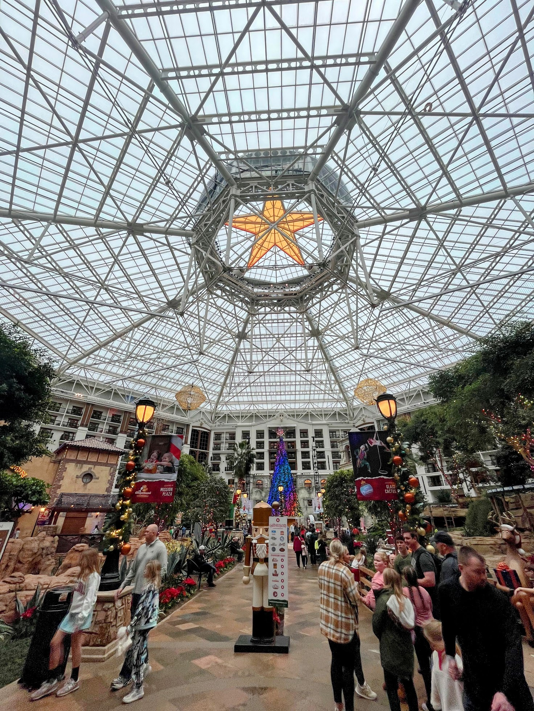
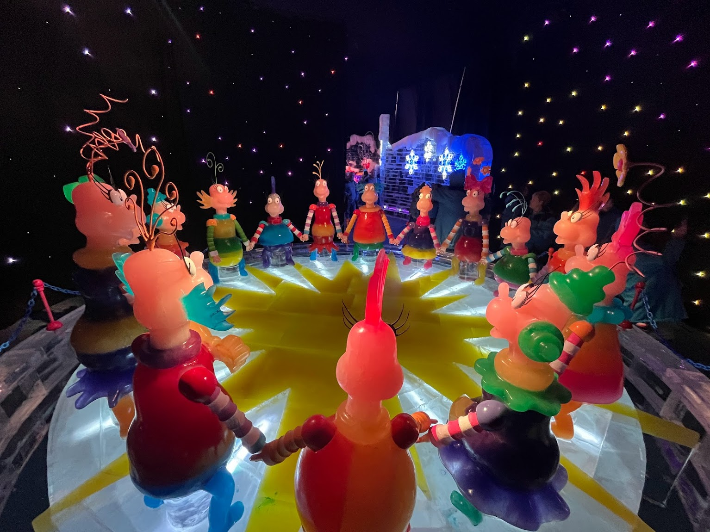
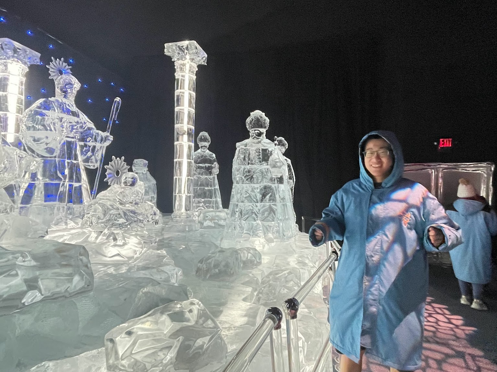
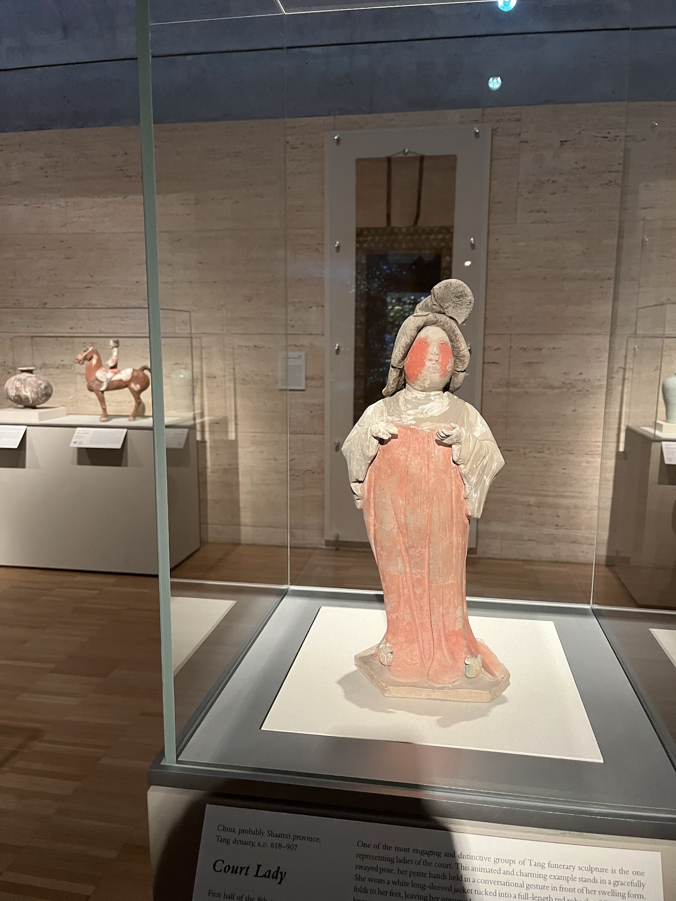
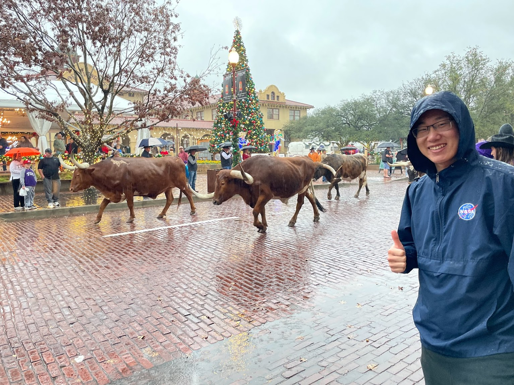

Worth visiting city near Dallas with a lot of niche attractions.

I first learned about the city of Fort Worth from the name of Dallas airport (DFW), which is actually located in Fort Worth. I discovered that rodeo is a big tradition here, and there are numerous museums and beautiful gardens in the area. Despite the rainy weather, we decided to visit and explore the cowboy culture, finding plenty of fun activities.

## ICE! at The Gaylord Texan

The Gaylord Texan Hotel, recommended by a local friend, was our destination today. It's a resort by a lake, boasting a massive interior space complete with shops, restaurants, sculptures, and a riverwalk. We booked tickets for their Christmas special event, ICE!, which features a variety of ice sculptures in a giant, cold indoor facility. With the temperature around 9°F, we were grateful for the heavy coats provided by the hotel, especially since I was wearing shorts!

The ticket price was quite steep at around $60 per person, plus $25 for parking. However, the interior, not just the ice event, was worth visiting. The hotel has a huge Christmas tree and fountain shows throughout the day. The ice sculptures, crafted by experts from Harbin, China, included buildings, fairy tale figures, walls, and Christmas trees in a dazzling array of colors and shapes – a sophisticated and time-consuming work of art.

The highlight for me was the transparent ice sculptures of what I assume were Greek gods, which, when combined with the lighting, felt surreal and holy.

## Kimbell Art Museum

Given the rainy weather, we sought shelter in the Kimbell Art Museum in Fort Worth. Not only was admission free, but so was parking. We thoroughly enjoyed the exhibitions, and the building itself is an architectural gem, featuring a unique layout with multiple semicircular roofs in parallel.

The museum's free exhibitions are divided into two main sections: Asian and European. The Chinese artifacts, ranging from the Zhou to the Ming Dynasty, were particularly impressive. We saw Bronzeware from the Zhou Dynasty and beautiful paintings from the Ming era, some of which were discovered in my home province of Shaanxi.

## Fort Worth Stockyards

December isn't the ideal time for classic rodeo shows, but we were fortunate to witness a small parade of cows and horses. The cows, with their enormous horns stretching over 10 feet, looked almost like creatures from another world. We also visited the rodeo arena, which had a distinct smell, but I could imagine the excitement it must hold during rodeo events.

Trying on classic Texas hats was a lot of fun. They seemed to look good on everyone, embodying a blend of cowboy charm and gentlemanly style.
