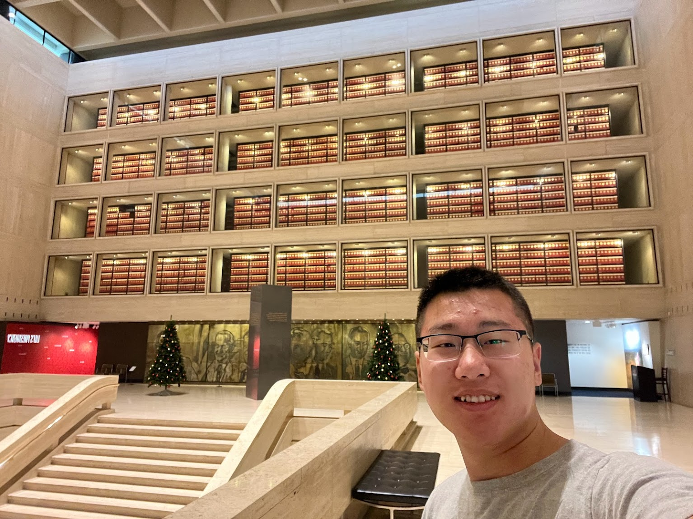
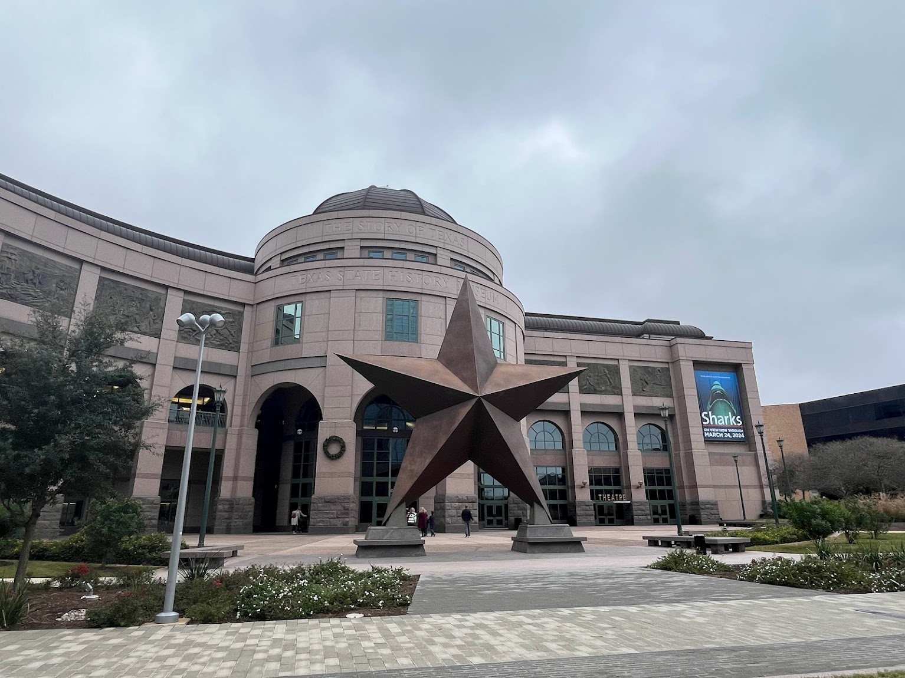
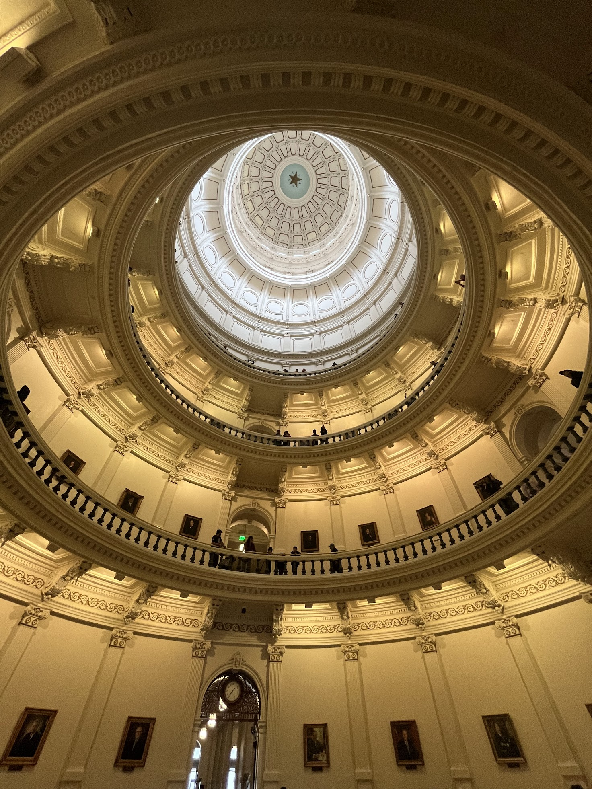
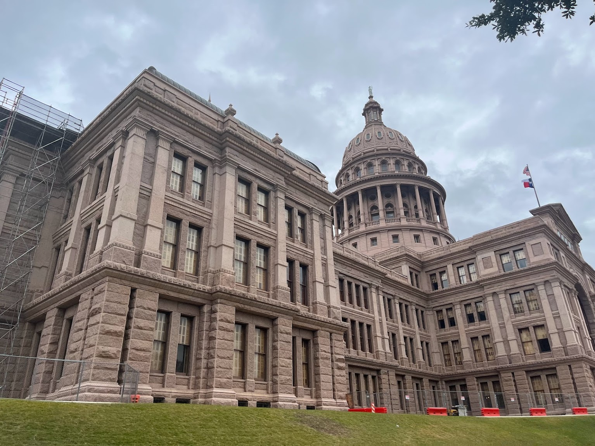
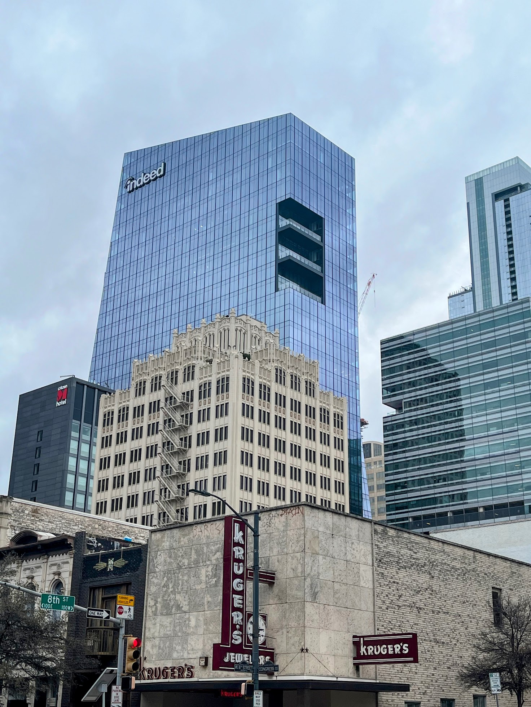
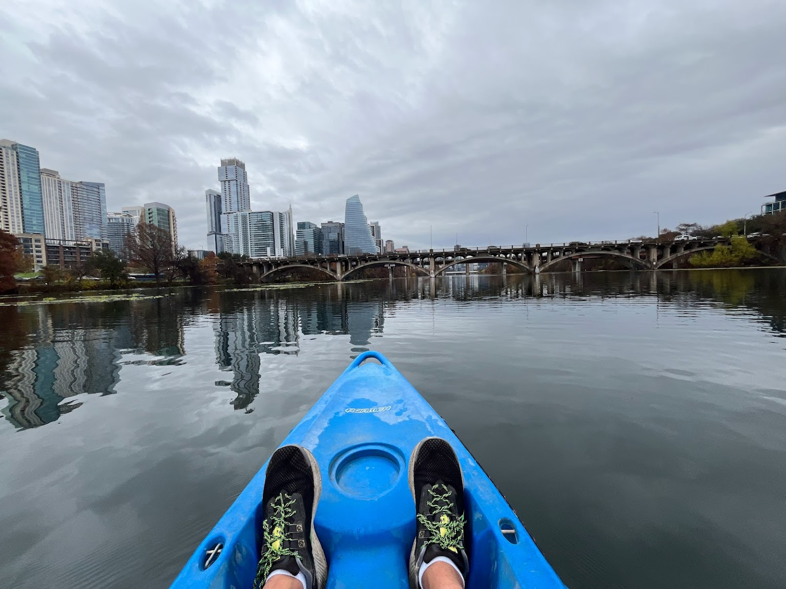
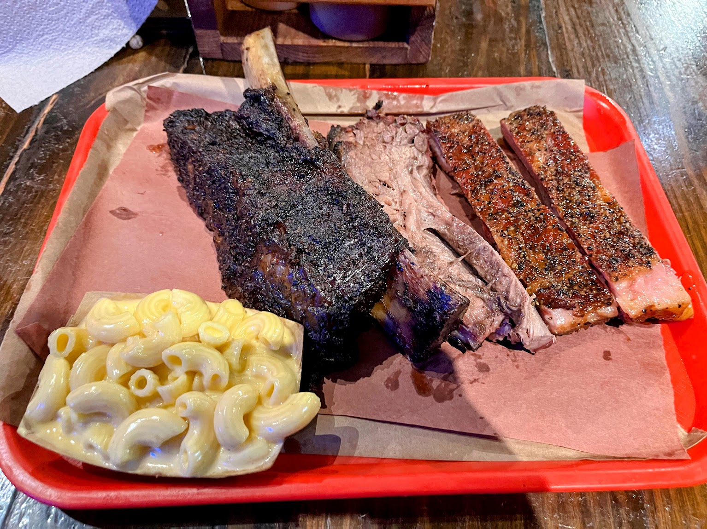
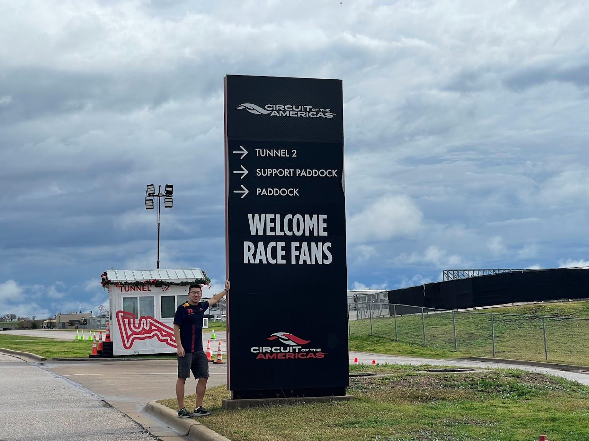

I find myself falling more in love with Texas each time I discover a new city.

## LBJ Presidential Library

It was never on my list until I discovered it on TripAdvisor the night before. The name LBJ was familiar, not because he was the 36th president of the United States, but because he succeeded JFK, who was assassinated in Dallas. We had just visited the [Sixth Floor Museum at Dealey Plaza](/posts/2023-12-20-dallas/#the-sixth-floor-museum-at-dealey-plaza), where the fatal shot was fired. Coincidentally, I had the chance to explore President Johnson's career and history at this museum located right on the UT Austin campus.

Before visiting, I knew little about this president, recognizing his name only in relation to JFK. However, as I stepped into the museum, I sensed that he was a great man, a sentiment reinforced by the exhibits. Although the museum primarily showcases his achievements, it was evident from both the staff and the exhibitions that he was a respected figure.

I liken this museum to the American version of the 小雁塔 in Xi'an, my hometown, where a famous monk stored his scriptures. Similarly, LBJ archived virtually all his documents and White House recordings in this library, spanning four floors. It was impressive to see them displayed before me.

It was fascinating to learn that he signed the Freedom of Information Act, a legislation against corruption, which I had just studied in my Global Corruption class last semester. Furthermore, he enacted numerous significant laws, like the Civil Rights Act, and played a pivotal role in the Vietnam War and NASA's program. The museum portrays him as a man who sacrificed his re-election bid to focus on resolving the complex issues of the Vietnam War, despite his heart problems. While the full truth of his presidency might be more nuanced, his efforts make him an honorable figure.

Moreover, Lady Bird Johnson was an interesting figure. Her unique name caught my attention, and it's clear she contributed significantly to public welfare as the First Lady, with even a lake in Austin named in her honor.

Overall, I view LBJ as an incredible president, based solely on what I learned at this museum. This experience has made me realize my growing interest in visiting museums, especially those focused on history, a passion I never thought I’d have.

## Bullock Texas State History Museum

The Bullock Texas State History Museum is both informative and interesting. As I've mentioned, my growing affection for Texas has spurred a desire to learn more about the state's culture. It's clear that there's more to Texas than just its size and the "Lone Star State" moniker.

Texas has a rich and complex history. It was first explored by French colonialists, then occupied by the Spanish, and later became part of the Mexican Republic. The state's eventual incorporation into the United States followed a significant revolution. The museum offers fascinating insights into the stories of cities like Houston and Austin, both named after pivotal figures in Texas history. These narratives are captivating, highlighting the unique cultural, historical, and revolutionary aspects of Texas. The sense of Texan identity is strong here, often feeling more prominent than a broader American identity.

## Texas Capitol

Everything in Texas is indeed very big, including the Capitol. The grandeur of the huge dome becomes apparent as soon as you enter from the entrance. Its size and spectacularity truly make sense only when witnessed firsthand. Moreover, I had the opportunity to join a free guided tour to the Capitol's basement, where much of the business, including the Texas Senate and House, actually operates. This was a unique experience compared to my visits to other capitols like the US Capitol and Utah Capitol, which were not open for public tours either due to safety reasons or my timing. Texas feels very generous in many aspects - its buildings, policies, and more.

A side note: I find Texans to be among the friendliest people I've ever encountered, probably second only to Canadians. The conservative and extreme right-wing depiction often portrayed doesn't seem to match my experiences here, though this could be because I am merely a tourist.

The Capitol also has an underground extension, designed to avoid obstructing the view of the main building. This extension is vast and features ingeniously designed ground-level windows that allow sunlight in and provide views of the Capitol dome from below. It's a brilliant architectural solution.

## Austin City Walk

While all the attractions I just mentioned are in downtown, so a downtown walk is definitely needed. I was walking mainly insearch of Dropbox Austin office while got a taste of this capital city a bit. I saw a lot of skyscrappers under construction, which I believe show the potential and growith this city has possessed. Moreover, although there are still homeless on the streeet, streets were much clenaer compared to SF and NYC, it gives me a good vibe, a "keep austin weired" vibe.

In the end, I indeed found the Dropbox office but unfortunately there was no visile sign and the buidling was closed because it's a weekend and holiday before christmas.

## Kayak Lady Bird Lake

It was not a good weather day, raniy. But I still decided to kayak just beacsue i love it and it's a cool idea that seeing the whole cityline from the Colarado River, which I also saw in [Grand Canyon National Park](/posts/2023-03-16-grand-canyon-national-park.md/) in Arizona. I was just amazed by how river could travel that far. 

I was lucky when I started kayaking, it stopped raining. I kayak for a entirety of an hour, which was defintely the longest and most strneous one I ever done. I went across three bridges and fianlly got a great view of the city line even thoguh the weather was not that great. It was a great feelign to be at the lake center, alone.

## Terry Black's Barbecue

Probably the best BBQ I have ever had. It came highly recommended by many, so I decided that I had to give it a try. To sample everything, I spent $103 on famous beef ribs, pork ribs, and brisket, without ordering any vegetables. It turned out to be really good, and I filled my stomach way before finishing, so I had to take the rest to go.

On the other hand, I realized that BBQ will never be my favorite food. My rating system for food is simple: bad, medium, and good. I don't particularly derive much joy from eating amazing cuisines unless they're tied to a culture or have special significance to me, just like the [German Pork Knuckle](/posts/2023-08-11-cologne/#german-pork-knuckle-and-beer).

## Circuit of the Americas

Unfortunately, it was closed because I visited on the day before Christmas, but I still managed to get a good view of a chunk of the actual F1 track. The elevation changes in this section of the track were much more pronounced than I expected from watching flat TV broadcasts. Despite the closure, I couldn't help but feel excited upon seeing the observation deck, the tower, and the sign of the Circuit of the Americas (COTA) itself.

