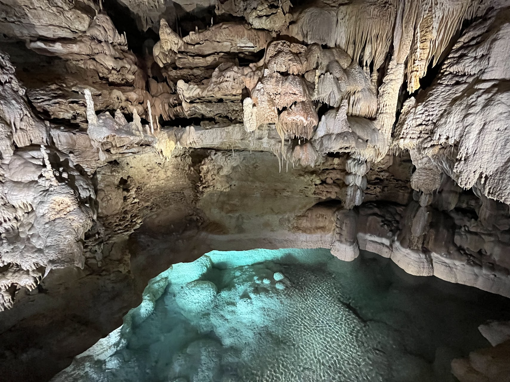
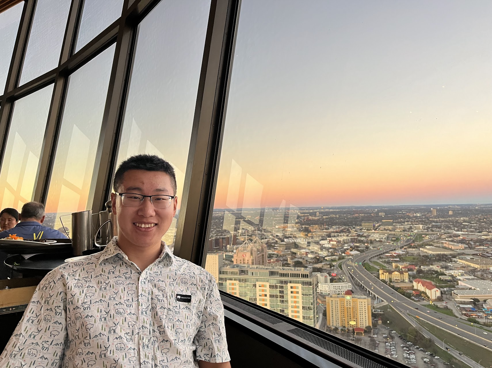
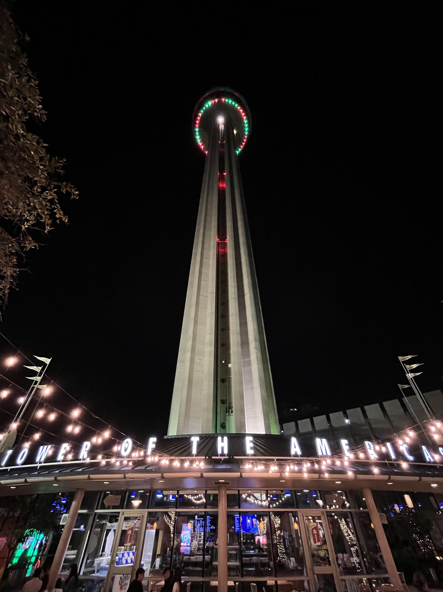
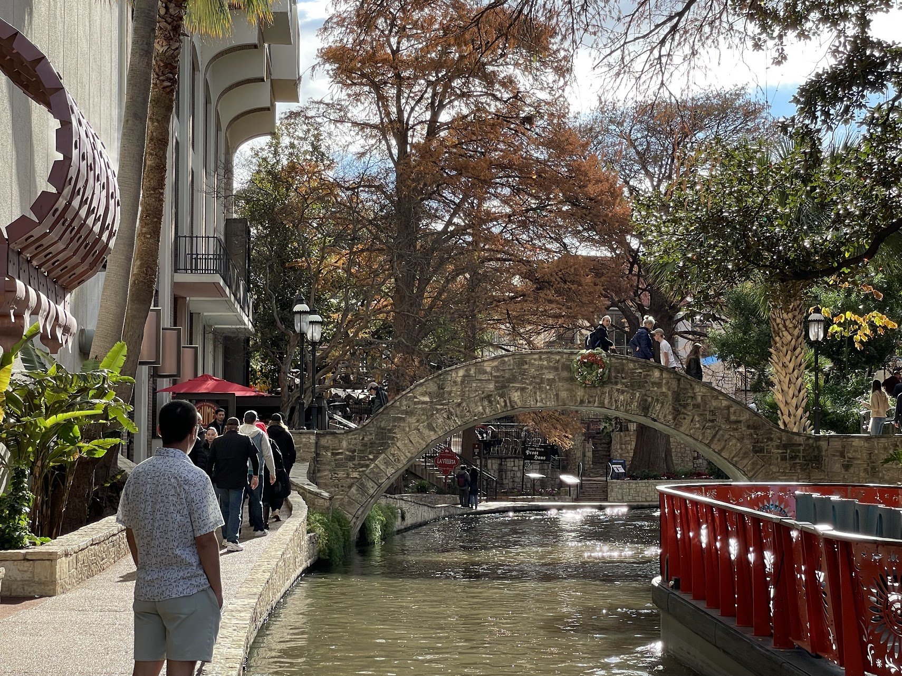
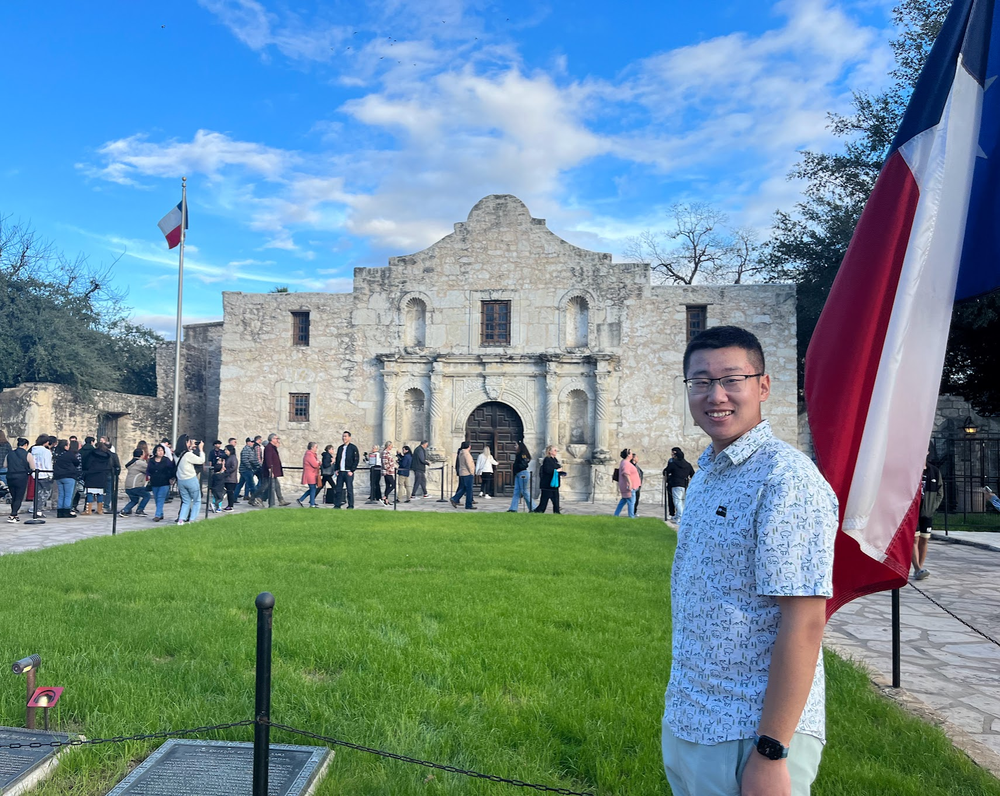
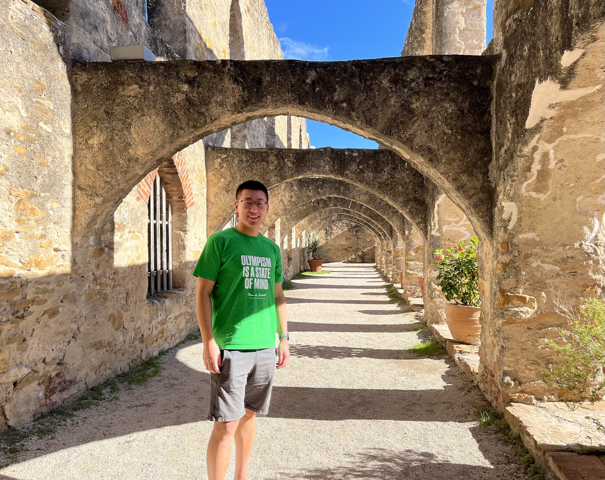
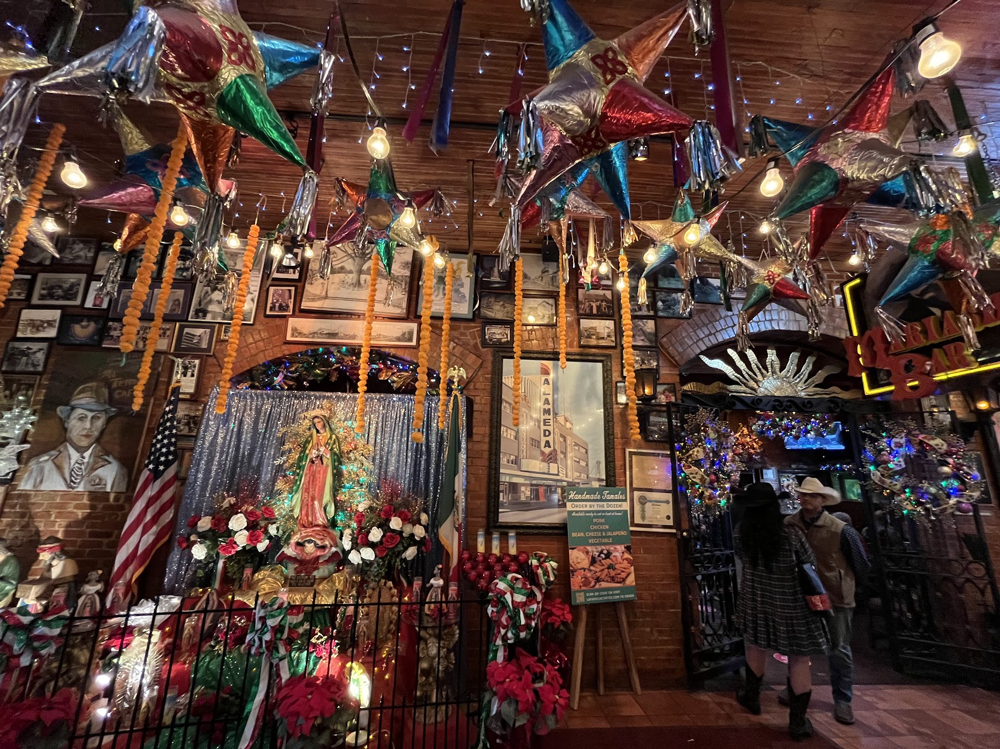
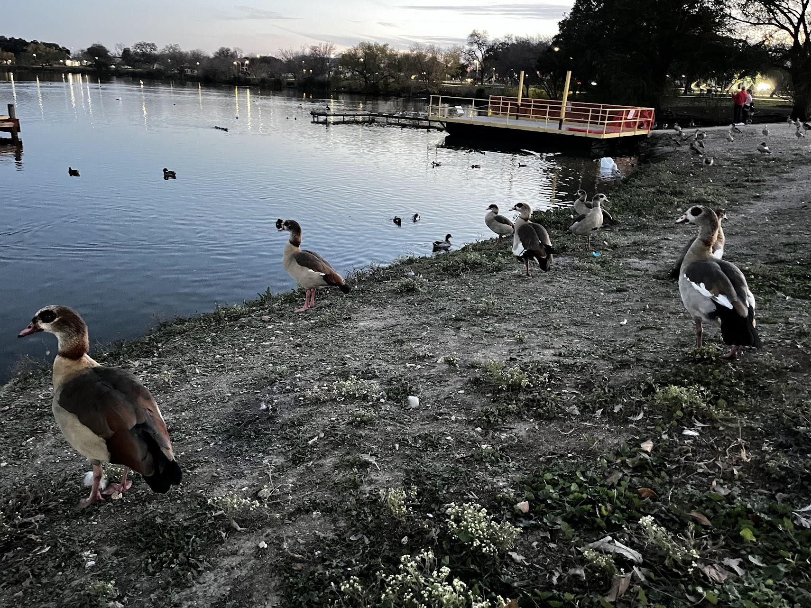

A slow-paced city that I stayed for Christmas and last stop before Big Bend adventure.

## Natural Bridge Caverns

San Antonio is only an hour away from Austin. After visiting the F1 Circuit of America, we continued south to the northeast side of San Antonio, where the Natural Bridge Caverns are located. Initially, I didn't expect much since I was very amazed by the [Luray Caverns](/posts/2022-11-25-shenandoah-national-park.md/#day-3-luray-caverns--skyline-drive) I visited near Shenandoah National Park in Virginia, and I didn't believe there could be something better than that. However, the Natural Bridge Caverns are spectacular in their own way and are a must-see in this area.

What amazed me the most were not only the incredible formations but also the sheer size of each room. There was one room called the Hall of the Mountain King, which is so immensely large that I was in awe standing in the middle. I truly felt like I was surrounded by all those 'kings', which are formations around me. It didn't feel like I was on Earth at all.

Moreover, there are underground creeks inside the caverns, originating from rainwaters. The water appears to be a mysterious light blue turquoise, which was surreal to see. Altogether, I felt like I was placed in another civilization underground.

## Tower of Americas

Interestingly, besides the Circuit of America, there's the Tower of the Americas, an observatory tower and a landmark of San Antonio, soaring to a height of 750 feet. A revolving restaurant at the top of the tower was our choice for Christmas dinner. Despite our low expectations, since it's primarily a tourist attraction, we found ourselves falling in love not only with the breathtaking views but also with the food. For the view, we were fortunate enough to be seated around sunset, allowing us to enjoy the stunning vista from a 360-degree perspective while also taking in the traditional night view of this charming city. Regarding the food, the portions were quite large, which was a pleasant surprise, and everything tasted pretty good. The Fried Calamari, Ribeye Steak, and Cheesecake were perfect.

## Riverwalk

Probably the most famous attraction in San Antonio is its Venice-style river that runs through the city center. Lined with historical sites and restaurants, this river is reminiscent of the iconic Italian city. Tourist boats offer hop-on services, and multiple bridges connecting various parts of the riverbanks enhance the Venetian feel. One of the best parts for me was being able to wear Crocs and shorts in winter while strolling along the river. I even spotted some yellow leaves falling into the river, despite it being December. Overall, the river exudes a calming vibe that seems to offer respite from the busyness of life. Numerous art galleries are also situated along the river, showcasing a variety of handicrafts. Under the beautiful sunshine, everything looks incredibly poetic.

## The Alamo

While I call this place the American version of 延安革命圣地, the only different is that Texans lost this war and it was a tragedy happened in the Alamos. The Alamo represents a pivotal event in the Texas revolution which I learned a lot from the [Bullock Texas History museum](/posts/2023-12-24-austin/#bullock-texas-state-history-museum) in Austin. I feel the strong pride and identity of Texans people and they have a strong will of preserving their own culture and history which I really respect. While it was a long line waiting to see the interior, I just had a peak outside. In the end, it's all about ideology and national counciisourness.

## San Jose Mission

Spanish colonists established control over the Texas area by setting up numerous missions to convert local natives to Catholicism. San Jose and The Alamo were among these missions. We visited one of these missions, located along the San Antonio River, which was quite small in size. It resembled a fortress, with walls on all four sides and a church as the central building. Its structure reminded me of a XXXL version of a Beijing Siheyuan. The entire mission evoked the citadels I saw in Puerto Rico along the coastline, where the Spanish had cannons to protect the island. There were also cannons here, around the surrounding walls. Even the architecture bore some similarities. The weather was great during our visit, which made the architecture look particularly striking against the blue sky.

## Market Square

It's akin to a shopping mall for small Mexican goods, reminiscent of the Yiwu Market. I encountered numerous elements reminiscent of those seen in the movie 'Coco', especially the skull artworks. Overall, it was amazing to witness such a rich collection of Mexican cultural works here, almost like an exhibition.

## Meeting Old Friends

I had the opportunity to visit two friends whose hometown is here. I always feel excited about visiting someone's hometown, as it offers me different perspectives of the city both through their eyes and my own as a tourist. We enjoyed some amazing Tex-Mex food and went bowling with each friend, which turned out to be really fun.

## Woodlawn Lake Park

It's a small attraction right next to the Airbnb we stayed at, which was probably the best one I've ever experienced. It gave me a sense of growing up, as if I 'owned' a small house where I could drive right up to the front. I arrived at the park at dawn, marking our last stop in San Antonio before we leave for Big Bend tomorrow morning. Surprisingly, I saw a lot of crows and ducks in and around the water, along with a single white swan, which reminded me of the fairy tale "The Ugly Duckling." Under the late sunset, locals were playing basketball near the lake, and others were walking along its edge. Everything was so peaceful, and I really enjoyed it. I hope to return to San Antonio one day. While nothing in the city was overwhelmingly impressive, it had a slow pace that suggested it's a popular retirement destination. Furthermore, I just loved the winter weather here, sunny every day, which I desperately needed. It gave me a great mood boost during our stay.

