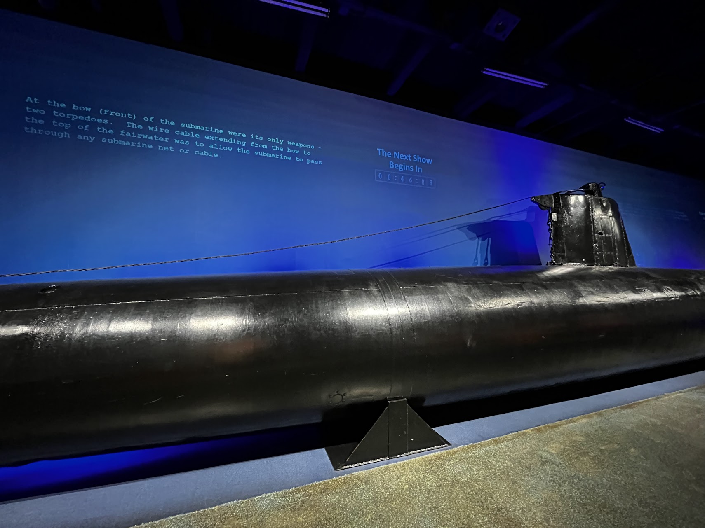
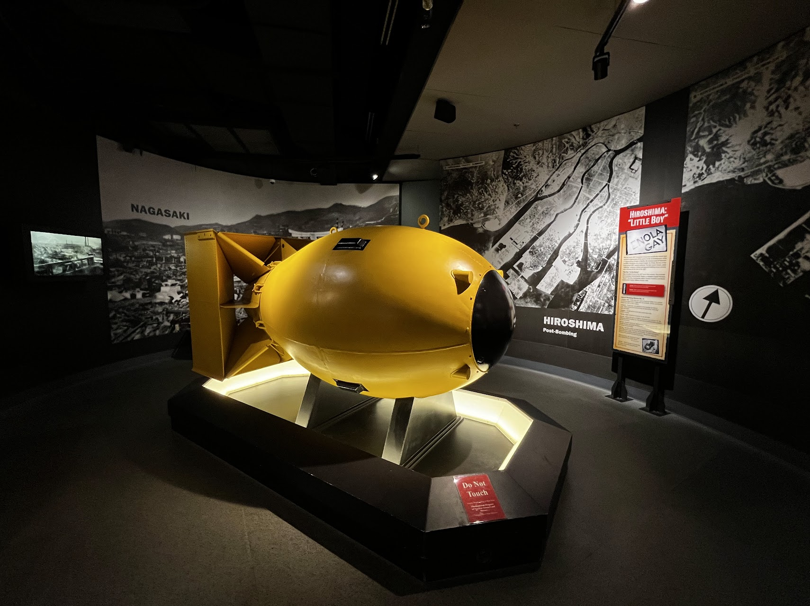
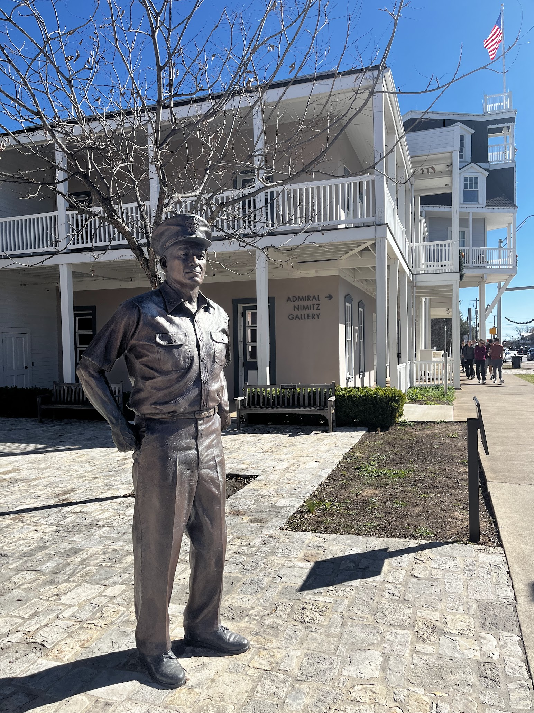
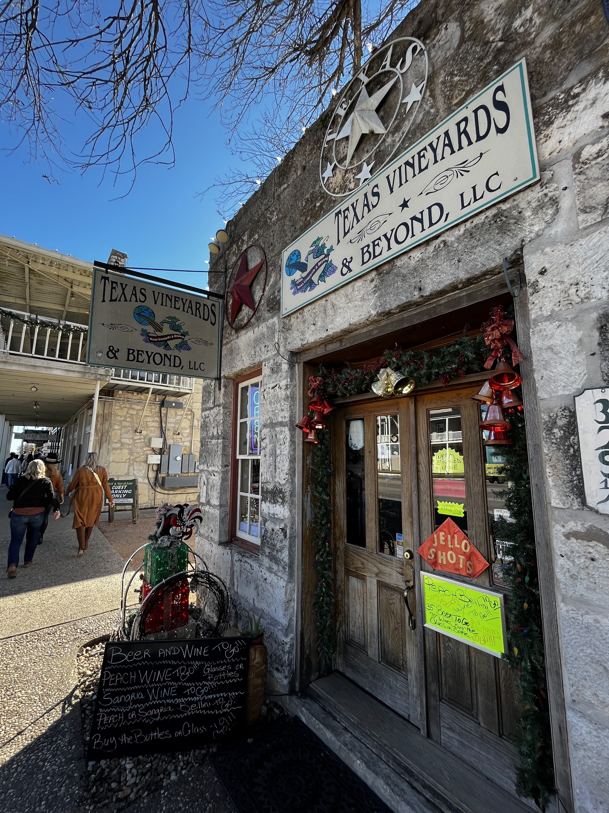

A beautiful German town with a heroic history that has my highest respect.

## National Museum of the Pacific War

Our only agenda for the entire day was to visit this museum, following a 6-hour drive from San Antonio through Fredericksburg, and then on to Marathon, a small town near Big Bend National Park, by night. This museum quickly became one of my favorite museums in the world, alongside the [Museum aan de Stroom](/posts/2023-08-09-antwerpen/#museum-aan-de-stroom) in Antwerpen, Belgium, which I visited last summer.

I included the town of Fredericksburg in my itinerary because it was on the route to Big Bend and also boasted an exotic German culture. I was hoping to enjoy some delicious [German Pork Knuckle](/posts/2023-08-11-cologne/#german-pork-knuckle-and-beer) like I had in Germany. Contrary to my expectations, no German restaurant here served pork knuckles. However, I found an even better reason to visit: it is the birthplace of Chester W. Nimitz, the Commander in Chief of the US Pacific Fleet during WWII, a fact I only discovered upon arriving. I had always wondered why a national WWII museum was located in this remote Texan town, and now I understood. I first learned about Nimitz as a child, fascinated by aircraft carriers, particularly the powerful Nimitz-class. And now, I've come to know more about him.

The museum is expansive, covering various components including war history, Nimitz's personal biography, and several memorials. It took me over three hours to briefly explore all the exhibitions, and I was deeply moved by the experience. Everything inside made me feel fortunate to be born in a relatively peaceful time and place, a reality made possible by the sacrifices of people from various nationalities. One quote that stuck with me from the museum, displayed in all capital letters, was: "CHINA PAID THE HIGHEST COST IN THE WAR AGAINST JAPAN THAN ANY OTHER NATION," a poignant statement in an American national museum.

The museum comprehensively covers the war, tracing its roots back to the relationship between China, Japan, and the US, even including major events from the late Qing Dynasty that I studied in middle school, such as the first and second Opium Wars and the Meiji Restoration. After this historical background, it focuses on America's role, starting with the attack on Pearl Harbor. The presentation was outstanding, featuring real Japanese attack submarines, videos, recordings, and interactive light effects, all highlighting the significance of these events and the war. Major Pacific battles like Midway, Guadalcanal, Iwo Jima, and Okinawa are showcased in detail, impressing upon me the scale and brutality of the war. The immense cost of each individual battle exceeded all my expectations.

Overall, I learned so much from this museum. War is far more cruel than one can imagine, and peace is invaluable. It must be cherished and protected at all costs. I pay my deepest respect to everyone who sacrificed their lives and health in this war.

## Main Street in Fredericksburg

To lift my spirits after the museum visit, I decided to take a stroll along the main street in town, which exudes a bit of German cultural flair. Like any tourist town, it has a traditional shopping street, but Fredericksburg is particularly renowned for its wineries and German cuisine. Unfortunately, I could only legally indulge in the latter. The visit to the artsy galleries and stores was enjoyable, and I had a pleasant lunch in a quaint German restaurant, savoring some sausages and a Reuben sandwich. If given the chance, I would definitely return, not only to experience the wineries but also to visit Enchanted Rock State Park, located just 20 minutes away. We attempted to go there but were unable to enter as it had reached full capacity. Moreover, the town holds a special place in history as the birthplace of a revered national hero, Admiral Nimitz.

