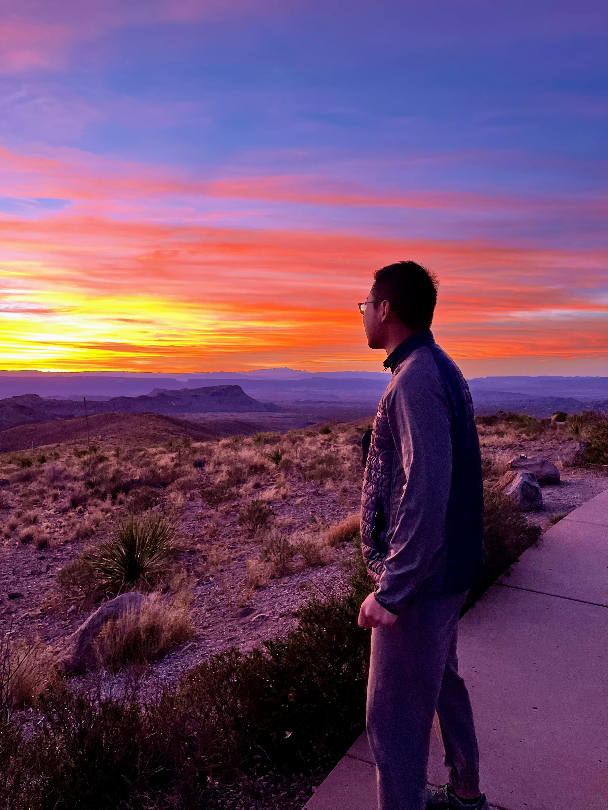

I swam to Mexico.

Happy New Year from the middle of nowhere in Big Bend National Park, Texas to everyone! And yes, I did swim to Mexico from the US side across the Rio Grande, which is the boundary river. More details to come.

## Wild Decision

For my Texas road trip, originally I was thinking of doing a classic triangle route between major cities: Dallas, Austin, San Antonio, and Houston, which is much more common and easy to do. However, once I learned that there is a famous National Park here in Texas, I couldn't resist planning to go at all costs, even given it's a 7-hour drive from San Antonio. To make my road trip route even more wild, I made the following destination Corpus Christi, which is further south of Houston, and an 8-hour drive from Big Bend. Anyway, I have been determined to visit this park in the middle of nowhere. And it proved to be the absolute right decision as I have seen some once-in-a-lifetime views and have had experiences like swimming across the US-Mexico border for the first and probably only time.

## Stargazing at Marathon

As mentioned, it was a long drive for me, and I didn't want to find myself exhausted from driving even before exploring the park. Thus, I decided to make a pit stop along the way in Marathon, which is around an hour away from Big Bend. By the time we arrived in Marathon from Fredericksburg, it was already pitch dark outside. It was truly a small town with virtually no residents but all visitors to Big Bend. It is pretty much a ghost town.

We had a very niche Airbnb here, a house built mostly from recycled papers. However, it was not as crazy as it sounds. It is still a decent, normal, and safe dwelling to stay in with some interesting furniture and decorations inside. My favorite part was the stargazing zone on the second floor, which was entirely dedicated to stargazing with an actual bed and a half-shed with another air mattress. Although it was freezing cold outside, I still decided to take advantage of this place to stargaze. After grabbing a blanket from the room, I wrapped myself within the blanket and peacefully fully lay down on the bed to watch the dark sky. It was absolutely gorgeous. Jupiter and Orion were so bright that I could not even avoid looking at them while millions of other stars shone in the sky. The last time I was able to see so many stars was in [Shenandoah National Park](/posts/2022-11-25-shenandoah-national-park.md/#day-1-hikes--sunset--stargazing) in Virginia, but probably not as much and as clear as this time. Besides, simply lying down on a bed to fully appreciate the sky was a unique experience for me. I stayed for over an hour until my hands were too cold to hold my phone, that's when I left for sleep.

## Chisos Basin

We set off the following morning heading towards my dream destination, Big Bend National Park. The first stop for us was Chisos Basin, which is probably the most popular area within the park, featuring many high peaks and unique rocky landscapes. I was astonished by the view the entire way there. The entire park landscape felt like the curtain on a stage gradually opening as I drove towards the Chisos Basin area, with all the peaks presenting themselves and zooming in in front of the windshield. It felt like watching an IMAX movie with a fabulous visual impact.

### The Window Overlook Trail

This was an easy few-step hike to an overlook point for the famous window, which is formed by two mountain peaks overlapping to create a ridge resembling a window between them. Through the window, the unique landscape of a Grand Canyon-like terrain was visible.

### The Basin Loop Trail

It was also an easy 1.8-mile hike surrounded by all the peaks, offering a grand view of the entire basin area.

### The Window Trail

Yes, it is another trail, distinct from the "overlook" one, and much more challenging at 5.5 miles. It leads to the actual point of the window. This trail is more challenging than a typical 5.5-mile hike because it goes downhill first and then all the way up on the return.

The view on the way to the window was breathtaking, with giant rock formations presented right in front of me. I felt very small against all those giant rocks while marveling at their color, shape, and sheer size. It is truly a natural wonder. What's special about this park was the monotonous colors, but by no means was that a negative. In contrast, the simple, dull color palette really highlights the magnificent nature of this place. The mountains feel like silent but powerful warriors, while I was just a small human standing amidst them.

Hiking forward, I realized there was actually a river running through the basin all the way to the window, but it had dried up due to the winter low season. It was fascinating to see the fully exposed riverbed, some of it consisting of purely white rocks with a really smooth surface. By the time we reached the window, the absence of the river water was so obvious that the rocks were so smooth I almost slipped through without any grip. Going back to the window, it was amazing to see the Grand Canyon-like terrain through this window at a closer look, and we even spotted people there when we started shouting to each other. It was quite a magical experience.

The way back was quite strenuous, but we also had a whole different view of the surrounding mountains and rocks, even though it was still the same route, because of the sun setting. The golden sunlight shone on those rocks, making them look like giant gold bricks with a mysterious color, which reminded me of the golden hour during sunrise in [Arches National Park](/posts/2023-03-14-arches-national-park.md/) in Utah.

## Sunset at Sotol Vista Overlook

It was the best sunset I have ever seen. We hadn't planned to see the sunset but spontaneously decided to drive along the Ross Maxwell Scenic Drive to this amazing vista overlook because we were fortunate enough to be there just in time for sunset after hiking. On the way to the overlook, the golden hour cast its magical glow, coloring all the giant rocks and mountains with a breathtaking golden hue.

Upon arriving at the overlook, it was the perfect moment, with the sun halfway through its descent. The clouds captured the full richness of the golden light and multiple layers of colors from the sunset, while in the opposite direction, the sky was painted with an amazing purple color, interspersed with a few clouds. It was a scene that seemed to belong only in fairy tales.

## Living in an RV

We rented an RV on Airbnb, which I was quite excited about since I had never lived in an RV before. I thought that eventually, I would have some sort of trip with an RV as an avid hiker and traveler. However, this experience really changed my mind, not because our RV Airbnb was unpleasant, but rather because I couldn't stand the small living area and restroom, where odors were a from-time-to-time problem that you cannot avoid. I think I prefer a sketchy motel rather than a fancy RV at this point. Other than that, the location of the RV park was perfect, just 5 minutes away from the park entrance.

## Sunrise at Santa Elena Canyon Trail

I decided to get up at 6 am to hit this trail solely because it was too popular to find a parking spot if going late. Coincidentally, it was the last day of 2023, and I was lucky enough to see the last sunrise of the year, which I had only seen a handful of times this year.

It was an hour's drive to the canyon, which is literally the border with Mexico, with the Rio Grande running through it. The view on the way there was already amazing enough. Frankly, I couldn't see anything clearly, but that's what made it beautiful. The hidden mountains and rocks, with just a little bit of light from the dawn, along with the numerous stars in the sky, were just breathtaking. You couldn't really capture the perfect combination of light and dark I saw with my eyes on an iPhone.

I was surprised that I was the first car in the parking lot, probably too early. Anyway, I started hiking first, reaching the beach. Seeing the sunrise with little obstruction was just amazing. I couldn't help but speed up my pace, running towards the other side of the river and later climbing up to the inside of the canyon to see an even prettier view of the sunrise. On the overlook at the switchback, I just couldn't believe my eyes. Every frame I saw was like those perfect wallpapers, especially the MacOS ones. The Rio Grande along with the sunrise was an amazing combination that took my breath away, plus the moon and the stars.

At the end of the trail, I was deep inside the canyon and had access to the river in front of me. Of course, I went into the water, even though it was freezing cold outside and even colder in the water. It was definitely the coldest water I have ever been in, much colder than the [Emerald Lake](/posts/2023-07-04-rocky-mountain-national-park/#nymph-dream-and-emerald-lake-trail) in Rocky Mountain National Park and [Sliding Rock](/posts/2022-04-09-march-madness.md/#asheville) in Asheville. Even though I was going for a swim, I ended up walking in water not above my knees. I pulled out of the water after 5 minutes, and it took me over an hour for my feet to regain heat and recover from complete numbness. It was quite cold and frankly dangerous. But I did enjoy sitting on a rock, with two hands holding one of my feet to warm up, while looking at the sunshine gradually shine on the canyon with the reflection in the river. It was breathtaking to be there quietly alone, experiencing this natural wonder all by myself.

## Celebrating New Year's Eve with a Bonfire

It's been a long time since I last set up a bonfire, an activity I have always enjoyed immensely, so it felt fitting to resume this tradition on the last day of 2023. With aids like lighters and burning liquid, it was easy to get the fire started. The rest of the evening was spent sitting near it, listening to my favorite songs over and over again, in the pitch-dark RV camp, which had a cemetery literally just 5 steps away. I had intended to recap my experiences of 2023, but I ended up thinking about random things and gazing at the stars. The sky was even brighter and had more stars than what I had witnessed two nights ago in Marathon.

## Sunrise again at Lost Mine Trail

I really didn't plan any part of getting up insanely early beforehand, but rather it was all spontaneous because of the same reason: these trails are too popular to get a parking spot. This time I got up even earlier, without any fatigue, because I went to sleep before 10 pm, which marks probably the first time I missed the midnight celebration for New Year's, but it was definitely worth it. When I think about it, every timezone celebrates at a different time for this midnight, which makes no sense as it is just socially constructed or constructed by design. Suddenly, I didn't feel the significance and meaning of celebrating midnight during New Year's Eve. Anyway, I got up around 5:30 am and headed out to the trailhead, which is 45 minutes away. Then I began my first ever pitch-dark hike alone, climbing all the way up to Lost Mine Peak.

The view, again, was incredible. With the dawn, all the mountains and peaks surrounding me felt like they had a different landscape and vibe that I could feel being here. Together with the stars and moonlight, it just felt super poetic.

It was quite strenuous climbing up with all the switchbacks and a steady upslope. However, when I almost reached the final peak with the first glimpse of the actual sunrise, I got excited and started to sprint on the top ridge of these mountains, just as I did yesterday in Saint Elena Canyon.

Arriving at the peak while panting, I realized today I am in second place, not bad. Besides being astonished by the view of the sunrise, I started talking to the first person there, who is a Naval Academy graduate named Jack. He works for the Marine Corps right now, which is really cool to me.

The sunrise actually started to look not that great with clouds blocking the sun. However, we did enjoy the peak moment before the sunrise where the reddish and pinkish layers took my breath away. After all, we were the first people to see the first sunrise of 2024 on this great peak. I accidentally saw both the sunrise on the last day of 2023 and the first day of 2024, which I am really proud of.

## Swim to Mexico!

I failed to swim one day ago in 2023, but now I got the chance to do it on the first day of 2024. We went on the Boquillas Canyon Trail, which offers a view similar to that of the Santa Elena Canyon Trail. Both are canyons with the Rio Grande near the border, but they are far apart from each other.

At the end of the trail, there was an area for river access, and Mexico was just feet away across the river. I first tried to walk to the other bank of Mexico, but all the stones on the riverbed hurt my feet because it was hard to see. After reaching Mexico, I began to take off my clothes, leaving only my underwear, to swim along the river, back and forth between the US and Mexico. The water was much warmer than yesterday, even though it is the same river, and it was so clear that it appeared a milky white color, similar to those I saw in [Switzerland](/posts/2023-08-23-switzerland-jungfrau-region/#driving-to-the-region).

Now I can say, I've maintained my ritual of swimming in the waters of every national park I visit. It's great to kick off a new year by swimming to Mexico, haha. We even later got to see a wild horse drinking water along the river, getting close to the horse, literally just a couple of feet away.
