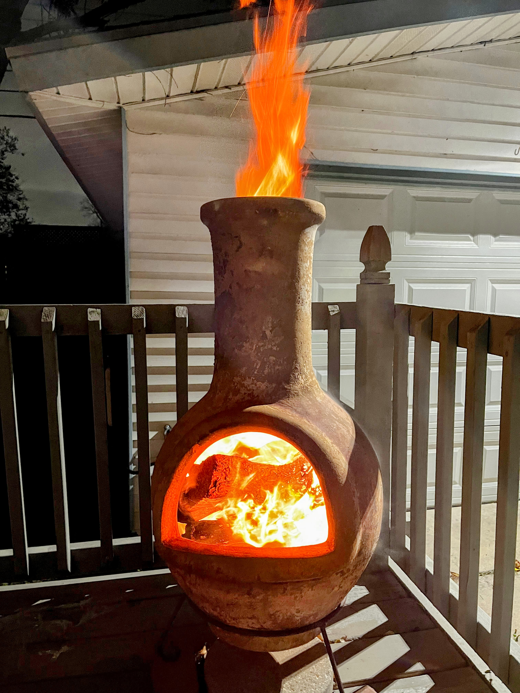

I drove the car right onto the beach and got stuck in the sand.

## Del Rio

It was an around 8-hour drive from [Big Bend National Park](/posts/2024-01-01-big-bend-national-park/) to Corpus Christi, and I decided to take a pit stop on the way in Del Rio, roughly the midpoint of the route. The town of Del Rio is quite large, being a border town to Mexico, and you can see a lot of Mexican cultural influences here, such as most names. For instance, the town Del Rio is named in Spanish. We didn't do much in the town but visiting the Amistad National Recreational Area, which is a vast artificial lake created by a dam near the border. The water level varies a lot when the dam releases or stops water from the upstream Rio Grande, which we just saw in Big Bend National Park.

It was quite amazing to see how a small stream of river becomes a huge vast reservoir hundreds of miles away, where I had just swam in the park. Probably due to the weather, the lake had an interesting milky white-ish color when we visited.

We were able to drive on one of the spur roads, which leads into the lake, and I could tell the road disappears in summer when the water level is much higher. Reaching the end of the drive, there was a boat ramp that offered a decent view of a part of the lake. I hiked a bit to a higher point with rocks, sitting down to enjoy my snacks while watching this peaceful lake and its surroundings. One interesting thing was a father and son trying to get their boat into the lake from the truck on the ramp. I saw them finally make it after struggling to move the boat out of the low water zone, but unfortunately, the boat somehow lost power once it was ready to sail. The conversation between the dad and the son was entertaining to listen to, and I kept thinking about how lovely this family is and wondered what would happen if I have my kids in the future. The son was helping his dad, who was controlling the boat, pulling a rope on the dock to divert the directions while they talked back and forth. It didn't work out in the end, but I guess that's still a lovely day for them, even for me as a bystander.

## Border Control

It's funny that we were pulled over by US border control twice in two days. I was thinking it might be due to the increasing illegal migration of Chinese citizens around the border these days. I don't know why I was kind of excited to see those border control stations, as technically I never left the US, but they just set up stations within a few hundred miles of the border to check. Moreover, we even saw a military amphibious armored vehicle on the normal road near Del Rio, where I believe there's also a military base. It's quite a scene to see and a unique experience, I guess.

## Corpus Christi

Corpus Christi, a sizable coastal city in Southern Texas, was our chosen spot for some refreshment and sea air after spending a few days exploring Big Bend in the midst of desert-like surroundings. The detour was definitely worth it, even though it was a longer route compared to our original plan of heading directly to Houston from Big Bend.

### USS Lexington Museum

I was unaware until my arrival that one of the five aircraft carrier museums in the US, the USS Lexington, which served in WWII, is located here. Having recently visited the [National Museum of the Pacific War](/posts/2023-12-29-fredericksburg/#national-museum-of-the-pacific-war) in Fredericksburg, my interest in the history of the Pacific War was piqued, and I was excited to gain further insights from an aircraft carrier museum's perspective.

However, my expectations were perhaps too high. I soon realized that the museum was more family-oriented, featuring a variety of entertaining activities such as escape rooms and flight simulators, rather than providing a chronological account of the ship's wartime experiences. Instead, it offered a broad overview, covering various topics like the history of other aircraft carriers and the Pearl Harbor attack. Compared to the Pacific War Museum, the information here felt fragmented and less effectively presented, which is understandable. Nonetheless, the most striking feature was the actual USS Lexington docked in Corpus Christi, which looked spectacular and almost surreal from a distance.

My slight disappointment may also stem from having previously visited the USS Midway Museum in San Diego, CA, which shares similar layouts and structures, being an aircraft carrier that was active around the same time, during or before the Cold War. The experiences offered, such as tours of the flight deck, bridge, and lower deck, were similar. However, for those who have never visited such a museum, it's certainly worth exploring.

One aspect that left a lasting impression was the unpleasant smell in the cabin, particularly in the engine room and several lower deck areas. It was hard to imagine how sailors managed to live in such an environment for months, especially during wartime when conditions would have been even more challenging. Reflecting on this gives me a deeper respect for them.

### Light a fire in a chimineas

This was the first time I lit a fire in a chiminea, and I evidently made the fire too large. The Airbnb host even received a phone call from the fire department, questioning why there were flames and smoke in her backyard. I suspect it was because I used too much charcoal lighter fluid, combined with the strong wind that night which provided ample oxygen for the firewood. Nonetheless, it was quite a sight to see, resembling a flaming grenade. But I promise to never do it again.

### Mustang Island State Park

En route to Mustang Island State Park, which is situated on a seashore consisting of multiple long, chain-like islands, we crossed several bridges offering stunning sea views. It was my first time driving from the mainland to the outer islands, and we hopped between different islands, even driving on roads with seas on both sides. The experience was truly amazing.

Moreover, this was another first for me: driving on the beach in my little 2WD sedan. We were so close to the water that I worried the car might be swept away by the sea waves.

The view, of course, was impeccable. I had never seen such a lively seashore and beach right through my driver's seat window. The sound of the waves, the sunshine reflecting off the sea surface, and the car's somewhat out-of-control maneuvers all combined to create an exhilarating experience. I couldn't help but pull over and sit on the roof of the car, overlooking the Atlantic Ocean. It was absolutely breathtaking.

However, there was a less than great moment when our car's front wheels got stuck in the soft sand while trying to drive forward and reverse. I panicked momentarily, considering asking for help from other vehicles with 4WD. Fortunately, we managed to extricate ourselves fairly quickly by digging out the sand around both front tires. It was quite a relief.

Overall, Mustang Island State Park is an incredible place to visit. We even saw people camping and having bonfires overnight right next to their cars on the beach. It must have been a fantastic experience. Just remember, a 4WD car is needed.

