Another amazing Texan city that I almost went to college here.

It all started with my interview for Duke admission, which makes Houston unforgettable in my mind. I remember during the interview, I was asked why I chose Duke. Besides all the standard answers, I said, "Because Duke is in Houston, and it's a great city." Yes, I totally mixed up Duke with Rice during my interview. And for some reason, I still got in. Moreover, I almost went to Rice, but was convinced by my typical Asian parents that Duke has a better ranking. But now, I've got the chance to visit this almost-second-home city.

## POST Houston

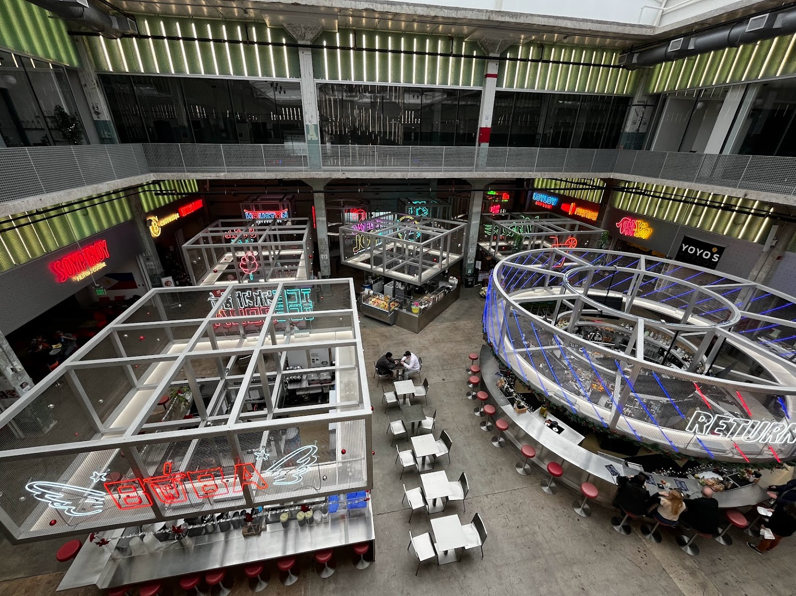

This is an interesting city complex recommended by one of my friends who is from Houston. The place has wonderful food courts — you can tell from the smell — and also a very artsy design of everything with lights and architecture. After taking the spiral staircase to the top, we reached the Skylawn, which offered an amazing overlook of the city landscape. Definitely worth visiting, and I imagine it would be even nicer with all the lights on at night.

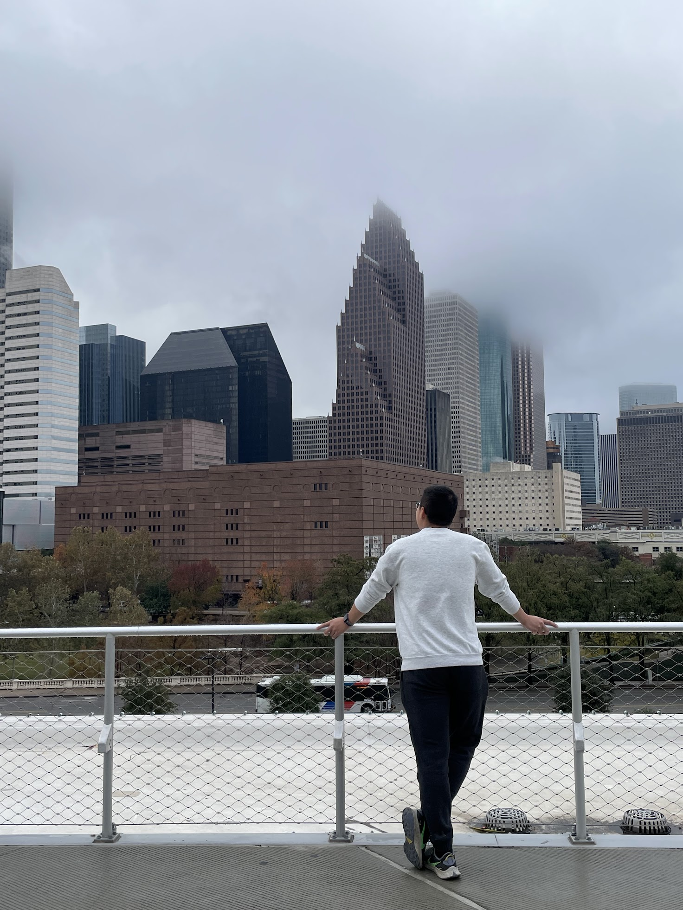

## Downtown Aquarium

It's definitely not the best aquarium out there, not even close, but I still enjoyed it since it was relatively affordable and offered an amusement park-like experience in addition to the aquarium.

For the first time, I got to touch a stingray with my own hands, and I was surprised at how smooth their skin is. They eagerly jumped up from the pool to get food from our hands, supposedly.

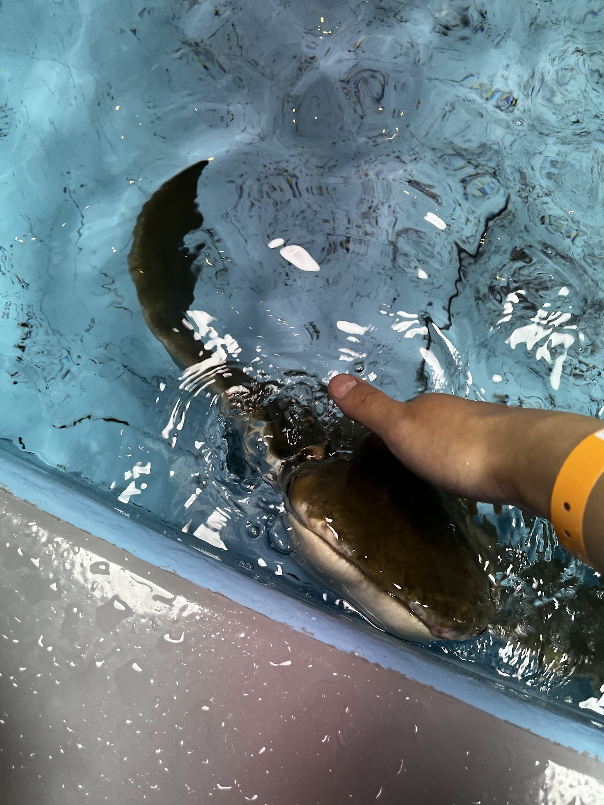

Furthermore, the little Ferris wheel in the park, right in the heart of downtown Houston, was the fastest-rotating Ferris wheel I have ever seen. Normally, I would be reluctant to take any non-dangerous rides, but this time I went for the view. It offers a better view of the skyline than POST Houston and also provides a really immersive environment with the highway right next to it, which felt very American in my opinion.

I also saw a giant white tiger in this "aquarium" which was quite entertaining. 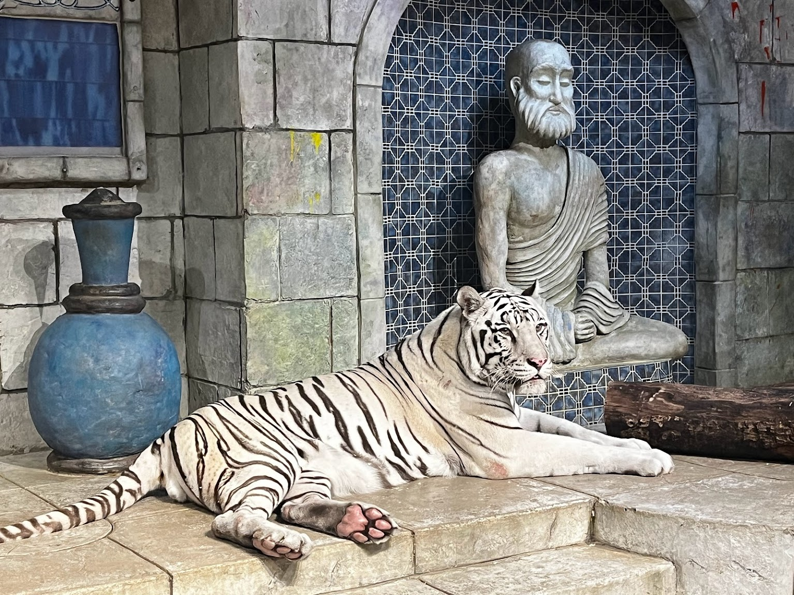

## Eleanor Tinsley Park

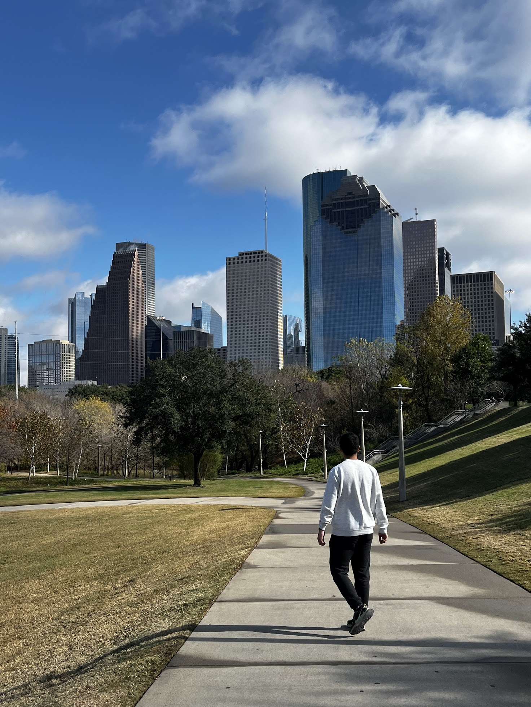

This is a great city park that, again, offers a fantastic view of the city skyline. I know Houston's skyline isn't as impressive as [New York City's](/posts/2021-11-28-new-york-city-day4.md/#再相聚--edge-sky-deck-at-hudson-yard), which is unparalleled in the world, but every time I'm still captivated by all the skyscrapers. I feel like they are a great sign of human civilization and a crucial aspect of the city's vibe. I came here again at nighttime, which was even better.

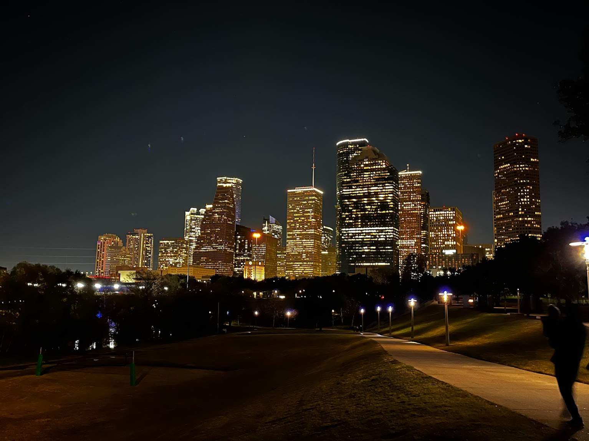

## Rice University

I can imagine actually being a student here at Rice instead of Duke. I would probably be just as happy as I am at Duke. However, if given the chance, I would definitely choose Duke again. In my personal experience, the two universities are extremely similar, as I feel the vibe and the people are the same. There were also a lot of small details at Rice that suddenly surprised me, but these might not be as shocking to others since I was likely biased. For example, both universities have a space in the library dedicated to Chinese artifacts, great sports programs, and renowned public policy schools. Additionally, the campus stores at both universities have a lower level selling clearance and office products. The most amusing similarity was that the famous and beautiful lawns of both schools are currently under construction and are in their ugliest state.

I spent more than two hours just wandering around this beautiful campus, continually thinking about what it would have been like if I had actually gone to school here. I believe it would have been quite nice.

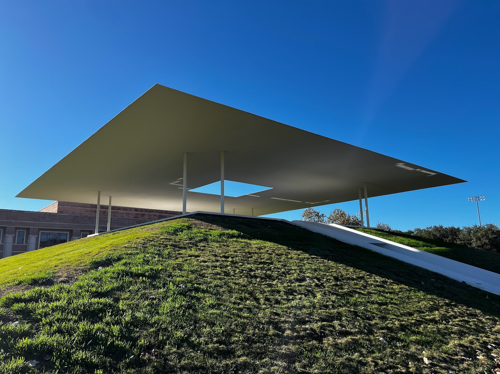

I really liked the Baker Institute for Public Policy, which clearly every prominent political figure in the US and around the world has visited. And also, the Twilight Epiphany, which is an art installation on campus, caught my attention.

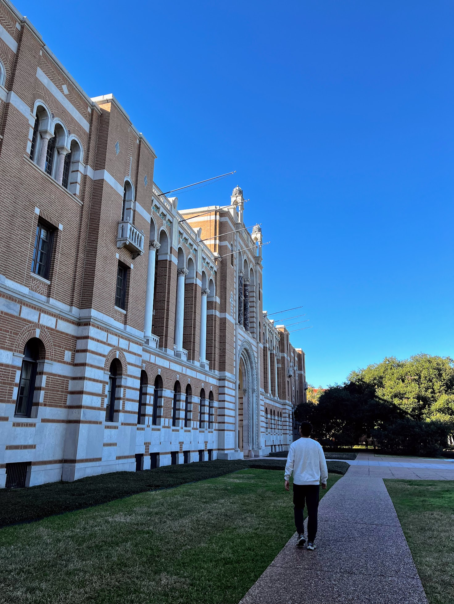

Now, I am really thankful that Rice accepted me because, after my campus tour three years late, I realize that I would actually be a great fit here.

## NASA Johnson Space Center

I think every boy wanted to be an astronaut, and so did I. Everything about space was so fascinating to me, and I couldn't help but imagine being in space. This time, I finally got the chance to visit here and fulfill my childhood dream.

The first thing we did was hop on the tram to visit the only certified-to-fly Saturn V rocket, which is the biggest and most powerful rocket ever built by humans. I vividly remember the Saturn V from all my childhood illustration books. When I actually saw the rocket, it was much larger than I had imagined. The five first-stage engines looked huge and so sophisticated that I was amazed by how this human-made thing was created more than half a century ago.

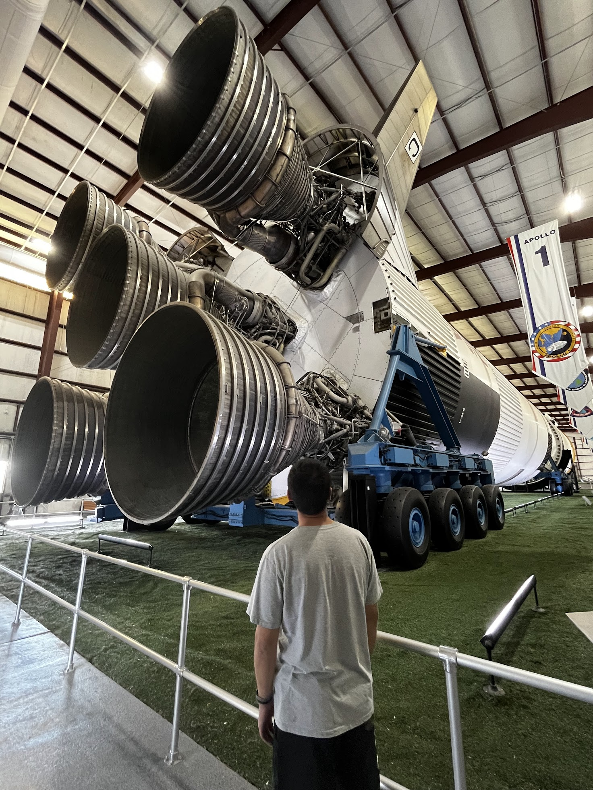

After that, we wandered through the exhibitions in the main building, which were quite entertaining to see. Some fun facts I learned include that the US sent up to four manned moon landings in a single year and that the US had its own space station, Skylab, following the Apollo Program. Some of the set scenes of those spacecraft were so amazing that I almost thought I was in space for a second.

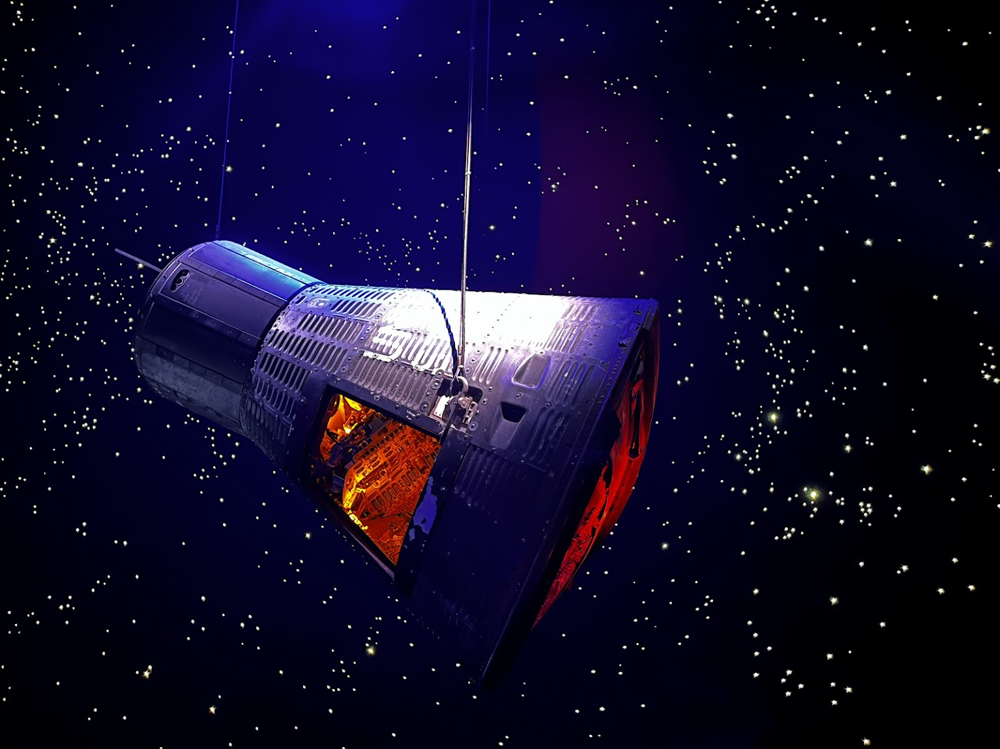

Lastly, we visited the SpaceX Falcon 9 first-stage rocket and an orbiter carrier Boeing 747 in the park, which are examples of what would have seemed like absolutely impossible human inventions. I was surprised that every deck, from the Boeing 747 to the space shuttle, was all accessible to walk in. Seeing the sophisticated control panels and the Canadarm inside the shuttle was pretty cool.

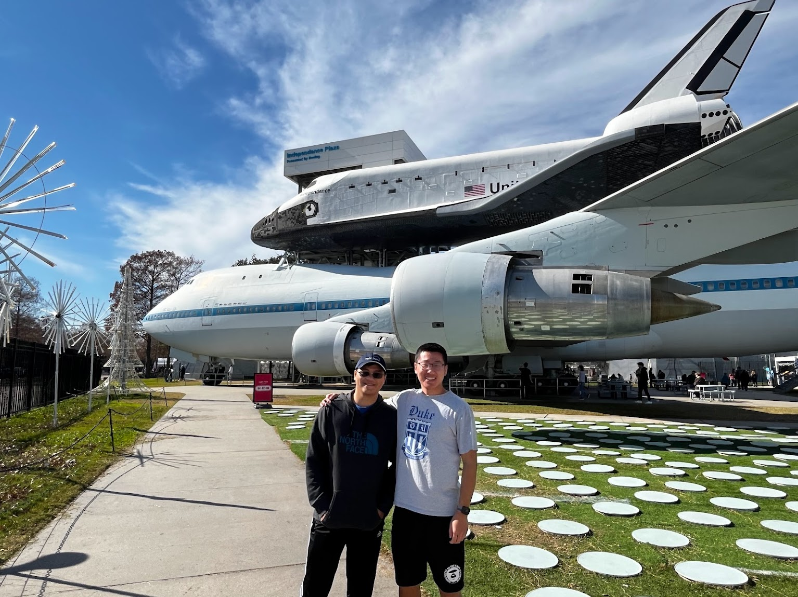

## Galeveston

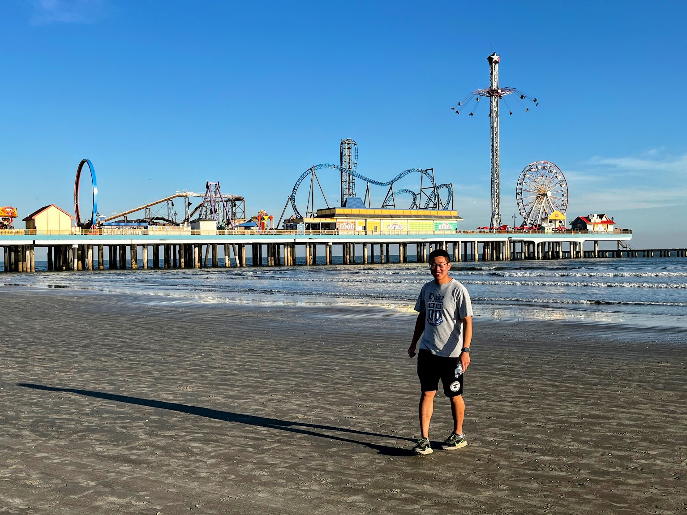

It's a pretty nice coastal city, about a 40-minute drive from Houston. We were able to walk around the boardwalk and Strand Street, which is historically famous. That's where I bought one of my favorite shirts. We also went to Moody Gardens, which was quite similar to the [Gaylord Hotel](/posts/2023-12-21-fort-worth/#ice-at-the-gaylord-texan) in Fort Worth. In general, it's a great tourist spot with a lot of beautiful historical buildings and resort-like entertainment.

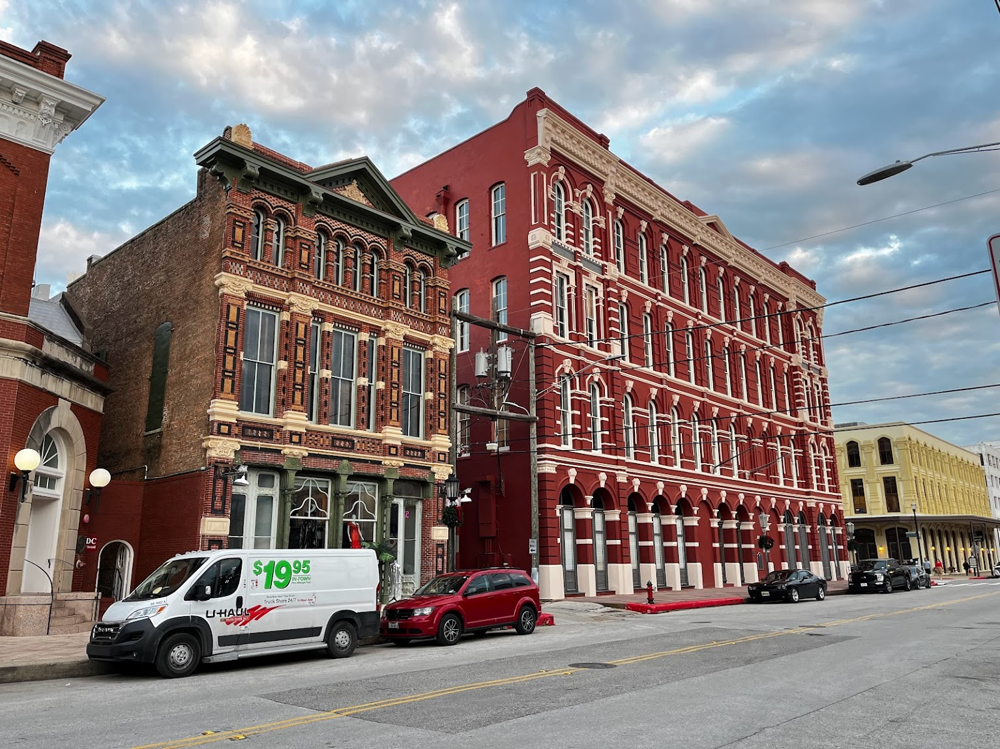

## Water Wall

It's another quick stop in the city of Houston, featuring a very beautiful water wall situated in a park. When I looked at the water flowing down the wall, I experienced a special moment of peacefulness in my mind.

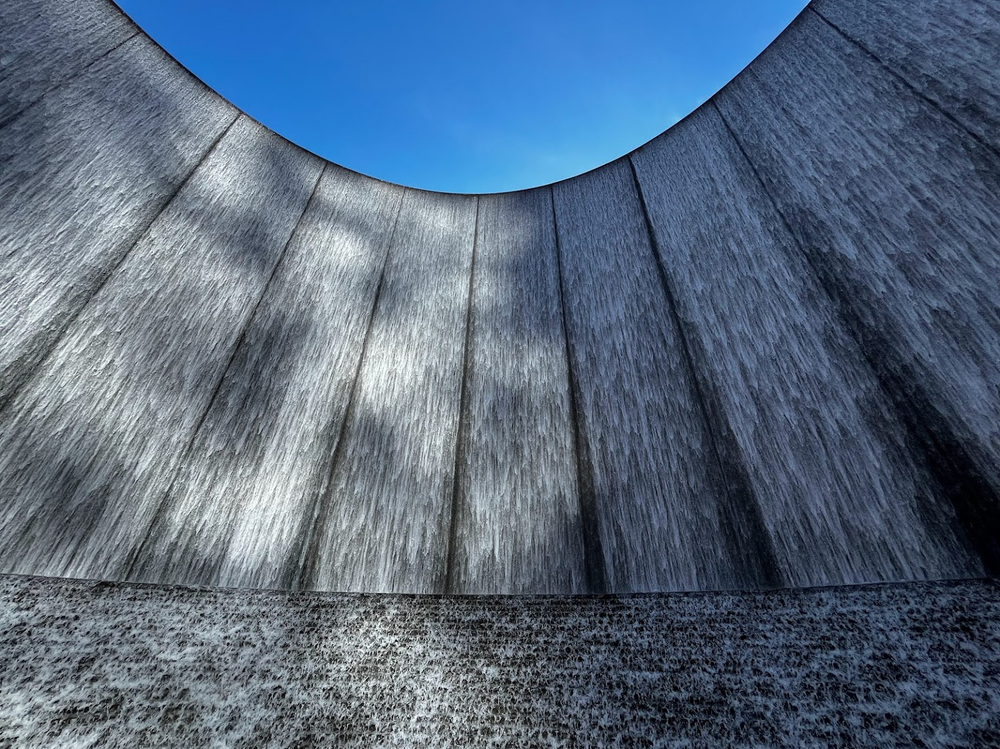

## Buc-ee's

Every Texan recommended that I visit this giant gas station, which has not hundreds but dozens of gas pumps in a single space, along with a general store. We stopped at one on our way back to Dallas from Houston. It is quintessentially Texas, and I loved the world-famous clean restrooms.

---

And here concludes the end of my epic [Texas road trip](/categories/texas-road-trip/). 
