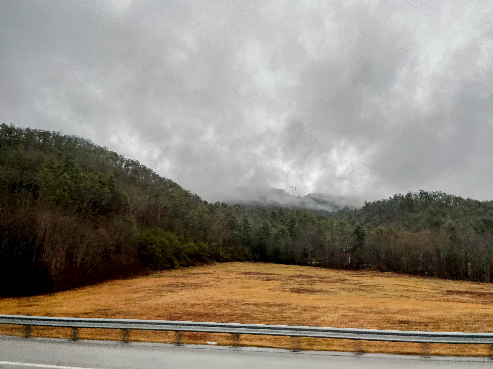
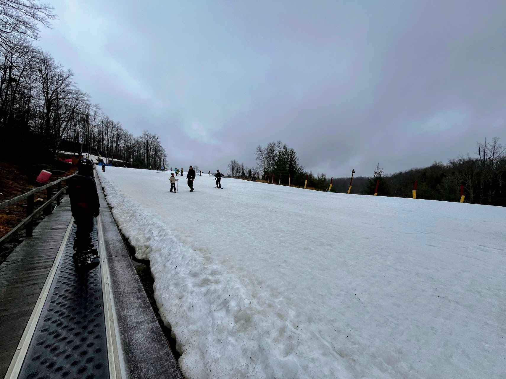
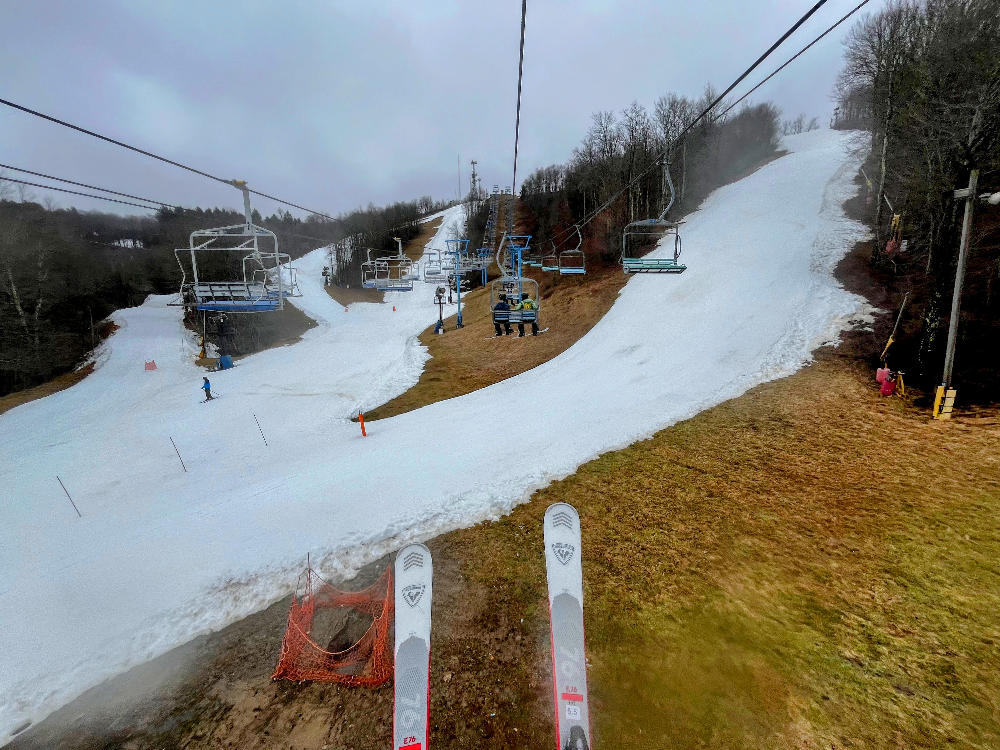
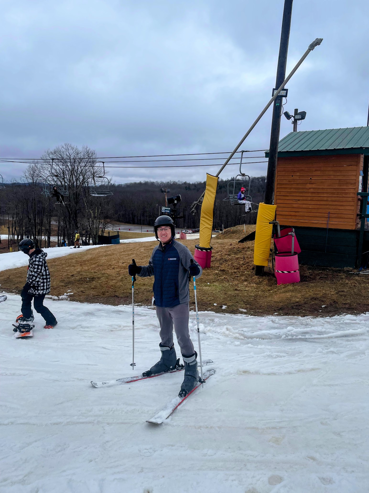

Almost Heaven, West Virginia~

Unexpectedly, I stumbled upon a link to a skiing day trip in the school's group chat. Despite not remembering the last time I skied, I decided to give it a try. Skiing, often considered an expensive sport, proved affordable this time—with the entire trip costing less than $200, including transportation and rentals. So, why not seize the opportunity for another adventure? Moreover, it was an opportunity to visit West Virginia, the last piece of the Take Me Home, Country Road puzzle I had yet to explore.

Admittedly, West Virginia does not enjoy the best reputation, and I've heard numerous negative stories about the state. Yet, when I mention my eagerness to visit West Virginia solely because of this song, it often surprises people. As a preview, I plan to visit the New River Gorge National Park during Fall break for a more comprehensive experience of West Virginia.

## Heading to the skiing resort at 6AM

The drive from Duke to WV, starting at 6AM, took approximately 3.5 hours. Despite the constant rain for most of the journey, the last 20 minutes offered a clear sky with clouds surrounding us. Our route passed through Greensboro, heading to West Virginia via I-77—a route I plan to take again when visiting the New River Gorge National Park this Fall break (although it's more than half a year away). Overall, the journey there was unremarkable, likely due to the poor weather, but the anticipation of revisiting this road in the future kept my spirits high.

An intriguing cultural phenomenon was the abundance of billboards along the highway, alternating between advertisements for gentlemen's clubs and proclamations that "Jesus is the way." This striking contrast highlighted a different America, just a few hours away from my usual surroundings. Throughout the trip, thoughts of moonshine also captivated me. Moonshine, the high-alcohol beverage illegally produced during the Prohibition era, has since become a symbol of West Virginia. Fortunately, by my next visit, I will be of legal age to taste this legendary moonshine.

## Learn how to ski

As I mentioned earlier, I had either forgotten how to ski or perhaps never truly learned. Thankfully, one of our trip leaders patiently taught us basic skiing techniques, such as braking and turning. Learning to ski evoked a similar feeling to ice skating, both requiring a shift in mindset from walking, alongside a touch of adventurous courage. After practicing for about an hour, I was excited and eager to begin skiing freely on my own.

The first green slope I tackled almost took my breath away because I was moving much faster than I could control. I narrowly avoided colliding with people too many times to count. Despite this, I thoroughly enjoyed the adrenaline rush.

## The adventure

After taking my first-ever lift to the top of the mountain, it was time for the adventure to begin. Throughout the experience, I was not in full control but continued to push myself. Honestly, there was no turning back since I couldn't stop and hadn't fully mastered braking, which nearly led to a dangerous situation in the end.

I began experimenting with more challenging trails until I encountered a black slope. The slope was far steeper than I anticipated, causing me to gain speed uncontrollably. Eventually, I lost my balance and fell, resulting in my skis and poles scattering as I tumbled down the hill at a terrifying speed.

The initial moments after regaining my footing and seeing all my equipment strewn across the slope were overwhelming. Thankfully, someone collected my belongings, for which I am profoundly grateful. The shock of the experience lingered for the remainder of my skiing trip. This was the first time I genuinely felt frightened by nature, surpassing even my experience [walking on the cliff](/posts/2023-03-11-zion-national-park.md/#angels-landing) in Zion National Park.

Before this incident, I had never really fallen, but afterward, I found myself falling repeatedly. To be honest, I might never attempt skiing again due to the close brush with serious injury.

Despite the scare, I tried something new and truly discovered my limits.
