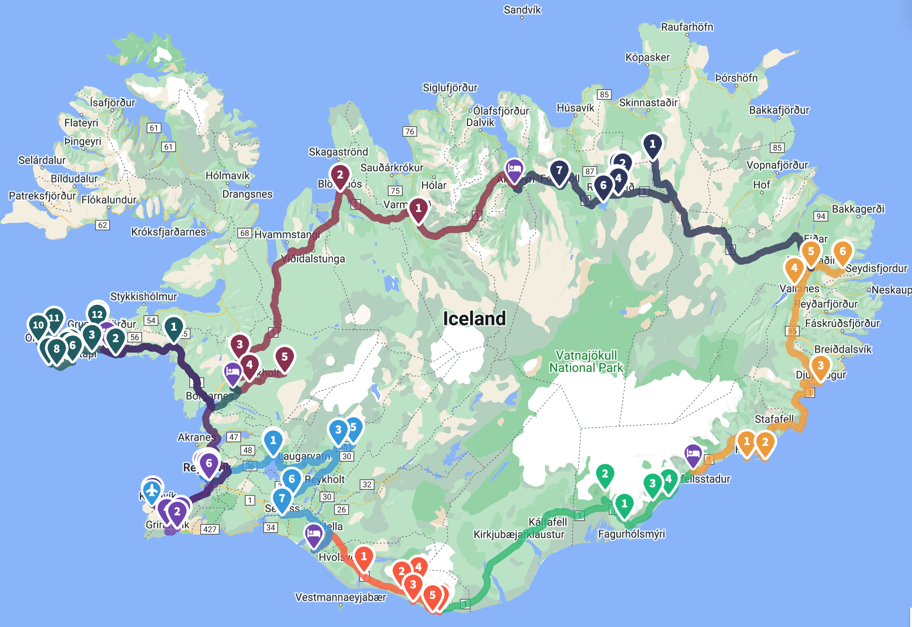
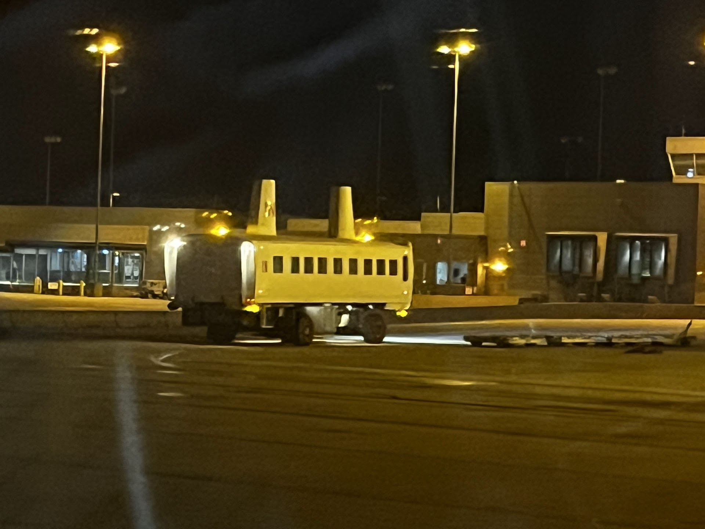
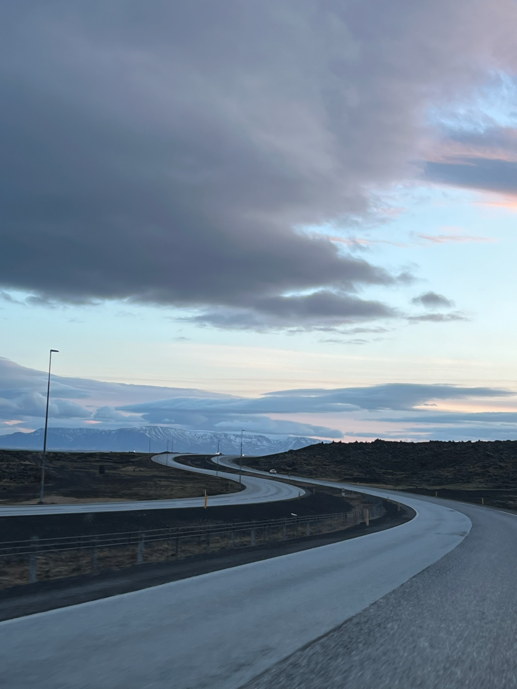
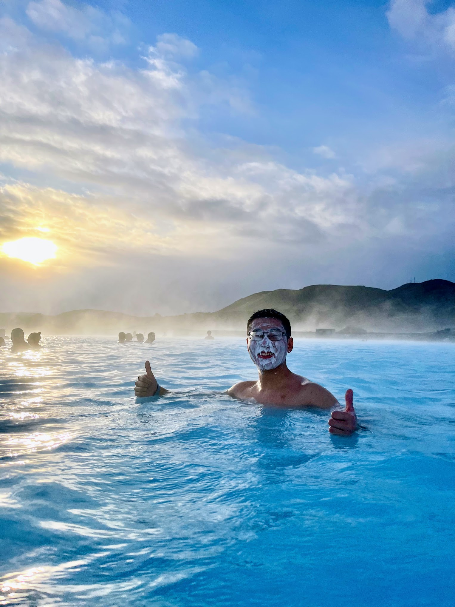
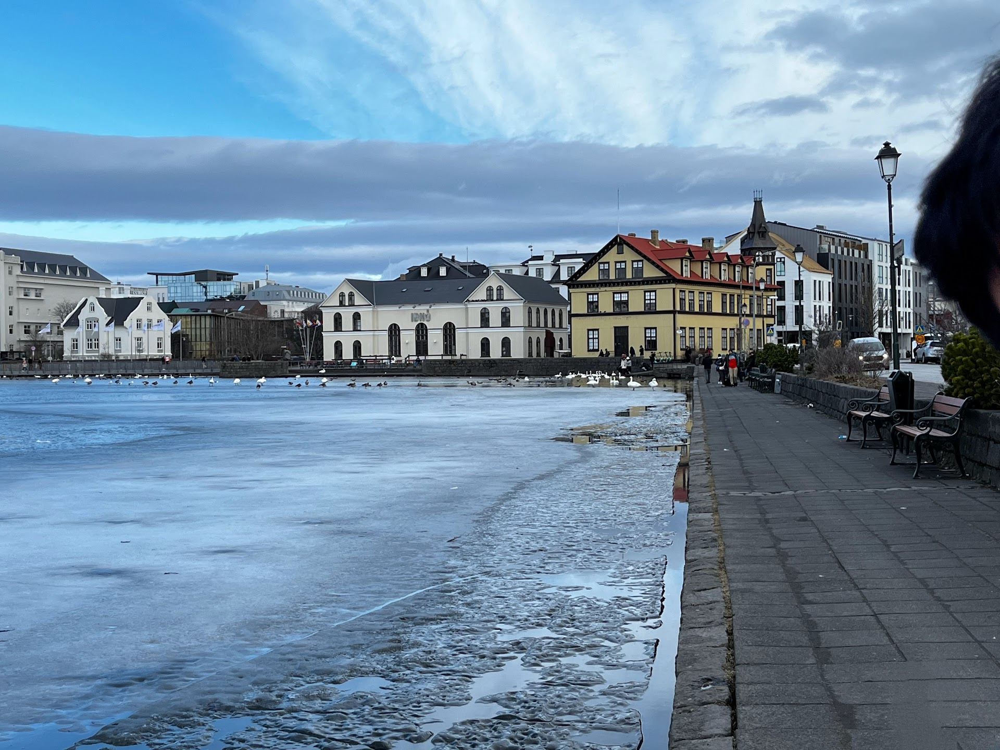
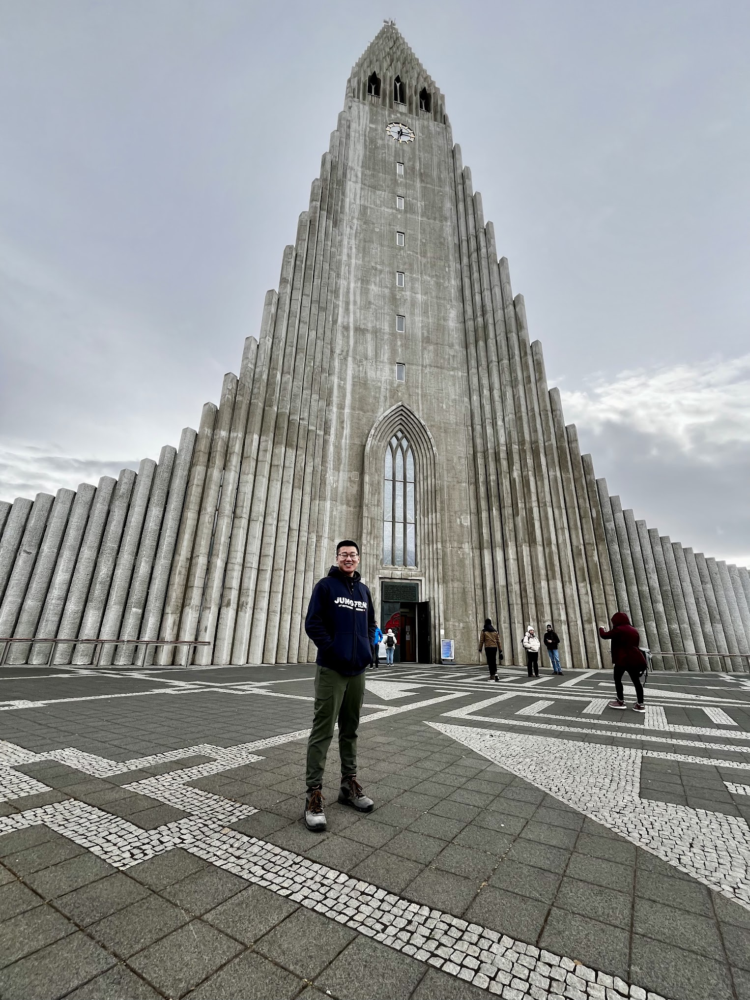
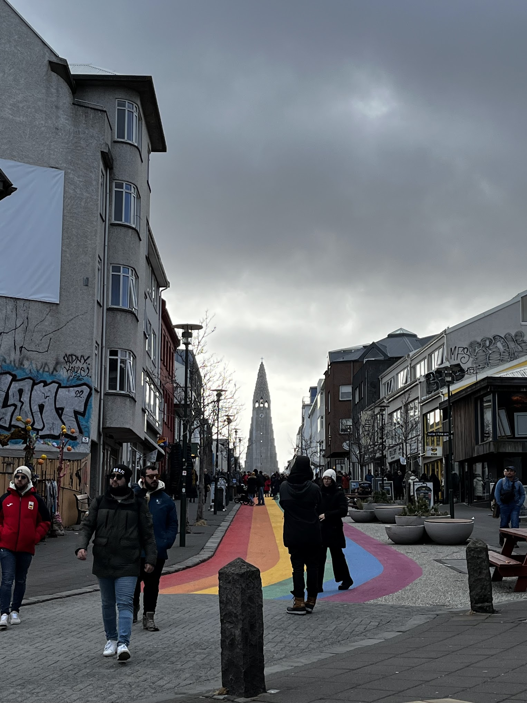
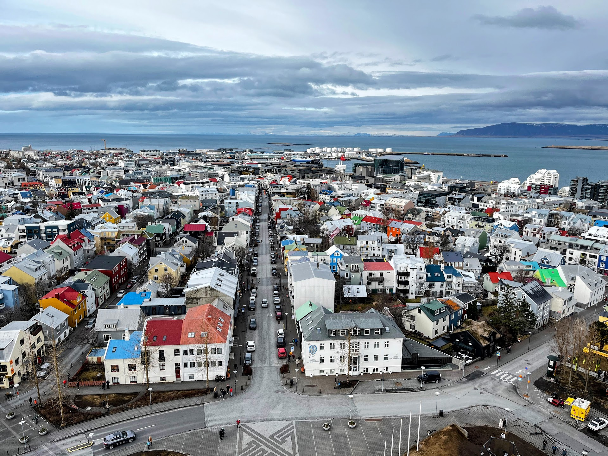
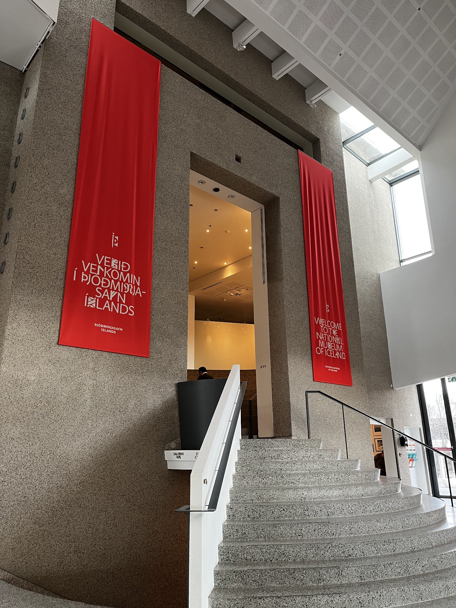
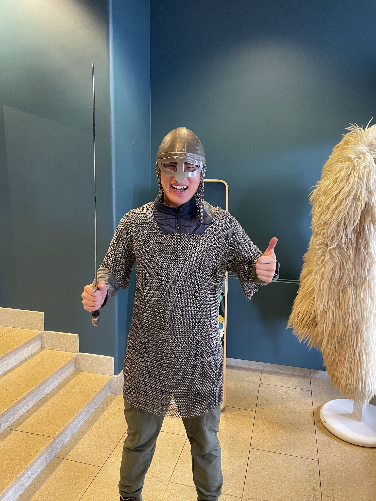

My first glimpse of a Nordic country and its culture.

## Why Iceland?

It's time for spring break again, and, of course, I have an ambitious plan to embark on, just like last year's journey to [6 national parks in a week](/posts/2023-03-11-zion-national-park.md/). Frankly, Iceland was never at the top of my bucket list since it's quite far and expensive compared to the many places in the US I haven't conquered yet.

Last December, a random conversation with a friend at Duke sparked this Iceland idea and turned it into reality quickly. It might be unusual for someone like me to ask people, "What's your spring break plan?" in December, but it works perfectly for me. It helps me recruit people for my trip and gives me ideas way ahead of time, as I am always an extreme early planner for travel—though only for travel. Otherwise, I'm just a typical guy struggling with academic deadlines.

***Get my full Icealnd itinerary [here](https://wanderlog.com/view/ykxamngmtu/iceland-itinerary/shared)***.

A week after talking to my friend about Iceland for the first time, I had planned out everything after spending an entire afternoon in Pitchforks during the "busy" final week of the semester. Another week later, I booked almost everything from lodging to car rentals to glacier hiking experiences.

So, in summary, I chose Iceland because of an inadvertent conversation with a friend, even though I had no idea what to expect besides "Oh, Iceland has great natural wonders."

## Fly to Reykjavik from DC

While we indeed booked everything ahead of time, we did not secure the most important thing—the flight ticket—solely because we thought it would become cheaper, which proved to be a disastrous decision. Consequently, we had to drive to DC for the flight and return to RDU on the return flight for the much cheaper price.

Fortunately, nothing unexpected happened on this short road trip, with just a bit of traffic. I was excited to see the Washington Dulles International Airport (IAD), which I had never visited before. It has quite interesting architecture, and the moment I saw almost every country's flag hanging at the terminal, I knew this was the legit capital airport of the US.

I liked the shuttle bus at the airport, which has an unworldly design with super high clearance and a bizarre, chimney-like roof. It is just as unworldly as everything we are going to see in Iceland, all reminiscent of something that could come from the movie "Interstellar."

## The volcano that erupts

Throughout the entire flight, I remained awake, as I have never been able to sleep on any flight, taking long-exposure pictures out of my window in hopes of catching a glimpse of the northern lights, which unfortunately didn't work out. However, I was extremely excited and couldn't be more clear-headed after the flight, despite having only 3 hours of sleep in the past 24 hours.

Driving in Iceland already felt otherworldly. My first impression was of a cold-toned, lifeless, and black-and-white world, which continued to be my primary impression of Iceland even after the trip. It's such a unique place, unlike anything I have experienced on Earth.

As we started heading to the volcano hike, which was supposed to be our first stop, a road closure stopped us, which made perfect sense as this volcano had just erupted days ago, even leading to a temporary closure of the airport. I was a bit upset about this, as I might have just missed my only chance to hike to a volcano in my lifetime. However, it turned out that everything upcoming was going to blow my mind, and the volcano didn't seem that cool anymore.

## Blue Lagoon

This is one of the top travel destinations in Iceland and also a highlight of my Iceland trip. Driving to the Blue Lagoon, located right next to the recently erupted volcano, we saw roads partially covered by fresh lava and volcanic ash. It felt like we were driving to the end of the world until gradually, human-made structures appeared, with a lot of steam rising into the air.

I knew the Blue Lagoon was blue, but I was not prepared for its crystal-clear hue. It was a breathtaking blue, a unique volcanic blue, reminiscent of another heavenly bright blue I saw in the [Jungfrau region in Switzerland](/2023-08-23-switzerland-jungfrau-region/#lungern). These are the top two blues that I believe only nature could create, far beyond human replication (not even Duke blue).

## Tjörnin

Tjörnin is a tranquil lake by the City Hall in Reykjavik. It was the first landmark we saw after parking near the lake and beginning our walk around the city. With a few pieces of floating ice on the surface and many swans wandering around, the peaceful vibe formed my initial impression of this small Nordic capital. Surprisingly, after our 8-day road trip around Iceland, when we returned to the same spot, the lake had completely thawed.

## Hallgrimskirkja

Another famous landmark of the city is Hallgrimskirkja, which I humorously like to call the "normal distribution church." Walking on a random street, I caught a glimpse of the church in my peripheral vision to my right. When I turned, I was struck by its magnificent and divine presence, especially how it blends into the city and the rainbow street. I couldn’t help but imagine being an Icelander decades or even centuries ago; seeing this colossal building for the first time would have made me believe in whatever it represents. The sheer epicness of this structure, demanding people to look up in awe, powerfully conveys the essence of divinity. There's no way your heart remains unaffected at the sight of this otherworldly church, at least for me. It truly feels like the end of the world, a place unlike any other.

My fascination with Icelandic churches grew with each visit. For this one, I had the opportunity to take an elevator to the top, above the clock, which offered a panoramic view of the peaceful capital. The houses below, in various colors yet not overwhelmingly so, showcased a beauty of restraint and minimalism.

## National Museum of Iceland

Ever since my [Europe road trip](/categories/europe-road-trip/), I've developed a fascination for museums as they are the way to learn about the history and culture, making my experiences more immersive. Looking at a picture of a place generates 10% excitement for me, being there gives 100% excitement, and knowing the background of the place makes it 200% worth it. This is why I visited the somewhat unpopular National Museum of Iceland. To me, visiting a museum is like devout believers going to church; it helps me understand the essence of nature and the place. It has become a ritual for me to visit a museum in every place I travel to.

The National Museum of Iceland is quite small for a national museum, which made more sense after I learned that the entire population of Iceland is roughly the same as Durham's, around 400,000. This fact astonished me, and I was impressed by how orderly this society operates.

Inside the museum, the exhibits date back to the first group of settlers on the island, the Vikings, and then introduce the history of being under the Norwegian kingdom, later Denmark, and finally becoming an independent country. I was intrigued by the fact that Iceland has the oldest parliament in human history, as the settlers did not want a king but preferred to maintain their territories as chieftains. Another interesting aspect is the religious history of Iceland, transitioning from Norse religion to Roman Catholicism and then to Lutheranism. An intriguing detail was how the hammer of Thor might also be interpreted as the cross of Christ in an ancient artifact, given their similar shapes. We even had the chance to try on the ancient armor of those chieftains, which was so heavy that I couldn’t put it on by myself.

