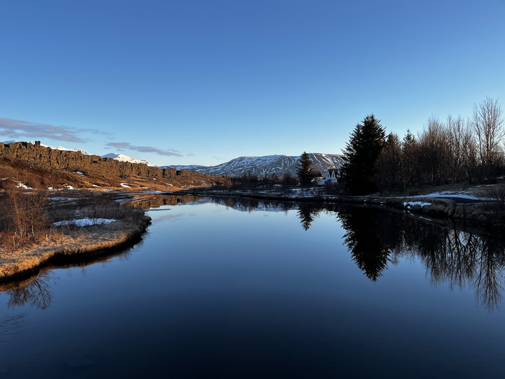

My 21st birthday on this iconic Golden Circle road in Iceland.

## Thingvellir National Park

This national park is part of the Atlantic Ocean ridge that runs through Iceland where a lot of incredible geological features can be founded. There are small canyons with multiple visible layers of rocks, glacier water formed lakes and the mountain covered in snow and pink when we drove here during the sunrise time. It's just another peaceful gift that Iceland granted us on a normal day morning. The pink hue on the snow mountains after mountains is definitely one of my favourite senerary in the entire trip.

## Snorkeling at Silfra Fissure

I had never gone snorkeling before and mistakenly thought it was akin to diving, treating it as something dangerous that required extensive guidance. To witness this natural marvel, the exact boundary between the North American and Eurasian tectonic plates, I prepared myself with a snorkeling mask with prescription lenses, purchased all the way from Amazon in the US, just to have a glimpse of this amazing geological wonder.

I was quite nervous before entering the water. We were encased in multiple layers of thermals and drysuits to prevent us from getting wet from the ice-cold glacier water. As I was still learning to breathe through the snorkeling mask, it was already time to jump into the water. Surprisingly, the dry suit helped me float, and I was relieved to realize that snorkeling merely involved floating on the water's surface.

I spent the entire time trying to keep my head down, facing the bottom, to fully absorb and remember this incredible moment. I could feel my heavy breathing, the ice-cold water on my face, my gloves filling with water, and the tranquility of the glacier water, making me feel as though I was not on Earth but rather alone in my mind or in heaven.

As I moved forward, I struggled to control my movement with the swim fins but managed to float forward with the water's flow. Soon, I saw the famous fissure that extends almost a hundred meters deep, perhaps leading to Earth's heart. It felt like I was in a physical time tunnel, with the fissures acting as markers of time that I floated by. The rocks, the clear blue water, and the small white unknown objects floating in the water all passed by me in this time tunnel, making me feel part of the continuum of time.

Toward the end, we saw another fissure that had opened due to an earthquake in 2008, which was astonishing. I watched people dive into the deep recesses of the fissure, exploring the depths of the unknown. Looking up at the surface with the sunshine filtering through, everything appeared surreal. Fortunately, at the end of the snorkeling trip, our guide helped me remove my mask and immersed me in the fresh glacier water, marking my birthday. That moment of clarity made me eager to swim more in the graceful glacier water, which I did several times in the following days. Each time felt like a divine baptism performed by the formidable nature God, and I couldn’t have been more grateful.

## Geysir

As a geothermally active island, Iceland is home to many geysers, similar to those I saw in [Yellowstone National Park](/posts/2023-06-18-yellowstone-national-park/#old-faithful-gesyer), albeit on a smaller scale. We witnessed an eruption of a major geyser called Strokkur, reminiscent of Old Faithful in Yellowstone. For a moment, I even thought I was back in Yellowstone.

## Gullfoss Falls

It was the first major waterfall we saw in Iceland. The grand scale of this waterfall reminded me of [Niagara Falls](/posts/2023-01-08-from-toronto-to-cancun.md/#niagara-falls) on the border of the US and Canada. You could feel the water vapor on your face even from a high-up viewing platform. Moreover, we saw many rainbows near this waterfall, a phenomenon that proved to be common at most waterfalls in Iceland. Rainbows became a casual, everyday sight in this area, something I could never have imagined before. I am pretty sure that I saw more rainbows in Iceland than in the rest of my life combined.

## Kerid Crater

It's probably not the first crater I've seen, but definitely the first frozen crater lake. It resembled a small egg at the center, with varying degrees of frozenness. I really wanted to swim there, but the road down to the center was closed due to the ice cover.

## Selfoss

"Foss" in Icelandic does mean waterfall, but this time it also referred to a charming little town, our last stop on the famous Golden Circle road. To celebrate my birthday, we dined at a fancy restaurant that served traditional seafood.

A humorous incident occurred while we were strolling around this small town, which had just one main road. We tried to order ice cream at a famous local shop. As we waited, it seemed there was no line. Instead, staff would call out numbers in Icelandic, and people with those numbers would go to the counter to order. The four of us, "four idiots," completely overlooked the number machine at the entrance and waited in a nonexistent line with confusion for almost half an hour before realizing our mistake. I walked out of the shop, deciding never to return. So if you are going to any icecream shops here, please pay attention to the number machine haha.

After dinner, we crossed the street to admire a beautiful Icelandic Lutheran church by the river. We didn't realize at the time, but it was our last clear night sky in Iceland.
