Rainbow and waterfalls becomes the least rare thing on this land.

## Seljalandsfoss

We continued our journey west along the south coast of Iceland, and our first stop today was the Seljalandsfoss waterfall. Despite the abundance of waterfalls in Iceland, I never tire of them, as each has distinctive features. I would describe these waterfalls as the capillaries of this land: abundant yet crucial. They constantly remind me of the divine craftsmanship of this terrain.

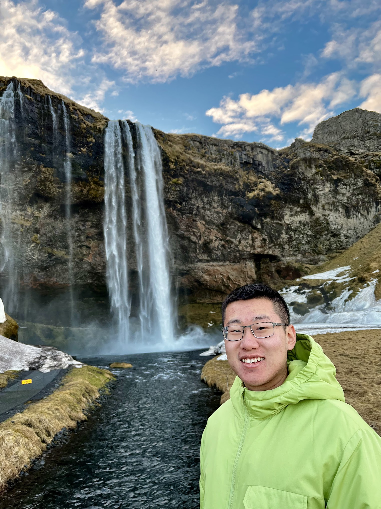

Another aspect of waterfalls is their breathtaking presence when experienced in person. The sensation of the air, the water vapor, and the roaring waterfall is incomparable to viewing a live photo on your iPhone. I contemplated the extensive journey the water, likely from glaciers, had undertaken to reach this accessible point where countless people gather to admire and revere it. Such a journey for the water is arduous yet honorable.

I didn't grasp the true uniqueness of this waterfall until we reached the end of the trail, where another hidden cascade came into view. It was akin to the scene in 桃花源记 where a narrow passage leads to a whole new world. My adventurous spirit was unleashed here, sneaking into the heart of the waterfall after navigating the rocks of a small stream.

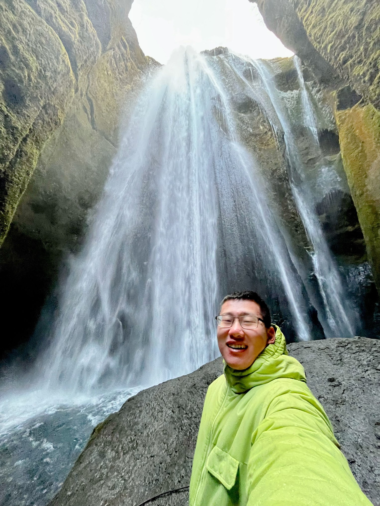

Standing just a few feet from the waterfall left me speechless. Gazing upward at the water plummeting from where the light originates, I felt the insignificance of myself and humanity in a world brimming with such marvels. Listening to the roar, feeling the water vapor drenching my face and clothes, I felt like a child touched by the goodness of nature.

## Skógafoss

We encountered another spectacular waterfall that left us in awe. Beside the waterfall, we saw a full rainbow, not just one but two. Walking on the black sand beach towards the waterfall felt like opening a book, with the rainbow on the left page and the waterfall on the right. However, unlike a book, this scene was real and dynamic, embodying the magic of nature. Rainbows became such a common sight that we almost saw them at every waterfall and elsewhere. 

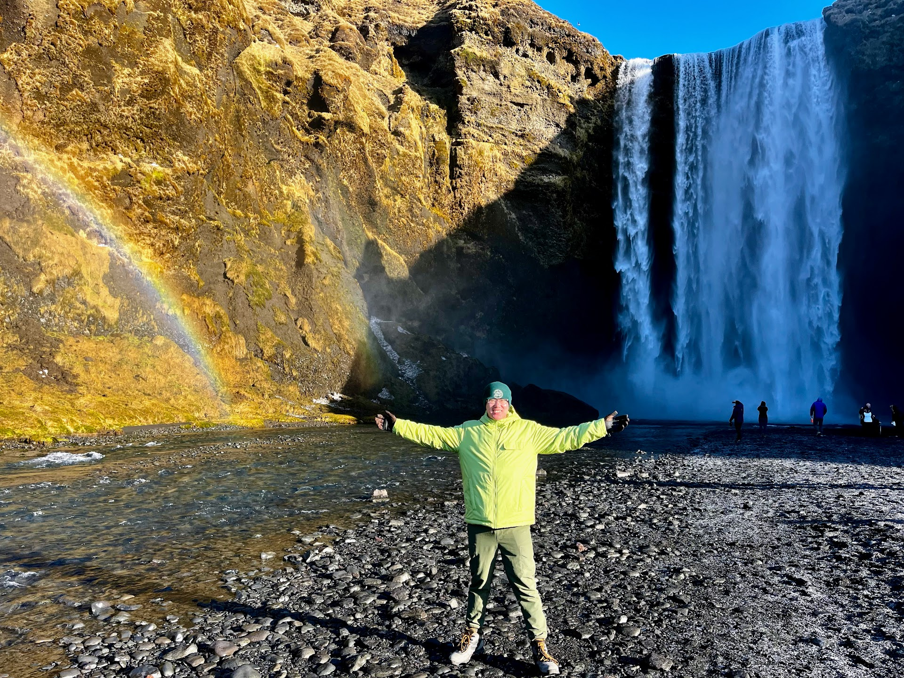

Here, a rainbow is no longer just a lifeless optical phenomenon; it becomes a playful creature engaging in hide and seek with us. They exist in this magnificent kingdom, with or without human admiration. Standing just a few feet from the waterfall, I could vividly discern every layer of the rainbow's colors and its formation, making it seem like a real entity, far beyond a mere light effect.

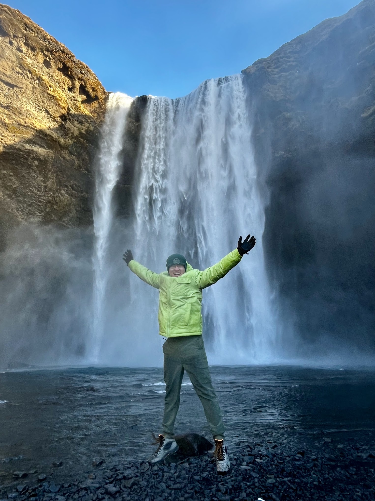

Approaching the waterfall, the familiar sensation of water vapor and the roaring sound enveloped me. It was simply amazing, and I couldn't resist capturing photos of myself jumping, as if dancing with the water in celebration of its long journey.

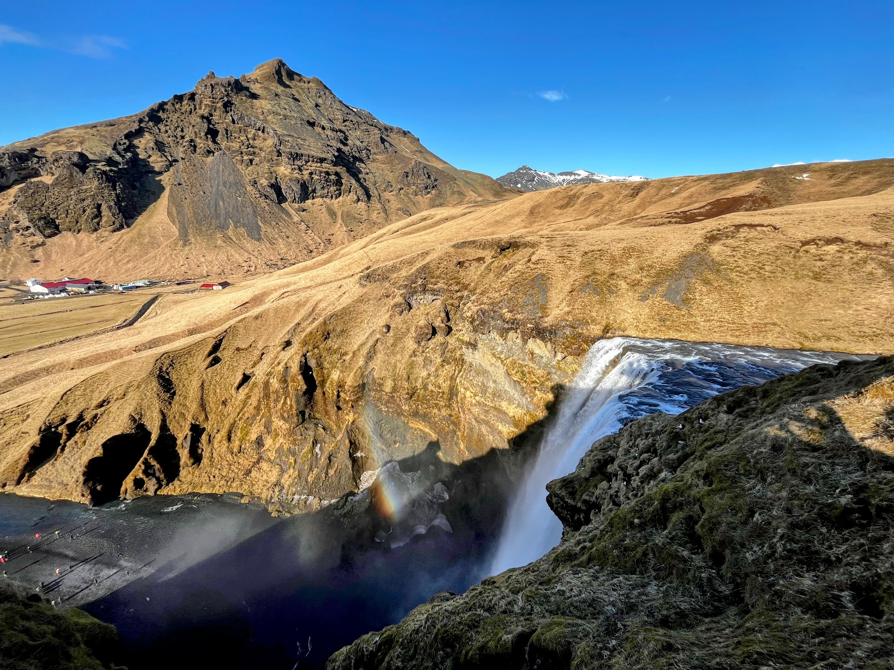

We later climbed along the trail to a platform behind the waterfall, where we could still see the rainbow. Rainbows are truly naughty creatures that followed us.

## Drangurinn in Drangshlíð

This was a stop we hadn't planned, but we knew we had to make it because of a peculiar rock standing alongside a human habitation site when we quickly drove by. I am glad we turned around and returned here because I have never seen anything like it in my life. An ancient house is hidden and enveloped by the rock, as if the rock is the holy protector of this household. The house literally has half of its roof outside, while the other half is just the rock. We saw cowsheds, gardens, and storage rooms, and I couldn't imagine people living here centuries ago.

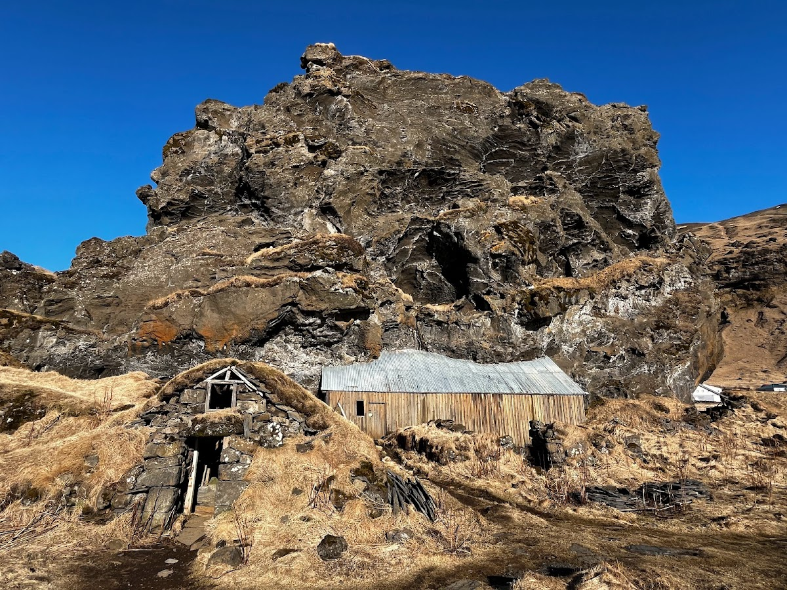

It turned out to be not only a home for humans but also for animals, with many seagulls making their homes in the countless holes on the surface of this giant rock. These seagulls were calling, flying in and out, as if they were proud of this rock. Contemplating the hundreds of generations of seagulls and dozens of generations of people living under this single rock was an epic realization for me.

## Sólheimajökull

We finally arrived at the source of those waterfalls, a massive glacier that stretches to the coast. After witnessing various forms of glaciers over the past few days, we got the chance to see one up close, serving as an appetizer for our glacier hiking journey the following day.

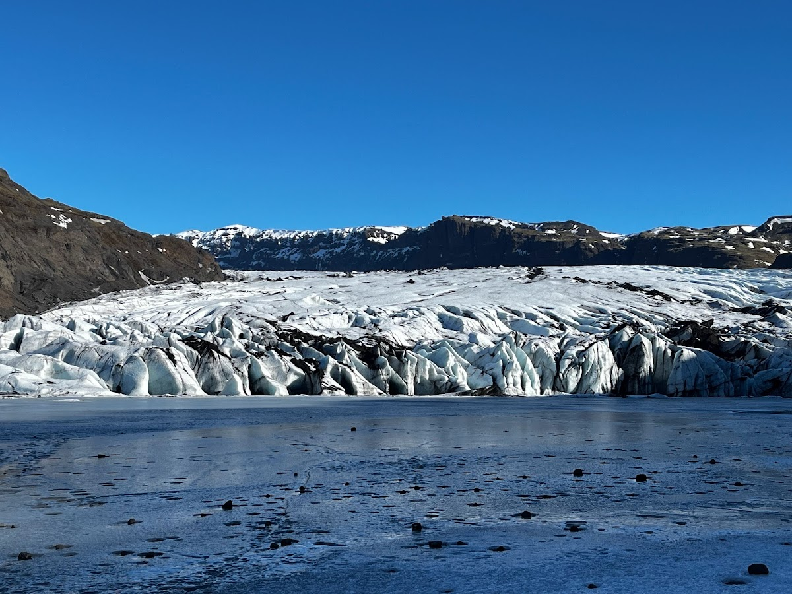

An easy hike with the glacier gradually dominating my view filled me with awe at nature's magic once again. The glacier is just like the sharp teeth of mythical beasts in Norse mythology, dynamically advancing toward the sea. The glacier was not just pure white and blue but also interspersed with black, highlighting the sharpness of the monster's fangs. As we stepped onto the frozen lake in front of the glacier, I was apprehensive about the possibility of a sudden crack leading us into a deep embrace with the glacier water.

## Dyrhólaey Viewpoint

Here we saw a purely black beach winding along the bay. The wind was so strong that I could barely hold my phone steady. Nature was roaring, and the seawave and waterfall are definitely all its descendants.

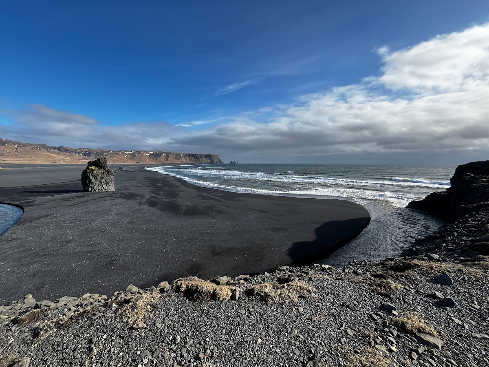

## Reynisfjara Black Sand Beach

I would never have believed something like this existed on Earth. Apart from the purely black sand beach, there was an interesting rock formation on a large rock by the beach, resembling a 3D hologram, which also inspired the design of [Hallgrimskirkja church](/posts/2024-03-09-reykjavik/#hallgrimskirkja) in Reykjavik.

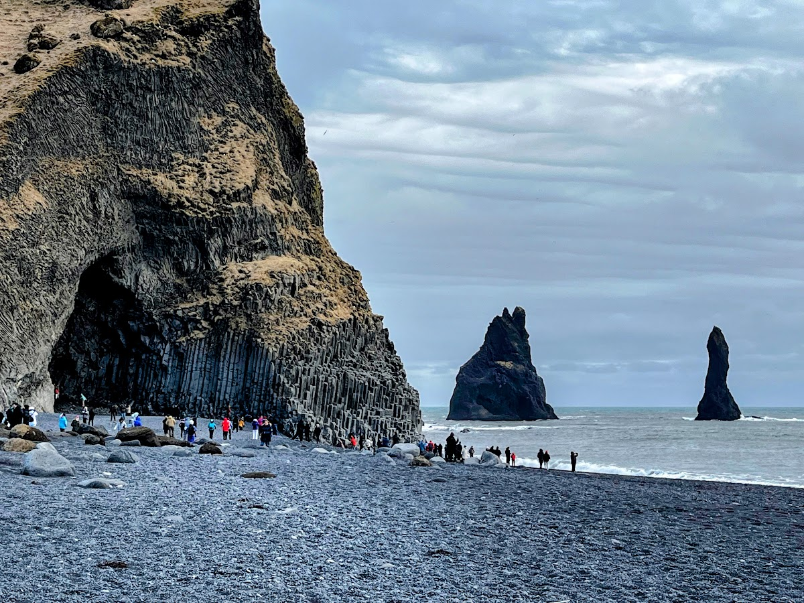

Moreover, the peculiar large basalt columns standing in the middle of the sea resembled a king and queen, protecting the coast from the roaring sea monster. Climbing to the tip of these intriguing formations and looking out at the sea and the two rocks, it's no wonder people would both revere and fear nature. This experience was simply amazing beyond words.

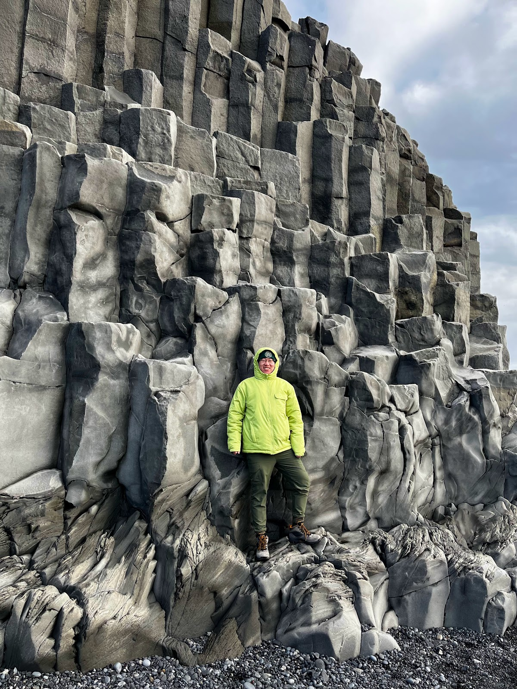

## Reyniskirkja Church

A classic Icelandic Lutheran church stood by the road. Had I been among the first settlers of Iceland, after witnessing the amazing black sand beach and the basalt column rocks resembling a goddess, the first thing I would have wanted to do is probably build a church, worshiping the powerfulness of nature. There's nothing else that could explain such amazing formations here.

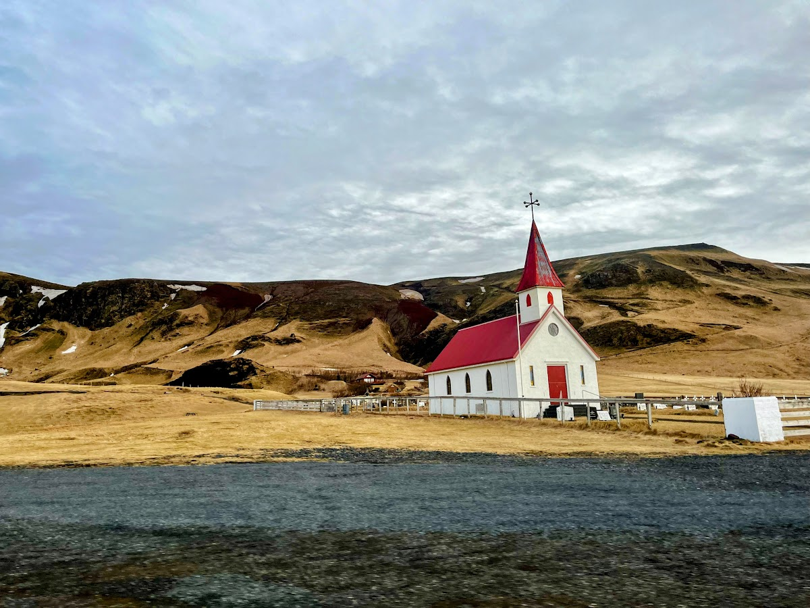
