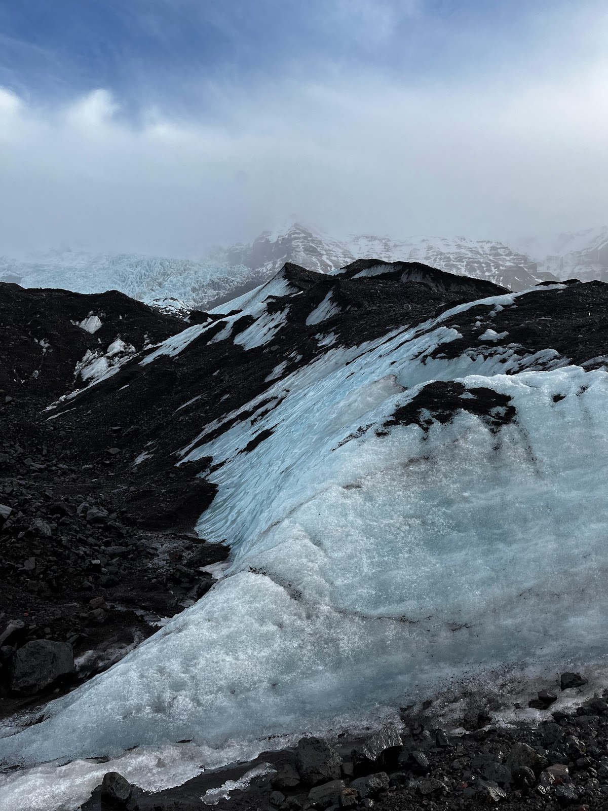
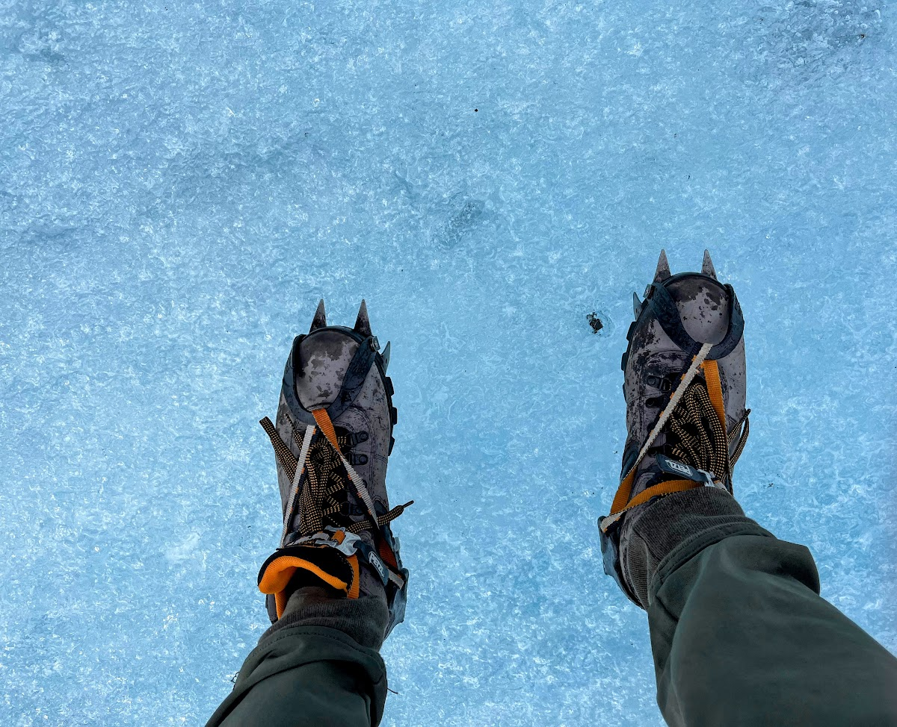
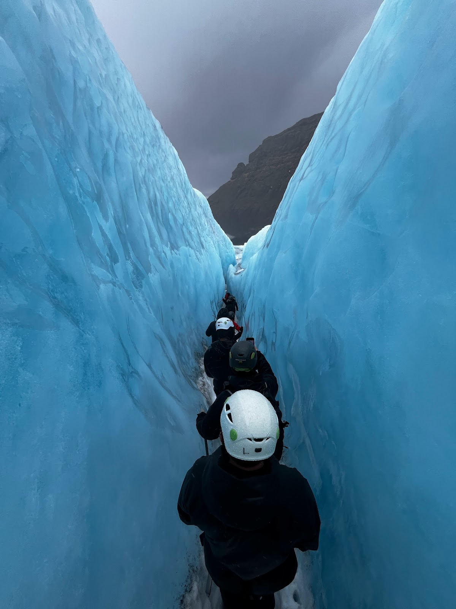
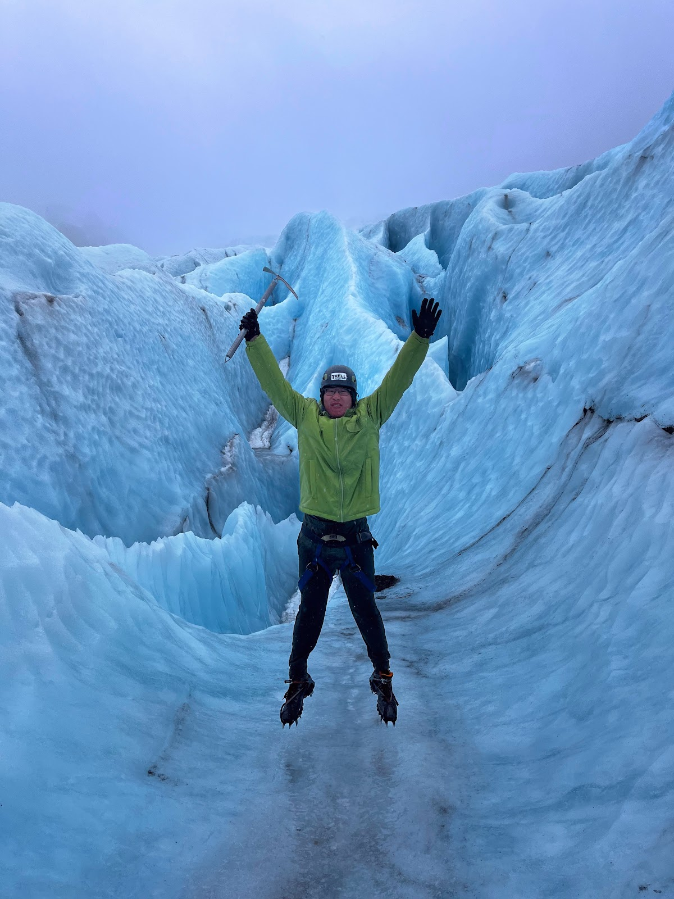
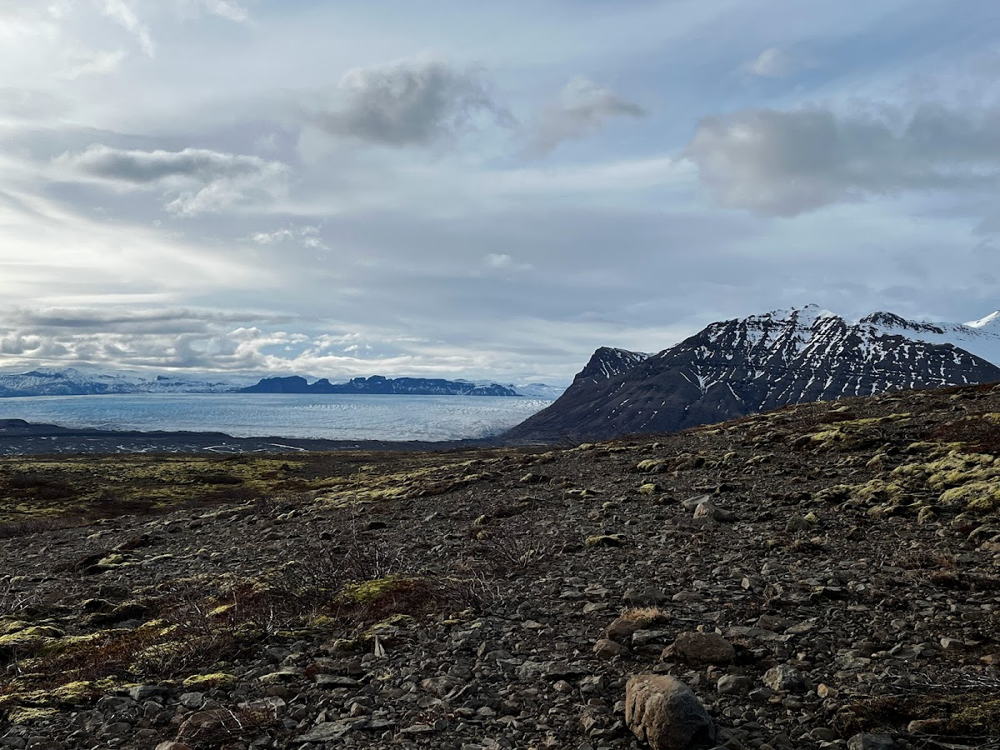
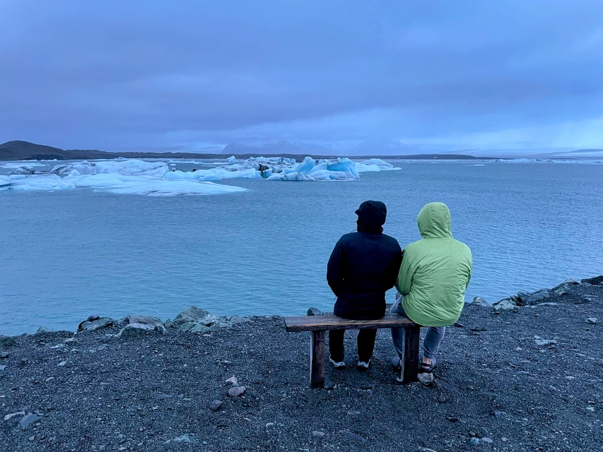

Today was a movie, Interstellar specifically.

Where should I start? There have been so many "Oh My Goodness" moments today that have totally blown my mind. I could never believe there was such a place on Earth with the geological features we have seen today. It was truly like a movie, constantly reminding me of the desolate glaciers on that remote planet in the movie Interstellar.

## Glacier Hiking

I could never have imagined that one day I would hike on an actual glacier, but we made it today. Glacier hiking requires us to be accompanied by a tour group, which was quite expensive but absolutely worth it. We had to wake up super early, as the meetup point for our tour was a 2-hour drive away. On the way there, we saw countless waterfalls again, and to our surprise, the landscape started turning greenish and [Grand Canyon-like](/posts/2023-03-16-grand-canyon-national-park.md/), with giant rocks formed in the middle of nowhere.

Arriving almost late, we made it to the meetup point while other people were already geared up with all the necessary equipment such as special crampons and ice axes. We could literally see the glacier we were going to, surrounded by the mountains. It was like we were a worshipping group, heading to the deepest heart of this untouched, pure land.

After hopping on a giant bus with super high clearance, which almost felt like an XXL version of a Mars rover, we arrived at a parking lot where the trail starts. Our guide told us that a few decades ago, the glacier was right next to this parking lot, while nowadays we have to hike a bit to get there. The glacier is alive and retreating. After waterfalls, glaciers are another thing I believe are not lifeless here. They move and they are sacred.

After hiking around 10 minutes, the vista suddenly widened to reveal a vast black sand beach in front of us by a half-frozen glacier lake (I suppose that's how to call it). A random Jeep parked right in the scene felt bizarre, as you wouldn't expect to see a Jeep in a movie like "Interstellar." This truly felt like the end of the world. Nobody thought we were still on Earth anymore.

Starting from here, we put on our actual crampons and helmets, heading onto the glacier. There were a few little hills we were hiking on, which were purely black until I tried to break it with my pick, realizing it was glacier and ice under it. I could tell the little blue within the ice. I acted like a kid who found a priceless treasure, which I truly was.

Nevertheless, this small piece of priceless treasure I found by no means could compare to what we were about to see 10 minutes later after hiking up and down across these black hills. The real vast land of the glacier suddenly presented itself in its most amazing and beautiful appearance, without any hides.

It was raining constantly while the wind was roaring. It was like a symphony that nature performed to welcome us to this unworldly land. I still could not believe that I was standing on a glacier formed millions of years ago. Deep down there, it held millions of years of Earth's history, just like annual rings on a tree cross-section.

Continuing our hike, we reached the spiky part of the glacier. There were countless small peaks above the surface, creating small glacier valleys and blue ice caves. I was totally speechless while hiking on these ridges. 

Even the colors were perfect, the light blue and white, where you couldn't tell where one ended and the other began. This is a color only nature possesses. This is the heavenly color. We were even able to lick the surface while walking into the valley. Probably one of the purest waters I have ever had in my life.

Just being here, hearing the wind roar, and feeling my shoes and pants soaking wet still felt amazing. The sound between my crampons and the ice surface was the most unique sound I had heard in a long time. Everything was perfect here.

## Blue Ice Cave

As part of our tour, we descended from the glacier and entered one of the black hills from where we initially started, which harbored a hidden giant blue ice cave. It was pitch dark as we walked downhill until we were stopped by a fence. While I was trying to ask our tour guide how we could go deeper, I turned back and saw one of the most amazing sights of my life: a cave crack emitting a heavenly blue color. This was the tunnel we had come through, and it left me absolutely speechless. Just looking at how pure and blue the ice was made me appreciate nature so much.

## Return from Glacier
I thought it would be pretty much the same scene on our way back from the glacier, as it was the exact same route. However, I underestimated the mastery of the God of nature once again. As the clouds dissipated and the sun emerged, I suddenly noticed the greenish vegetation surrounding our trail. It wasn't a complete green cover but rather like delicate embellishments scattered across the ground, as if nature had carefully placed each one. Glancing back, I was greeted by a colossal, vibrant rainbow. It stood proudly at the entrance to the glacier, a majestic gateway to another world, a portal to the heavens. I believe the glacier was bidding us farewell, enlisting the help of the rainbow to create an unforgettable moment of awe and wonder.

## Skaftafell

It's showtime for another waterfall, of course, another unique and equally astonishing one. There's something special about this one: it was the first place I swam in Iceland, in freezing cold water. This was my baptism in the wonderland of Iceland.

It was a short hike, during which I wore Crocs since my 'waterproof' boots were all wet from the glacier hike. This gave me a lot of confidence to dive into the water, but definitely not for walking on ice and snow to get to the waterfall.

After getting a view of the waterfall, I found it uniquely fascinating, with rock structures similar to those we had seen the previous day at [Reynisfjara Black Sand Beach](/posts/2024-03-11-south-coast/#reynisfjara-black-sand-beach).

While preparing for the water, another group of tourists kindly asked us to stay away from the waterfall so they could take pictures from the high view platform. Of course, we said yes, while I waited for my chance, feeling a bit nervous as I believed this was definitely the coldest water I had ever been in.

After they left, it was my time. I quickly stripped and dived into the water, trying to embrace this sacred flow. I didn’t have time to mentally prepare; the best time to go in was right then, which proved correct. The water was so cold that I couldn't feel my body, especially my feet and hands, upon entering.

I swam closer to the waterfall, receiving my baptism from it, which may even have originated from the glacier I had just hiked.

I quickly got out as the cold was unbearable. The air temperature, where everyone else was wearing down jackets, felt warm to me. I breathed heavily and quickly to regain my body heat. But I never regretted doing this; instead, I regret not staying longer. It was an experience that allows me to tell people I swam there whenever they show me pictures of this iconic Icelandic waterfall covered in snow.

On the way back from the waterfall to the parking lot, we chose a different path that led us to an overview of the surrounding mountains. Something that appeared to be an ocean caught my eye, but it was too white to be part of the ocean, even if frozen. It didn’t take me long to realize that it was a vast glacier extending from the mountains. I simply couldn't describe how spectacular it was in words.

## Diamond Beach

This is another iconic spot in Iceland, where large chunks of ice are scattered across the beach. The contrast between the purity of the ice and the darkness of the sand creates a surreal, otherworldly scene. It's as if these ice pieces were accidentally left here by a divine hand.

## Jökulsárlón

Adjacent to Diamond Beach is the place where glaciers flow into the ocean. It was also the first time I ever saw an iceberg in my life. Despite the imperfect weather and the approaching sunset, I was still able to sit on a bench by the lake, admiring the seals and the iceberg, and even watching the iceberg move. I couldn't be happier today.

