Best views are on the road.

Today was much more relaxed as we ventured into the less-touristy zone along Iceland's east coast, where numerous fjords are located. Many of the sights we encountered today were unplanned and spontaneous. This land never ceases to amaze us, even when we have no specific purpose or designated destination in mind. Iceland effortlessly transforms every location into a dream destination that any person would yearn for.

For example, the small church adjacent to our guesthouse last night was a classic Icelandic Lutheran church. Its simplicity and unique charm made it a beautiful and sacred sight to behold. The church's understated elegance perfectly encapsulated the essence of Iceland's spiritual architecture.

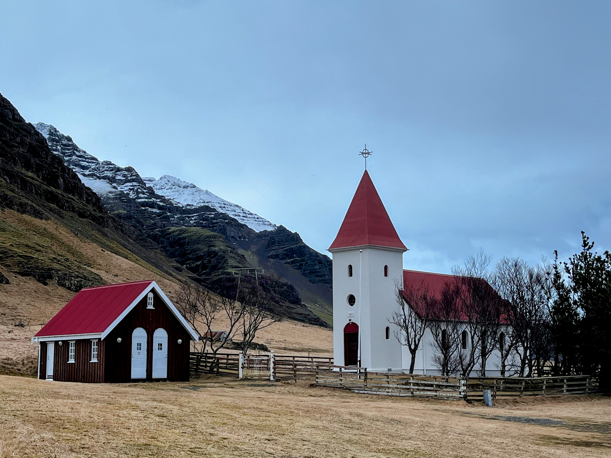

## Höfn

Höfn is a small port city situated on the southeast coast of Iceland, its name literally translating to "port" in Icelandic. While there weren't any specific tourist attractions in the area, we had the opportunity to drive to the tip of the coast, which provided a breathtaking view of the ocean and the snow-capped mountains in the background. The juxtaposition of the tranquil harbor and the majestic, snow-covered peaks created a scene that seemed to belong in a dream.

Having set off from our Airbnb early in the morning, we arrived in the town when it was still quiet and peaceful. Small boats and fishing vessels were neatly parked alongside the harbor, adding to the charm of this quaint fishing town. It's the kind of place that often features in people's fantasies – a serene escape from the hustle and bustle of modern life.

Iceland is one of the rare places on Earth where you can witness the captivating combination of snow-capped mountains and a harbor in the same vista. While this might be an unusual sight elsewhere, in Iceland, it becomes a normal part of the country's stunning landscape.

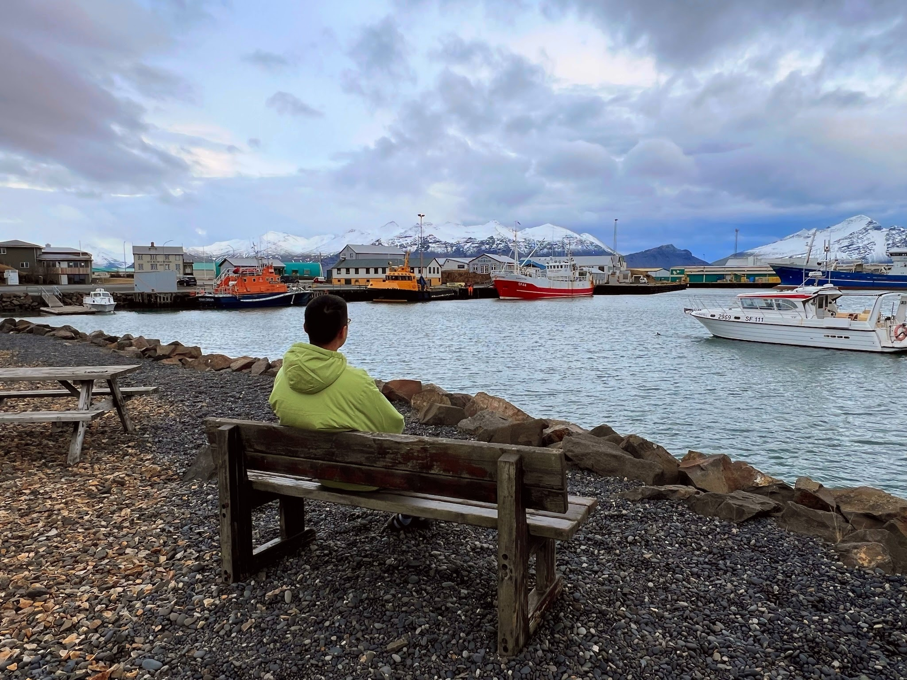

## Stokksnes

We continued driving east until we reached another fjord, which offered a magnificent view of a black mountain capped with snow.

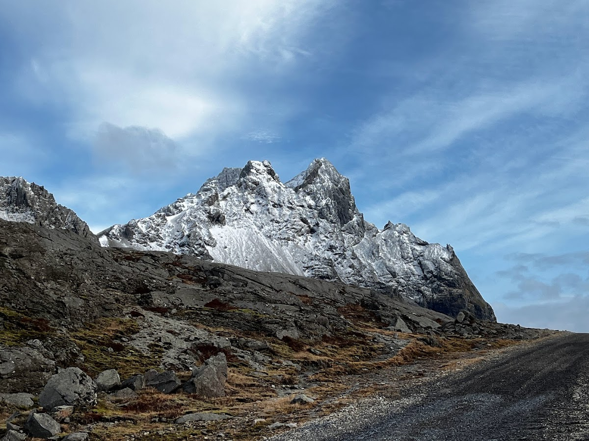

Driving on the gravel road here was quite an experience; it felt like I was driving through a time tunnel to the Stone Age, surrounded by the bizarre landscape.

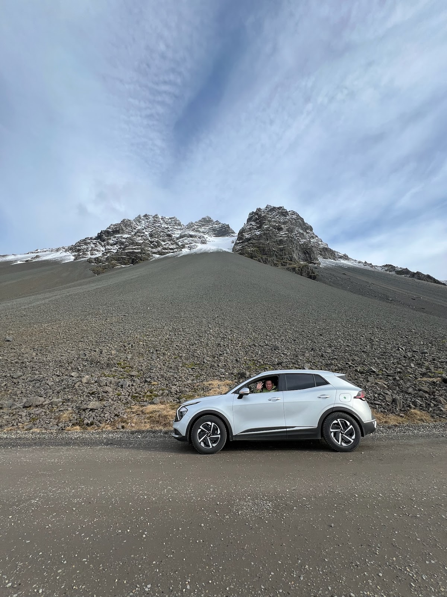

## Skútafoss

This was another spontaneous stop we decided to try. While driving by, we noticed a waterfall cascading down the middle of a snow-capped mountain, resembling a celestial water bridge leading to heaven.

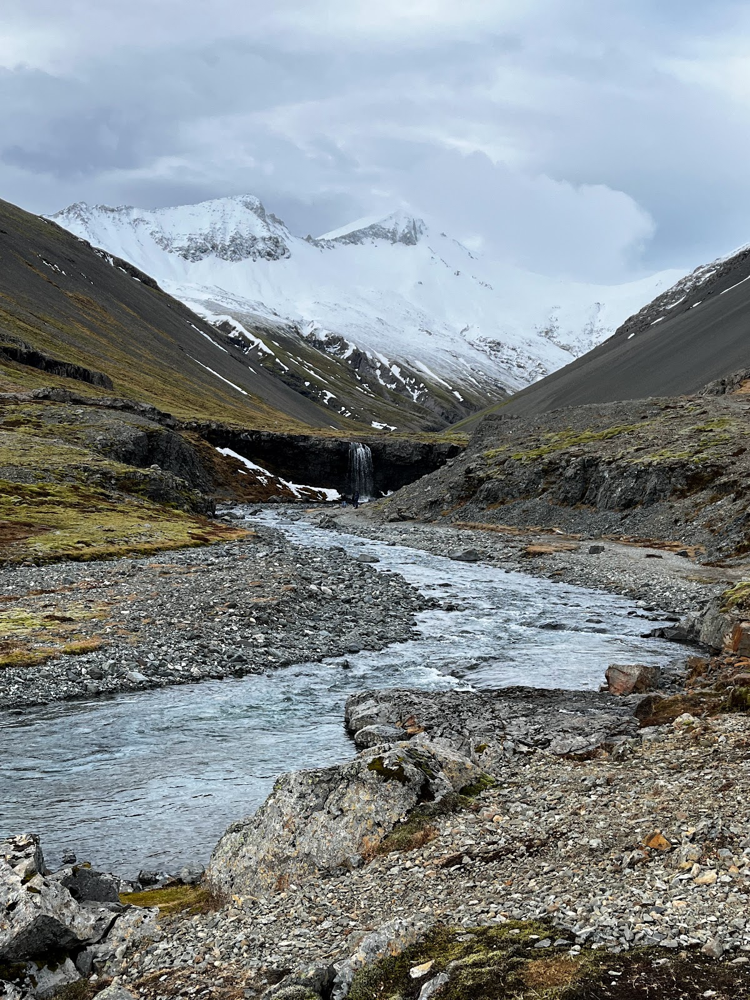

After a short 10-minute walk, waterfalls appeared one after another. Reaching the end, I was astonished by a pair of waterfalls, roaring and standing like guardians at the gateway to the mountainous heaven. The wind was so strong it nearly blew us away, as if the Nature God was hesitant to let us explore this untouched beauty — a temptation I couldn't resist. The double waterfall was mesmerizing, and walking behind it to see the water splashing down was an amazing experience, intensifying the sound and revealing the falls' vibrant life force.

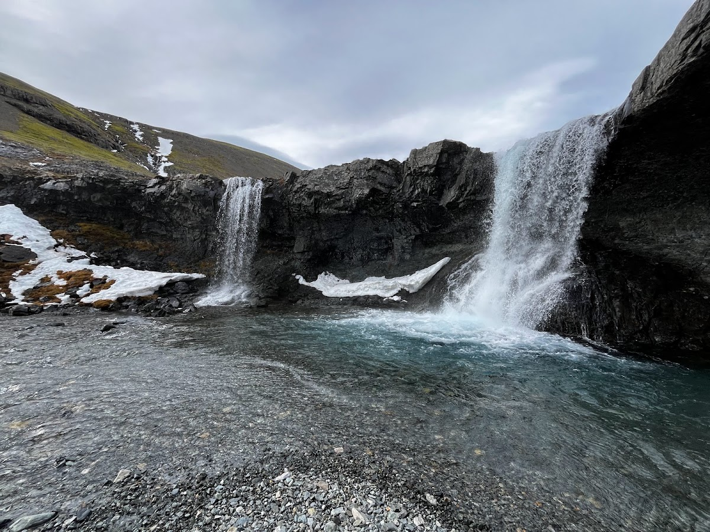

The urge to dive into the water returned. My ritual was not yet complete. After yesterday's brief encounter with an Icelandic waterfall, I longed to delve deeper into this land's beauty. Despite the many photographers capturing the falls from every angle, I stripped down and jumped in, embracing the heavenly guardians.

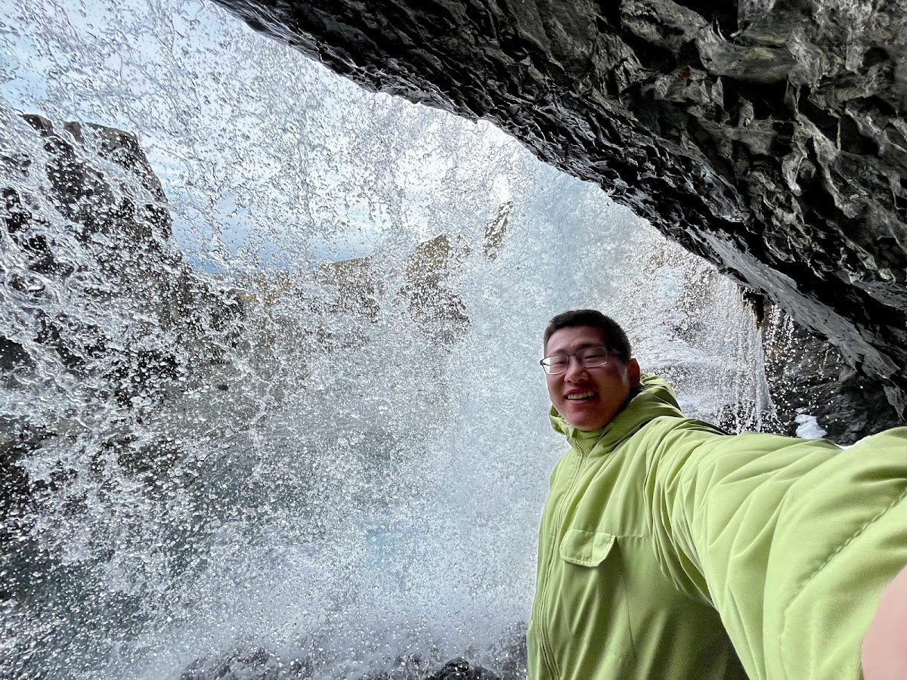

The water was as cold as the day before, but it felt mentally warmer due to my prior exposure. The pool below the falls was crystal clear, its turquoise hue reminiscent of [Emerald Lake in Rocky Mountain National Park](/posts/2023-07-04-rocky-mountain-national-park/#nymph-dream-and-emerald-lake-trail), a color that seemed otherworldly.

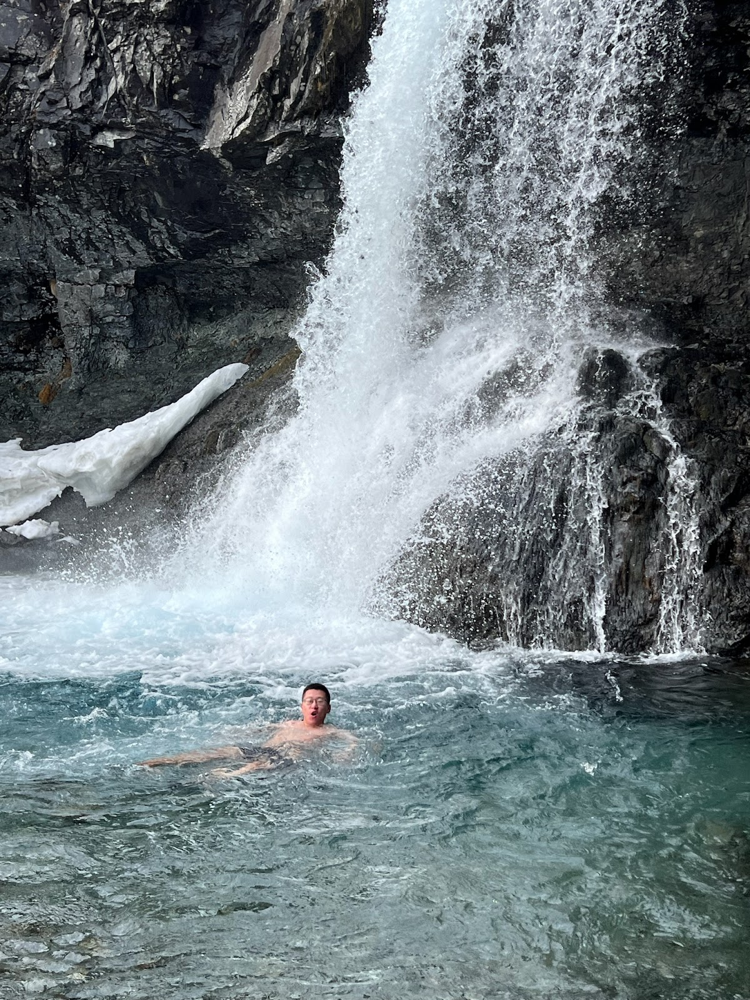

I swam several laps, fully immersing myself in the sacred waters. The cold numbed my senses, yet I felt more alive and aware than ever, my mind flooded with vivid memories. For a moment, I felt as if I were in heaven. This experience was truly a baptism for me.

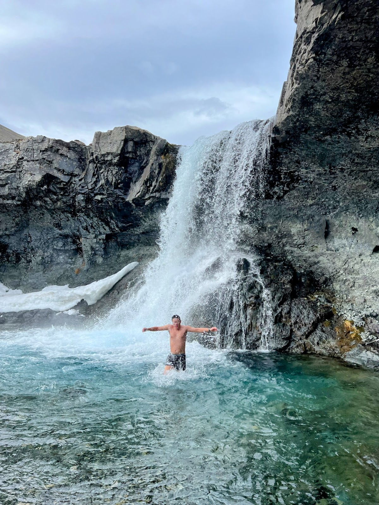

## Icelandic Horse

On the road, we came across a farm where dozens of Icelandic horses were grazing. We stopped, hoping they would come closer to us, as a fence separated us. To our surprise, they all started running towards us. They had beautiful manes that made them look very handsome. Moreover, they were very docile, stretching their heads over the fence so we could touch them. They were simply adorable.

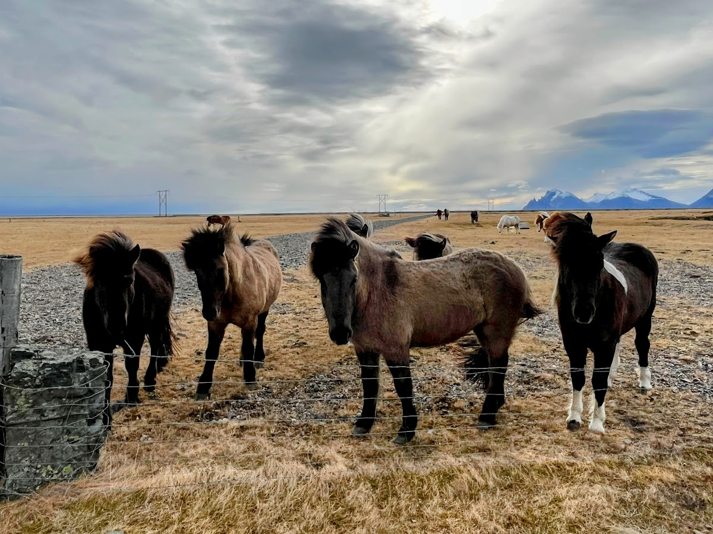

## Lækjavik

I had to pull over to take in the amazing view of the ocean. This place is truly a wonderland, rendered in black and white, reminiscent of the waves on the [Puerto Rican coast](/posts/2023-11-26-puerto-rico/#castillo-san-felipe-del-morro) but in monochrome. Driving along the coast was consistently astonishing, every second filled with awe. I couldn’t be more appreciative of this natural beauty.

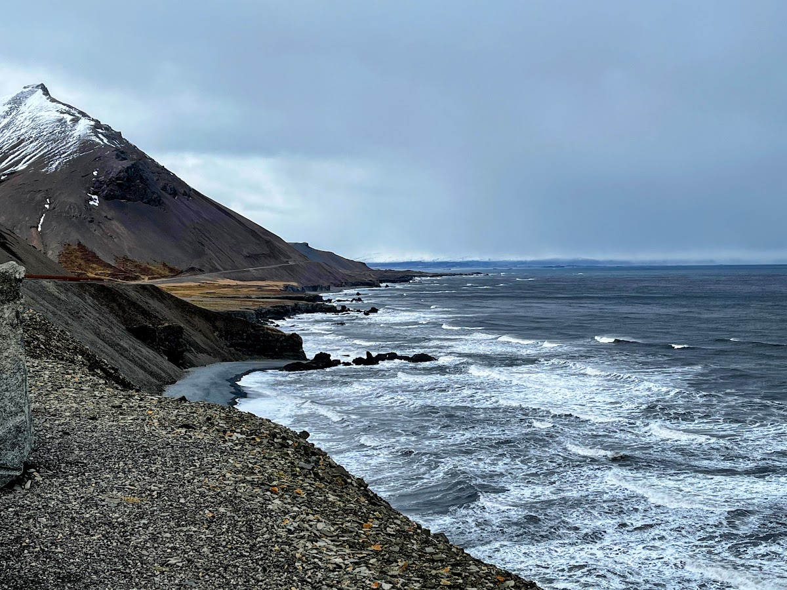

## Djúpivogur

We stopped for gas in another small town, where a snow-capped mountain loomed in the distance, resembling a pyramid as we drove towards it. This pyramid-shaped mountain felt like the Patron Saint of the little town.

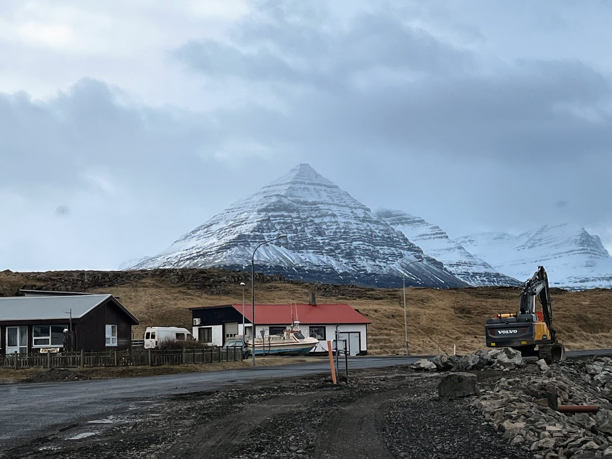

## Tunnel to Winter Wonderland

Shortly after passing by Mountain Pyramid, we encountered our first tunnel in Iceland. As we approached the other end of the tunnel, I anticipated a change in scenery, and I was not disappointed in the slightest. What awaited us on the other side was a completely transformed landscape, as if we had stepped into a different world.

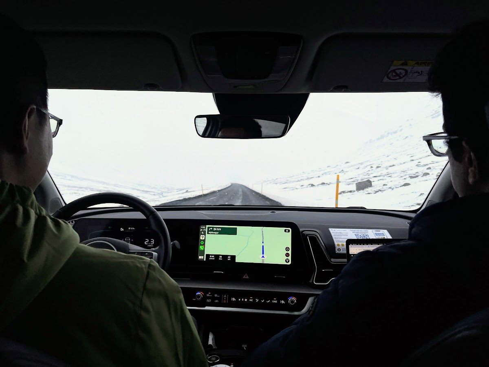

The lush greenery that had adorned the ground mere moments ago had vanished, replaced by an all-encompassing blanket of white. Snow began to fall, creating a stark contrast against the black road that stretched out before us. It felt as though we were driving on a path that led straight to heaven, a surreal and ethereal experience.

Excitement filled my heart as I cautiously navigated the road, with visibility reduced to less than 50 feet in some sections. The sudden change in weather and landscape added an element of adventure to our journey, making every moment feel like a discovery.

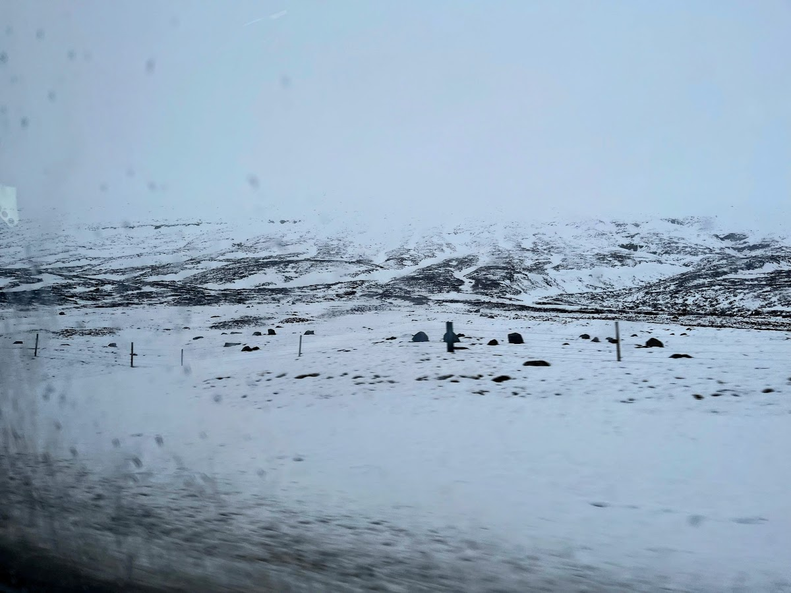

This dramatic shift in scenery also symbolized our entry into the northern part of Iceland – a region even less touched by human influence, a land that seemed to hold an even greater sense of holiness and tranquility. As we drove through this winter wonderland, everything around us exuded an atmosphere of peace and serenity.

When we arrived at our Airbnb house by the ocean, everything seemed even more surreal. It was in the middle of nowhere, with nothing but a house and a cemetery in its backyard. The only thing we had was a hug by the ocean, formed millions upon millions of years ago. At night, the ocean seemed awake, roaring with the wind in our dreams.

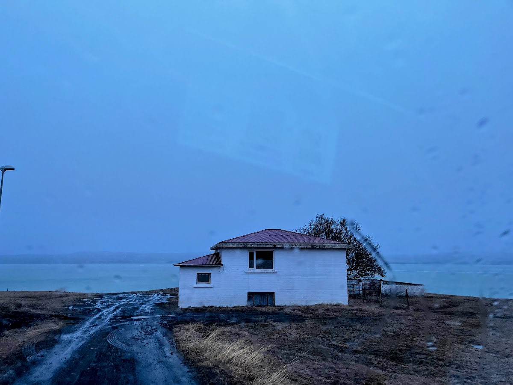
