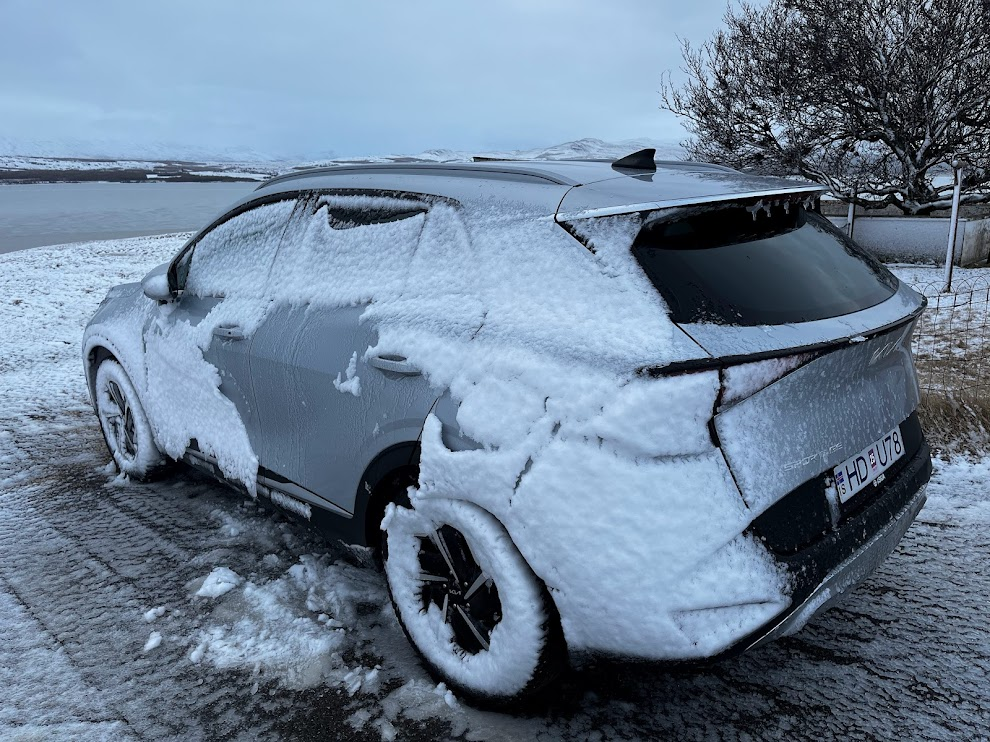
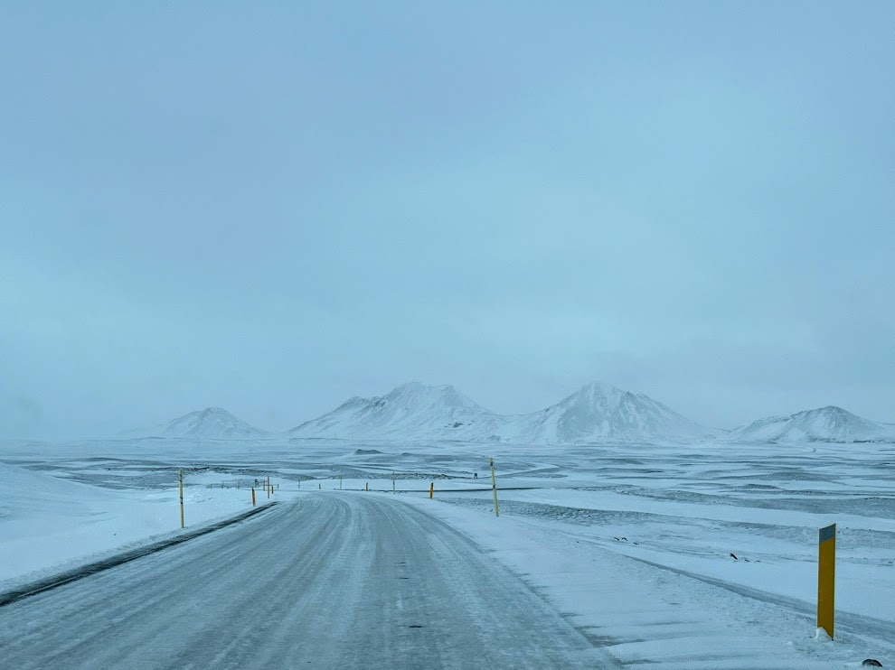
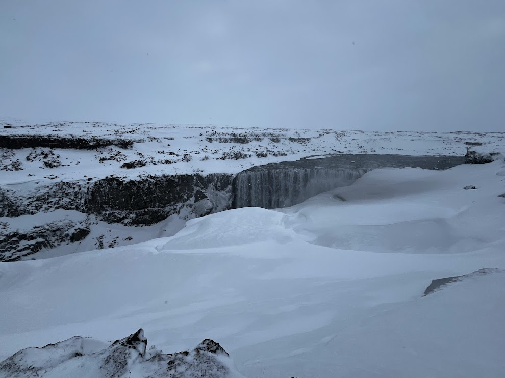
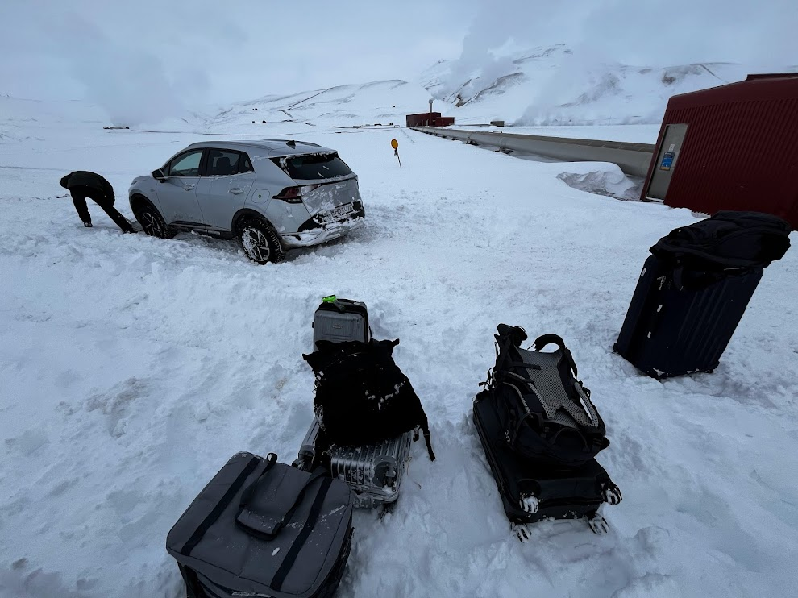
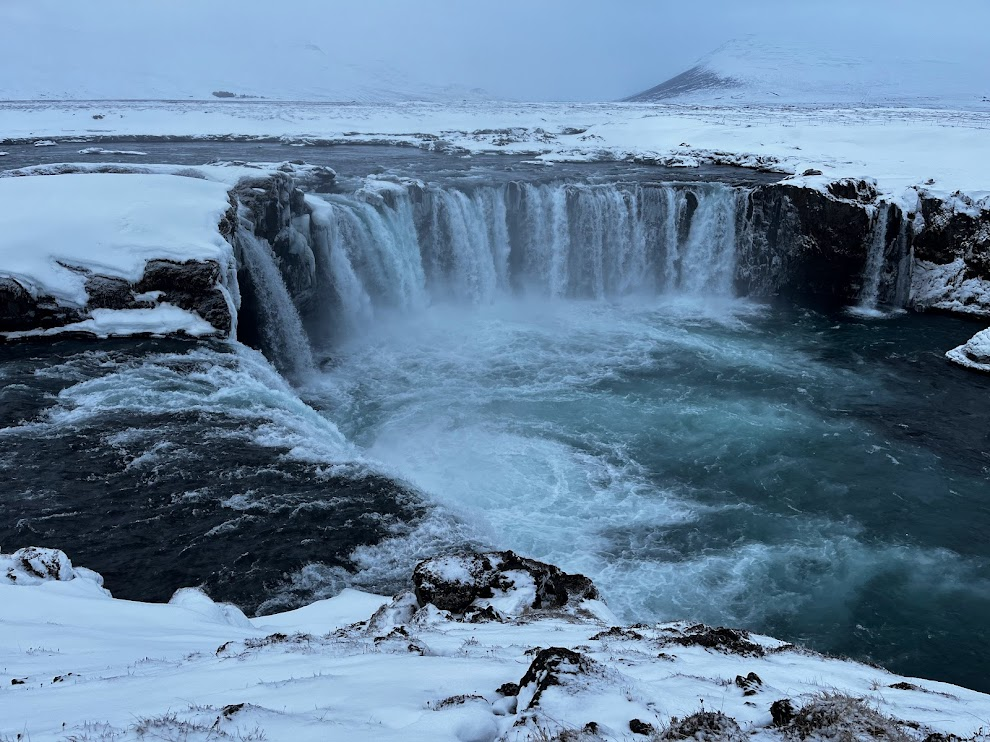
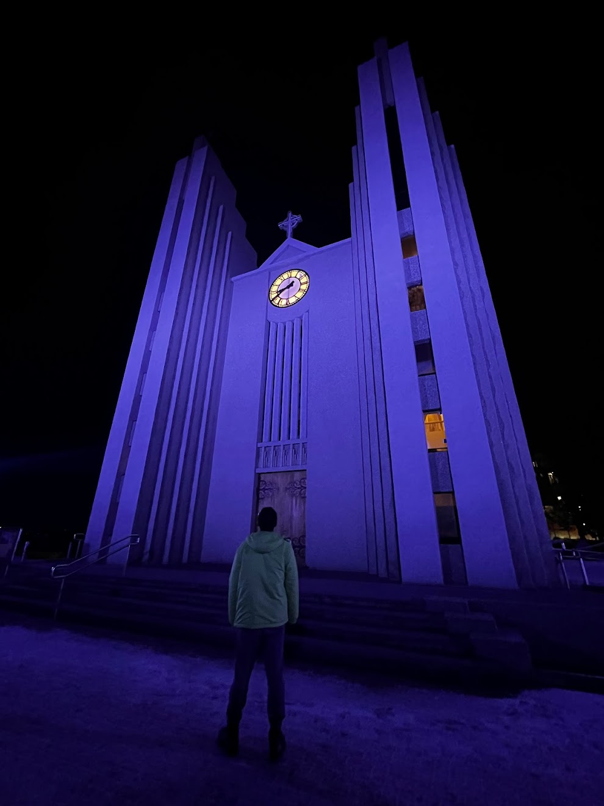
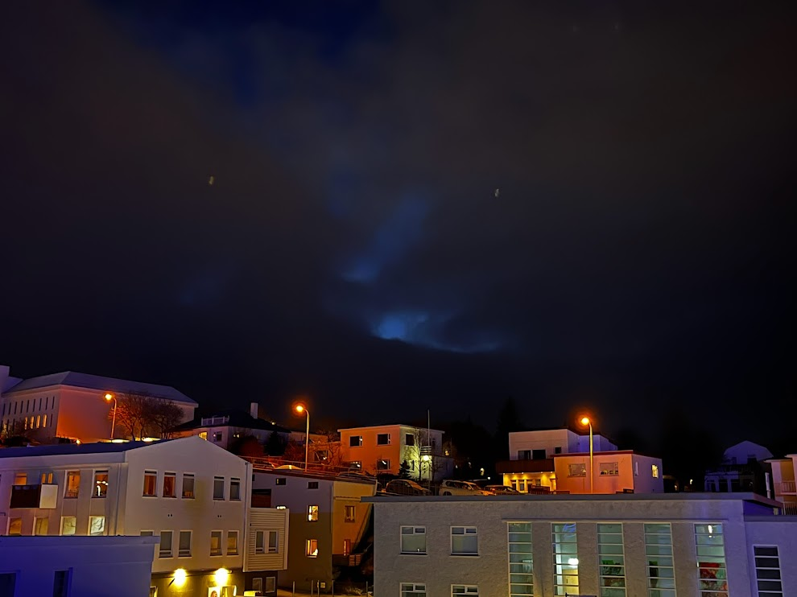
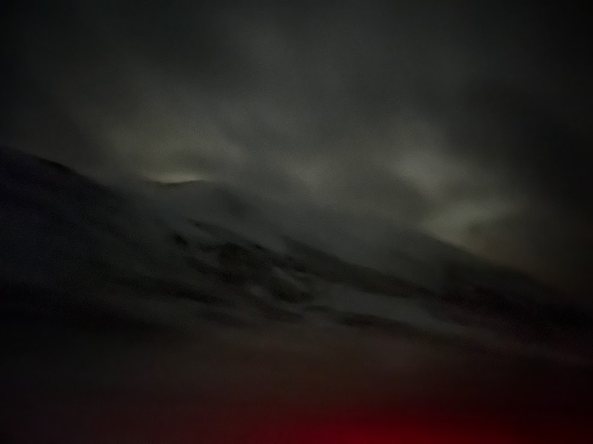

It's a world of nothingness but peacefulness.

## Morning
Waking up in this ghost house was truly an experience. I was definitely awakened by those strong winds that had been roaring all night. By the time I packed up everything and walked to our car right outside the house, the left side of the car was literally covered by snow and ice. The strong wind had piled all the snow from one direction, freezing even the door handle, making it impossible to open.

Once we got into the car, we headed north through a few more tunnels, each opening into another crazy snowy wonderland.

## Dettifoss
The road to Dettifoss was not easy at all. It was probably the most dangerous road any of us had ever driven. The world turned white, the road completely covered by pure whiteness. The only way to discern the road was through the sticks placed along its sides. A few times, we almost got stuck; only by driving faster were we able to push through.

The journey to Dettifoss was worth it, though. After parking in a vast expanse of whiteness, we began our hike. Once again, everything was white, the trail marks visible only through the sticks. The snow reached halfway up my legs, but stepping on the fresh snow, which gradually sunk beneath my feet, felt pretty nice. I also had to wear sunglasses to avoid snow blindness.

About a 20-minute hike later, we reached the amazing Dettifoss. Suddenly, the world had an extra color — the black of water, contrasting with the white snow. Seeing such a massive waterfall surrounded entirely by snow was surreal. We could even feel the water vapor from a high overlook platform. It was truly amazing, reminiscent of an earthly paradise. The glacier water is so energetic; it travels far, in the cold, in the whiteness, in the void, yet maintains a positivity by roaring to nature. I respect that. I want to be like that.

## Supposed to be Krafla
Our next stop was supposed to be Krafla, an icy blue crater lake by a thermal power station. Unfortunately, when we were close to the destination, we got stuck in the snow. Our entire car chassis was lifted by the thick snow, and all four wheels were basically in the air. We tried digging the snow for a while, and even asked a truck driver to pull us from the front, which didn't work at all. Worse, the truck driver broke the rear of his truck. We felt so sorry, but we were still stuck until I realized we had roadside assistance. Ironically, the roadside assistance arrived in less than 15 minutes after we called, which was really surprising. As we all know, roadside assistance can take forever in other countries, especially when you're literally in the middle of nowhere. We started to eat lunch, ham sandwiches we bought at the local store, while watching the roadside assistance truck effortlessly pull our car out of the hole. It was truly an experience, though one I do not ever want to repeat. And of course, we didn't get to Krafla due to the time wasted here. Anyway, it was still a good story to tell. I'm glad we didn’t die out there.

## Fossholl
Fossholl is another amazing waterfall that brings a second color to the world besides pure white. It even looks like the grand Niagara Falls, with its wide platform and the large volume of water falling down the cliff, reminiscent of a Water Curtain Cave that might lead to the entrance of a new world. It’s hard to believe these are real waterfalls; they seem more like something from a painting.

## Chasing Northern Lights from Akureyrarkirkja
Today was a chill day, with much of our attention paid to the road to ensure we didn’t kill ourselves in this white nothingness. After arriving in the town of Akureyri, we had a brief dinner and decided to explore the town at night.

As I mentioned, I have a fascination with churches here. I decided to drive to the iconic Akureyri Church first, not realizing at the time that it is one of the highest points in town.

The town was very cool at night, bathed in purple light, making everything feel holy and sacred. The magical moment came when we turned around and saw a bit of the northern lights peeking through small gaps in the cloudy sky. We were literally screaming, as it was the first time we really got to see the northern lights with our bare eyes.

We all became so excited that it felt like a magical power was pushing us, and we decided to chase the northern lights, almost religiously. We didn’t think too much; I just started driving out of town as fast as possible to find areas with less light pollution. I kept telling myself we would be able to see the great northern lights tonight, as we had faith and I was willing to drive however long it took. After half an hour of driving, we realized we were headed in the wrong direction, so we turned around and headed north. It was me driving, with two of my friends constantly checking the forecast and cloud map while looking out the window for the best view.

The journey to chase the northern lights is just like life. We saw a great sign and started working toward a better goal. We even saw better northern lights on the way north, but as we drove further, the sky started to get very cloudy, and we couldn’t see anything. Interestingly, in the middle of nowhere, we passed by at least five towns in two hours of driving. We hated it because of the light pollution that prevented us from observing the northern lights. From the beginning of the trip, we probably saw five towns in total over five days, while today, in two hours, we saw five. Sometimes, we are too eager to get something, and we won't.

Continuing north, everything was so mysterious, with snow-capped mountains around us feeling like demons in the dark, which was actually very scary, unlike the awe-inspiring view during the daytime. Trust me, if you ever get a chance to watch a snow-covered mountain at night, you will understand what I mean by really scary. In one way, these mountains feel like the guardians of the city; on the other hand, they feel like the punishers and enforcers of this place.

Even worse, it started snowing pretty badly, and I could tell our wheels were drifting while the visibility was zero, and we were in pitch darkness. If today’s drive in the snow was the worst, this one was even more dangerous because we were driving a winding mountain road high up without fences, with snow on the road and strong wind. It was truly a once-in-a-lifetime experience. Until the snow became so heavy that we couldn't drive, we decided to head back. That three-pointer turn on the edge of the mountain snowy road was the scariest three-pointer turn I’ve ever done in my life.

Even more scary, most tunnels in Iceland are single-lane while both directions will be in the tunnel for some reason. We almost hit a car from the opposite direction, and thank God we kept honking, and I was able to pull over at the turnout.

Everything was just so mysterious tonight; it almost feels like a long road to nothingness, to another world, to be close with God's kingdom, which of course is full of obstacles and mysteries and not easy at all. It was only later I realized we drove all the way north to basically the most northern tip we could get in Iceland, and of course, the northernmost point I have been to in my life.

I was so tired that I decided to let my friend drive, and I fell asleep on the way back. While we saw some northern lights on the way, it was nothing like we expected. But good enough, it was such an adventure for us tonight. It is always good to leave some pity and regrets, so we have a reason to come back again. And to be honest, everything else experienced on this trip was so much worth it that a northern light is not important at all, let alone we saw the northern lights, just in a more mysterious way.

It's a night that let me owe my greatest awe to nature again.
