It's the best day we had in Iceland.

## Akureyri
Nobody knows this town. We chose to stay here solely because the lodging was cheap. However, it might have been the best decision we made on this trip. Akureyri is definitely one of my favorite towns in the world, alongside Grindelwald, Switzerland, and Antwerpen, Belgium. It's a charming town with many details that made me instantly fall in love.

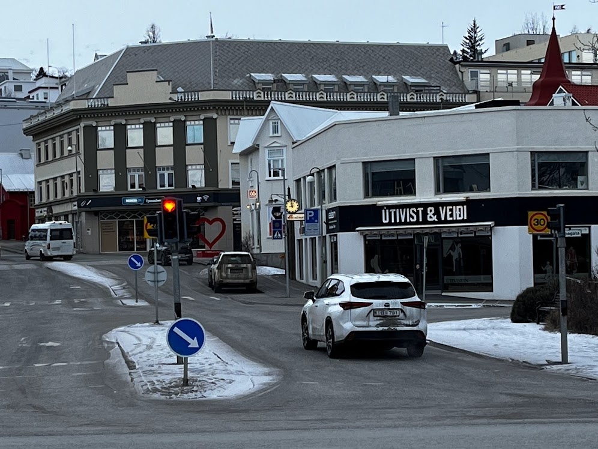

I got up early to explore the town after learning that it is the biggest town in northern Iceland. I parked the car at the church where we saw the northern lights yesterday and started wandering. It turned out to be very small; all the attractions, restaurants, and shops are on the same street, which is walkable in 10 minutes. Since it was early, around 9 AM, there was literally nobody else here, which really gave it an Icelandic vibe.

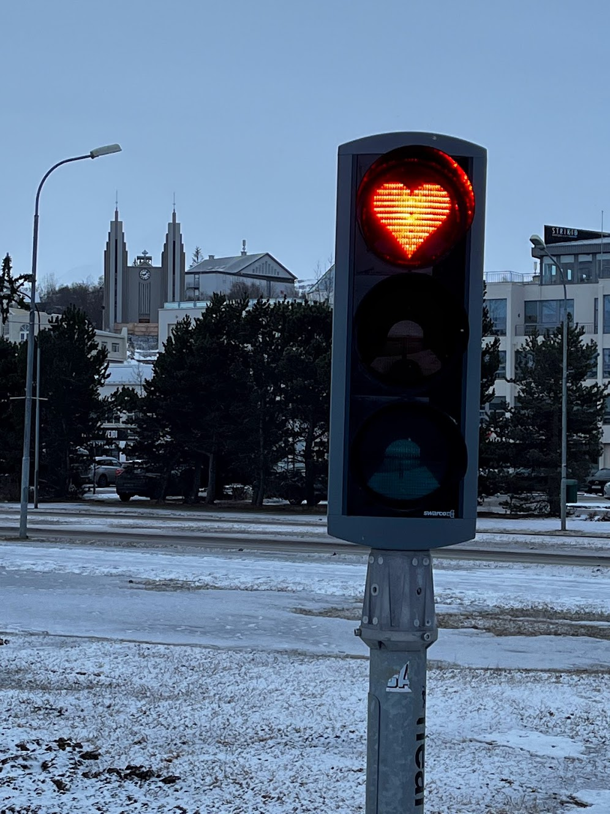

The first thing that caught my eye was that all the traffic lights in the town center are heart-shaped, similar to the hand-holding-people-shaped traffic lights I saw in Antwerp. These towns have their own characteristics. A red light is supposed to mean stop, but a red heart can only mean warmth and kindness here. I somehow wanted more red lights so I could appreciate this simple but heartwarming design.

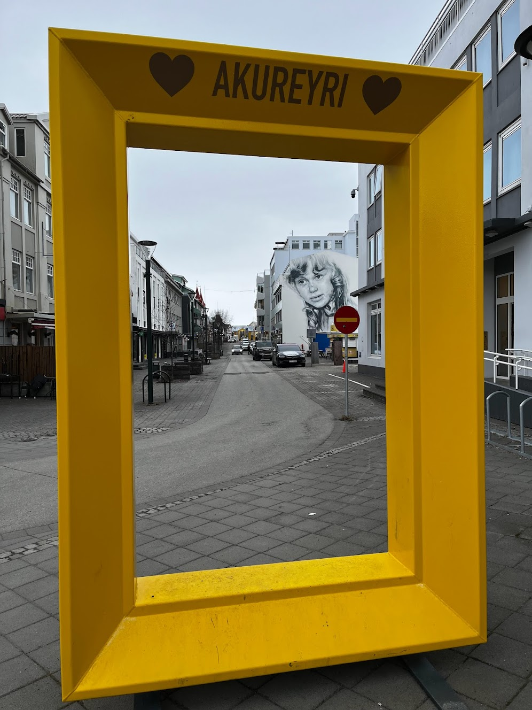

As I continued walking on the main street, I saw heart-shaped frames with the slogan #loveakureyri, which I believe every visitor truly feels. It's a simple but meaningful love for this town, for its kindness and peacefulness. Looking back, the grand Akureyrarkirkja church looked spectacular from this point, making everyone need to look up in admiration.

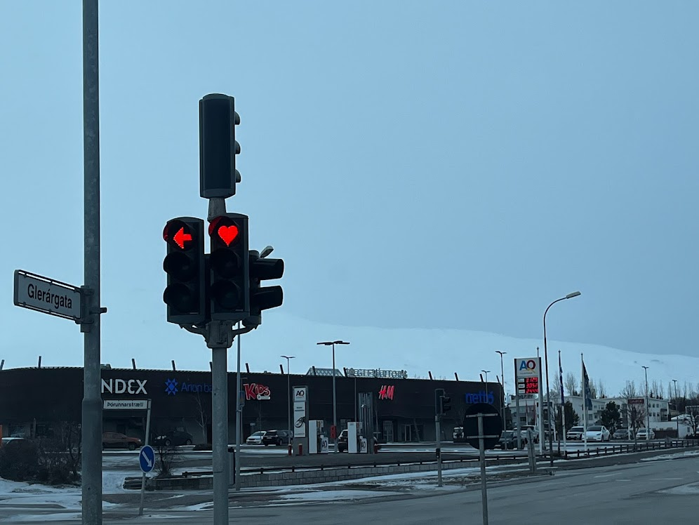

One store we walked into had a cute cat, whose Icelandic name I unfortunately forgot. All I remember was buying $60 waterproof gloves, hoping my contribution would help her feast. Moreover, the store owner told us many stores on the street adopt cats like this, which made me like this town and Iceland even more.

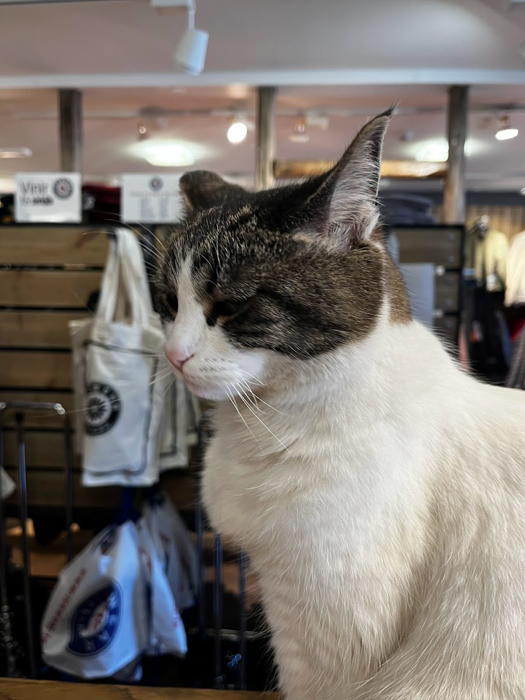

## Blönduóskirkja
Of course, we hit the road and I selfishly stopped by another beautifully designed church. While it was closed since it was not Sunday, we were able to look around and appreciate the irregular geometric shapes and the giant, elegant cross situated at the front. With the snow falling down, it was really a poetic moment.

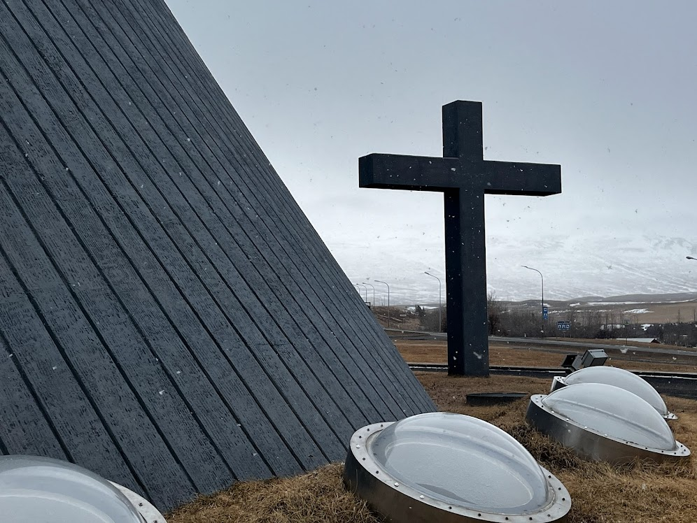

## Grabrok
This is a trail that features multiple volcanic craters and had quite a few elevation gains. It brought back memories of the only black and white world we encountered these days in the north but in a more 3D way, as these are crater lakes with depth. It's also more of a mix of little particles of black and white, volcanic rocks, and the snow. We did something stupid but funny, which was peeing here (we shouldn't have done that and it wasn't me, but we made sure we left no trace and didn't harm anything). They reported some body parts hurt due to the extremely strong wind during their pee LOL.

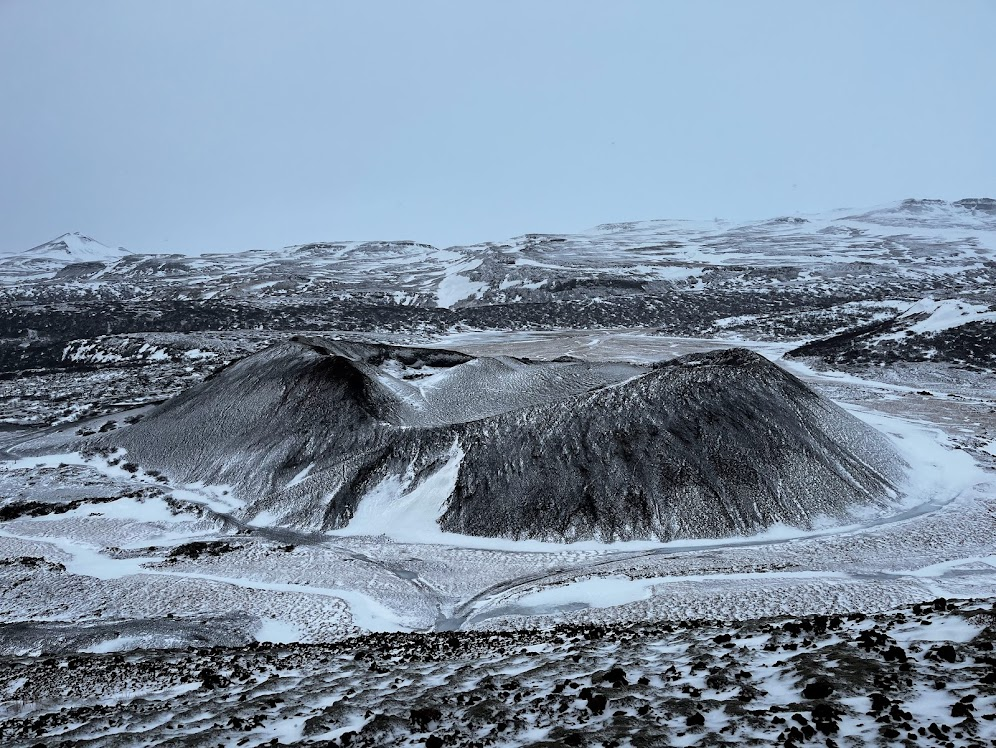

Anyway, it was an amazing crater that would only make sense on Mars or somewhere else, definitely not Earth.

## Deildartunguhver
This is like the Blue Lagoon, a natural thermal spring. What's different is the color of this thermal point, which was truly amazing, and we were able to walk close to the spring, feel the vapor and the roaring of the thermal energy from the lava underground.

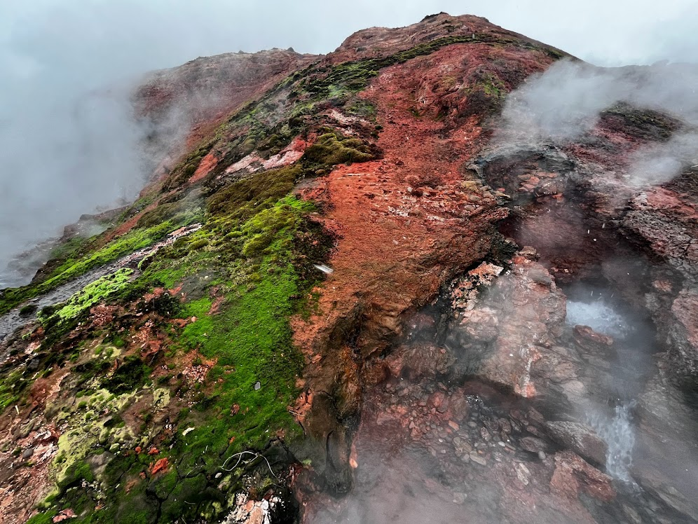

## Reykholtskirkja
Of course, this is another church I randomly decided to visit just because I saw its tower from far away. It turned out to be a great visit as it was the only church open during our whole 8 days in Iceland. Moreover, I got the chance to talk to the person in charge of this church, which is also a research institute for one of the world's greatest medieval writers, Snorri Sturluson. I knew nothing about this figure, but the way the person here described him made me feel like he is really important and a prominent figure in Iceland's history.

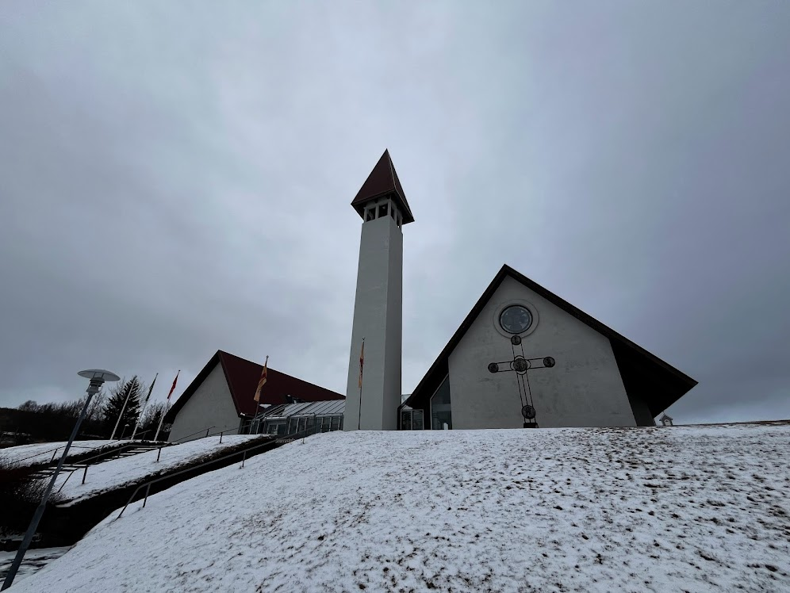

I also had the chance to strike up a conversation with a local Icelander. I started by asking the question that had bothered me throughout the trip: why are there so many churches and why are they all closed? He replied saying that it was more like a historical heritage, just like in other European countries, and people here are absolutely not religious, which really surprised me given the number of churches here. However, it also makes sense as Iceland is very developed and people are very educated, which are normally inversely correlated with religiousness. He says that the church is more of a cultural thing here, as people still hold baptisms, weddings, etc., at the church.

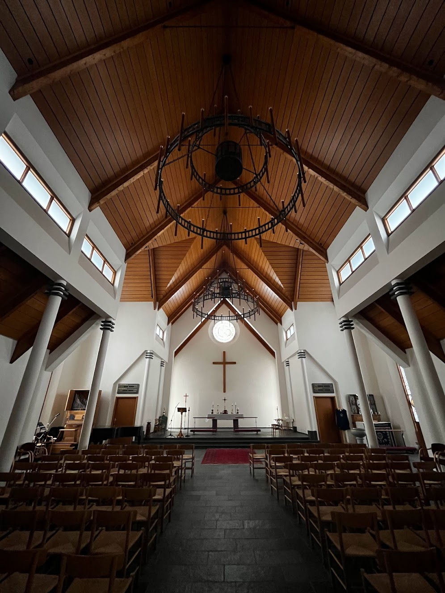

He then answered my second question: people steal things from the church so they have to close them, which I believe is definitely due to tourists. After that, we talked a lot about Iceland's politics as I am also a political science major and I am really interested in its culture and political structure. As I saw in their national museum the first day here in Reykjavik, Iceland has the first parliament in the world dating back to 930 AD. Surprisingly, he told me that most Icelanders are quite satisfied with the current government, especially the current female prime minister. He praised the government's efforts in healing the country from the 2008 economic crisis and the recent COVID pandemic.

Lastly, I walked into the church. It is a pretty standard Lutheran church, I believe, with a huge cross at the center and no other excessive decorations.

## Hraunfossar
Here is another waterfall and it was so blue that it looked like a blue gem. The current was quite rapid, or I would definitely have dived into this heavenly colored water.

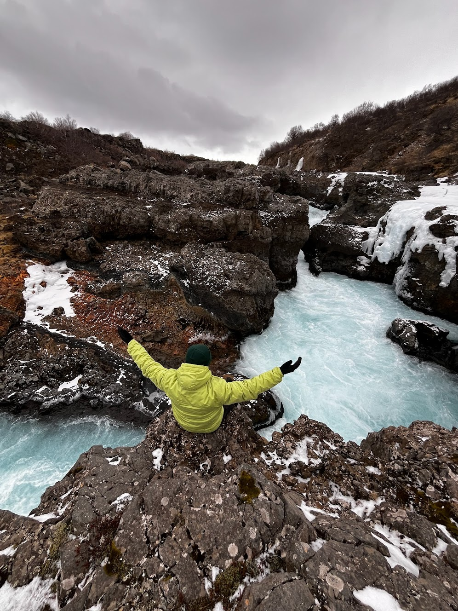

## Borgarnes

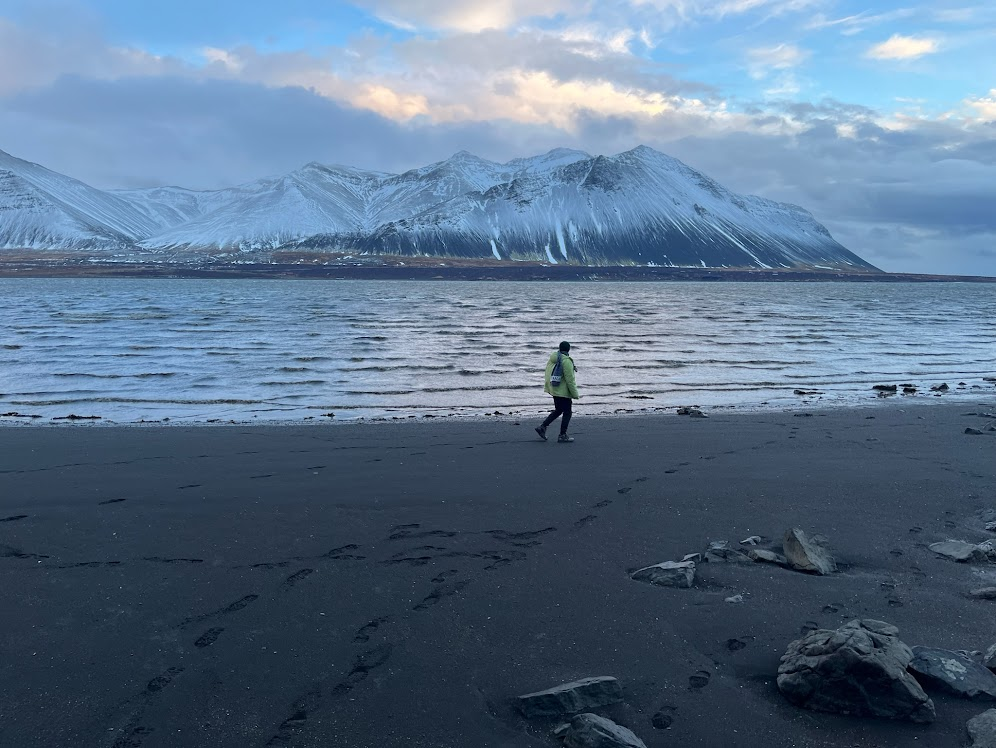

I forgot to mention this is also my favorite town, which I was lucky enough to discover two in a single day. I saw the most amazing beaches I have ever seen in my life, and I don't think I will be able to see a better one. Where else can you see a black sand beach, black sea waves, plus snow-capped mountains right across the water? Here you can. I was totally astounded by how uniquely amazing this place is, leaving me speechless for a long time. I really don't know if there's any word that can be used to describe this sacred place. There's nothing like this on Earth, probably nothing like this in heaven either. The moment I saw this beach, I knew I would swim here, even though it was snowing and literally freezing cold, as you can tell by our clothes.

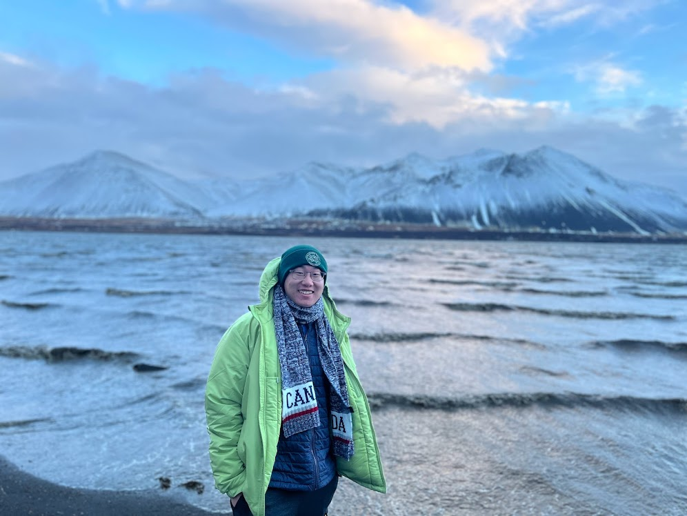

With the sunset approaching while we had to grab food first, we agreed to come back tomorrow as we would pass through either way to reach our final destination for the whole trip. Even sitting in the restaurant, we saw the snow-capped mountains through the window, which was totally surreal while we held our burgers and fries in our hands.

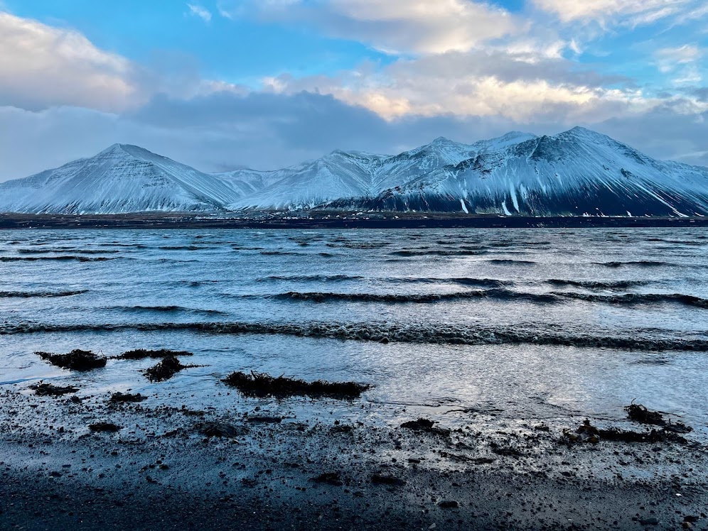

## Northern Lights again
As I mentioned, we weren't able to see a full blast of the northern lights last time after driving 2 hours north. Today, with a bit of clear sky only at this place, we thought it was our time, blessed by God, to see a full northern light display. So we drove to the tip of the island, where there was no light pollution and we had a clear view of the sky.

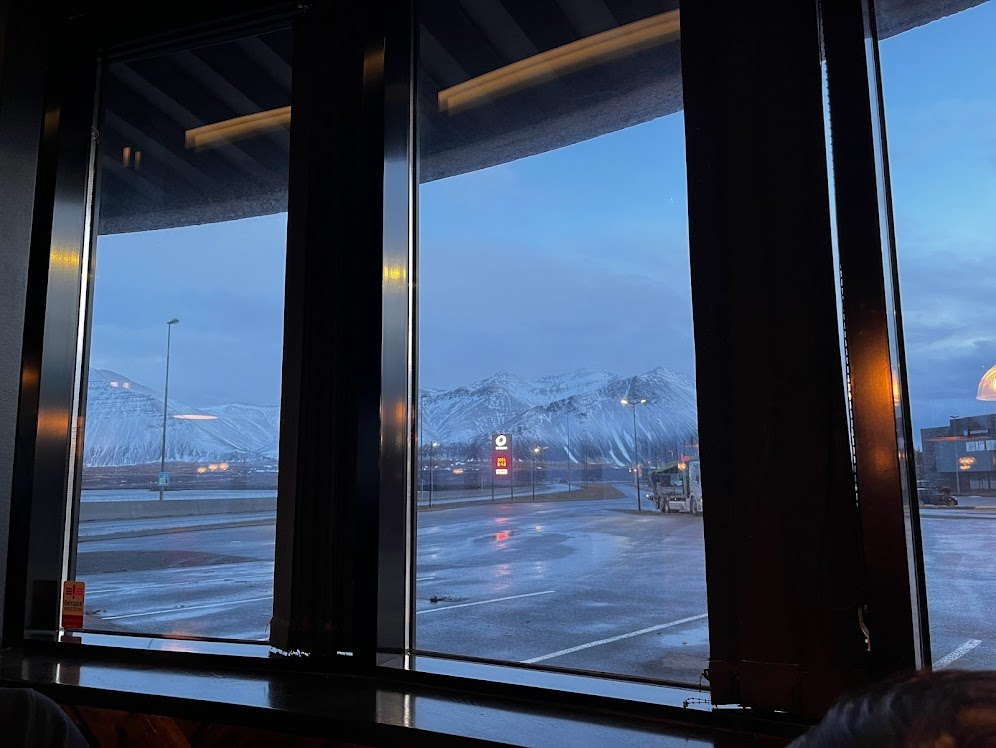

We just sat on a rock right next to the ocean, hearing the ocean sounds and wind blowing, patiently waiting for the northern lights. We started to see one star, two stars, and at most countless stars, but after 2 hours of waiting, we still didn't see a trace of the northern lights. We decided to head back.

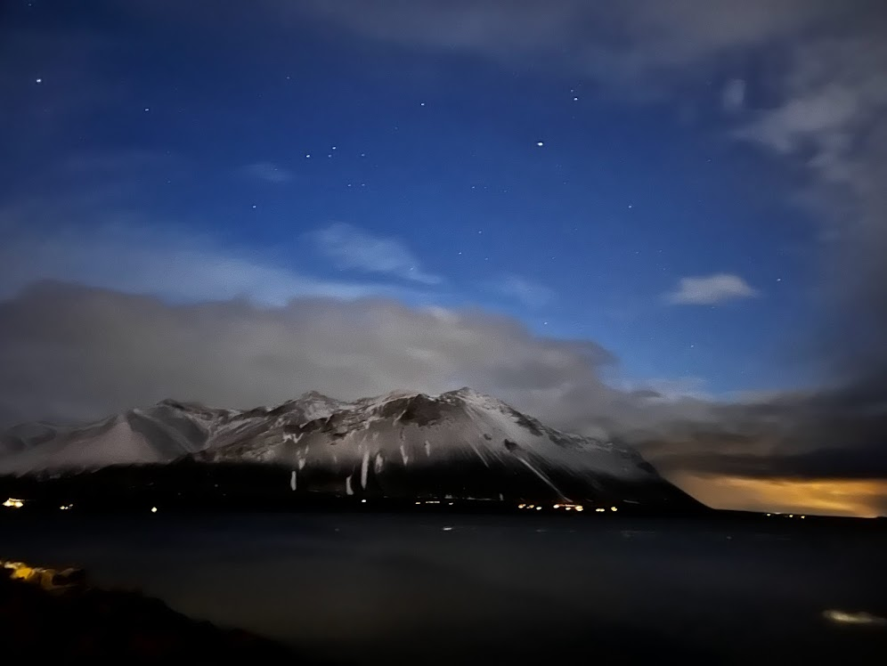

There's not really a feeling of pity when we head back, but rather joy from what we had seen today by chance. None of these were planned ahead, and I could never have imagined being able to see the amazing things we saw today. Everything is a blessing. The northern lights are not important at all now. They were the vessel symbolizing our finest appreciation of Icelandic nature, but now that we have seen all the stunning natural beauty, the vessel is no longer needed.
