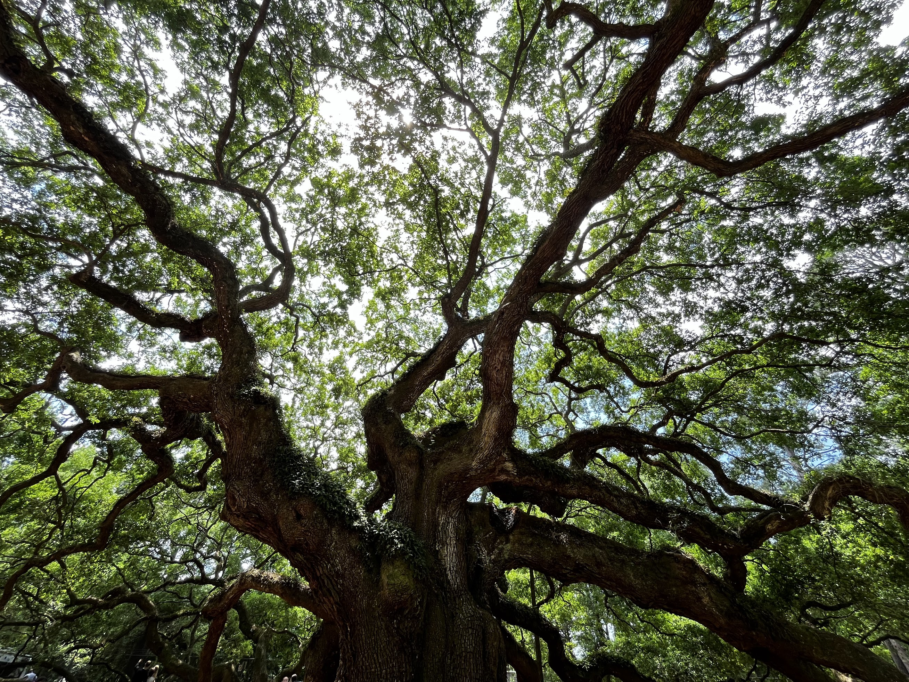

Beautiful historic town with breathtaking natures.

## Driving to Charleston, SC

It was another spontaneous two-day road trip that I decided to take with two of my graduating senior friends. We met back in the summer of my freshman year when we were all part of the Code+ program. That summer was a blast; we learned a lot, experienced so much, and had a great deal of fun. I'm glad we had the chance to embark on another mini road trip before we parted ways.

We kicked off the day pretty early, around 7 AM, and arrived in the charming town of Charleston around noon, where we grabbed lunch. When driving across the North and South Carolina border, there's a bizarre attraction called South of the Border. It features an all-Mexican culture vibe with restaurants, giant sculptures, gift shops, and it's just interesting to see so many Mexican elements in the middle of nowhere.

Other than that, there was really nothing special on the way as it was a pretty boring drive with nothing but trees.

## Charleston Downtown

It's definitely one of the least American cities, as it is so walkable and features what I believe are European-style houses. There are so many historical houses, and when I opened Apple Maps, virtually everything was marked as a historical attraction, block after block. We wandered through the town, checking out those classic tourist shops, much like anywhere else.

The weather was very sunny, and one of my friends said it gave him a feeling of Miami, Florida, primarily because it is a historical port city and the economic and trade center for the South. We didn't really have the time to check out a museum, but I already felt a strong sense of history here with all the buildings and carriages around us. There's really nothing standing out to me in downtown, but it's definitely worth visiting. We then walked to the Waterfront Park, where the famous Pineapple Fountain is located. The history of the pineapple is interesting; all tropical fruits were expensive back then, and the pineapple gradually became a symbol of hospitality, as people would treat guests with pineapple to show the highest respect at that time. So, I guess this fountain symbolizes hospitality, even Southern hospitality, which I felt so much when I was in Texas last summer.

Something interesting was that there are so many English pubs around the corner. This town truly feels like a European town at first glance, although I don't think a pub in Britain would have this American dollar thing on their ceiling.

We also went to St. Philip's Church, which is also a historical site and one of the tallest buildings in the old downtown. It was just a normal church, but I kept imagining there would be a huge mass attending church here centuries ago, in the exact same location and on the same chairs where I was sitting.

One last historical building is the US Custom House by the bay here, which is one of the oldest US customs ever built, symbolizing the busyness and development of this port city in American history.

## Folly Beach

We're in a port city, so of course, we're hitting the beach. However, this might be the first time I see the water and decide not to jump in, even after braving the freezing waters in Iceland. Due to some medication I'm taking, I have to be very careful about getting sunburned and must avoid salt water. So, I decided to rent an umbrella and chair, lying down and chilling on the beach for the first time. The sea wind was so strong that it almost made me feel cold on this 90-degree sunny day.

## Sunset at the lighthouse

We were already at a beach on an island, so why not stay and watch the sunset? We discovered a short lighthouse trail that offers a great view of the sunset and decided to go for it. Before hitting the trail, we stopped by an arcade in the town of Folly Beach where I won my first ever toy from one of those claw machines within three attempts. I felt really lucky and plan to keep the toy as long as I can.

The first half of the trail was a paved road, adorned with all sorts of lovely chalk paintings that led to the best view.

There was even chalk paint at the beach viewpoint for the lighthouse, but here, it was on the rocks that are consistently brushed by the sea waves—quite a poetic scene to capture. I climbed up and sat down on one of the rocks to appreciate this sunset scenery.

This was definitely one of the most beautiful sunsets I have ever witnessed. Although there were no dramatic clouds or colors, the opposite direction of the sunset featured a subtle gradient of purple highlighting the lighthouse. It was simply beautiful and peaceful. Along with the sea waves, which sometimes reflected the sunlight on the beach, everything was so poetic.

## Fort Sumter

As I mentioned, Charleston is a historic town, and it turns out it's also historically famous as the starting point of the American Civil War, where the first battle began. The Confederacy fired cannons from the mainland at Fort Sumter, located on a small island in the middle of Charleston Harbor.

We took a ferry to the fort while a passionate tour guide provided an introduction to the history there. I was really surprised to see how it resembled the Chinese patriotic education I received, except it was the American version. One story he told was that the first two soldiers to die during the Civil War were here, but not due to actual combat. After the Union soldiers surrendered to the Confederacy, due to concerns about the potential explosion of massive ammunition on the island, they lowered the American flag at the fort during a ceremony, while a hundred cannons fired a salute. The first, named Daniel Hough, died because a cannon went off prematurely during the salute. The second soldier died under similar circumstances.

After docking and exploring the island, we found it to be a fascinating historical site with many real cannons used during wartime, reminding me of the [Spanish fortress in San Juan, Puerto Rico](/posts/2023-11-26-puerto-rico/#castillo-san-felipe-del-morro). Surprisingly, we also saw dolphins in the sea from the overlook. On the ferry back to the mainland, I even spotted wild jellyfish in the waves. It was truly an amazing experience.

## USS Yorktown

I never planned to see so many WWII US aircraft carrier museums, but I've coincidentally visited 3 out of the 5 locations across the entire US. Last winter break, I went to the USS Lexington in Corpus Christi, Texas. Due to time constraints, we decided not to explore the inside of the museum, which I believe is almost the same as the previous two carriers I had visited. It is probably the smallest carrier among the three but still impressive to see even from a distance. I learned a bit about the history of this ship beforehand; it was named after the legendary USS Yorktown, which sank during the Battle of Midway in WWII. They managed to repair a ship overnight rather than the two months predicted, a feat that truly changed the course of the battle and the world.

## Angel Oak

It's a 400-year-old tree that isn't very large compared to others I've seen in China or the General Sherman in Sequoia National Park. What's special about this tree is that its canopy covers such a vast area that hundreds of people can share the shade at the same time. Standing in front of the tree really makes you realize how small humans are, and that none of us has the ability to create a shade for hundreds. Looking up, the branches and leaves framed by the blue sky create a truly amazing and picturesque experience.

## Cypress Gardens

This was probably the highlight of our entire trip and definitely the best kayaking/canoeing spot I have ever visited. One scene from the movie The Notebook was shot here, which really helped make the gardens popular. It was such a quiet place to visit today, though, where I saw more animals than humans. The first animal to welcome us was a peacock, which was truly remarkable. I can't remember the first time I saw one, but this peacock was amazing as it spread its tail, although the female seemed uninterested, and then it retracted its tail.

Moreover, just canoeing on the little lake was incredible. The reflection of the trees in the water, along with turtles, greenish plankton, and an alligator, made everything seem so poetic.

