Finally, I am watching an F1 race from the trackside.

## It was a dream and still counts as one

It has always been a dream of mine to watch a live F1 race, a dream that started when I first got into the sport three years ago, coinciding with my college years. I vividly remember waking up at 6 AM to watch the final race of the 2022 season and screaming in my dorm room as Max clinched that controversial, yet historic, championship. I even wrote [a blog post about my post-race reaction](/posts/2021-12-12-f1-2021-review.md/).

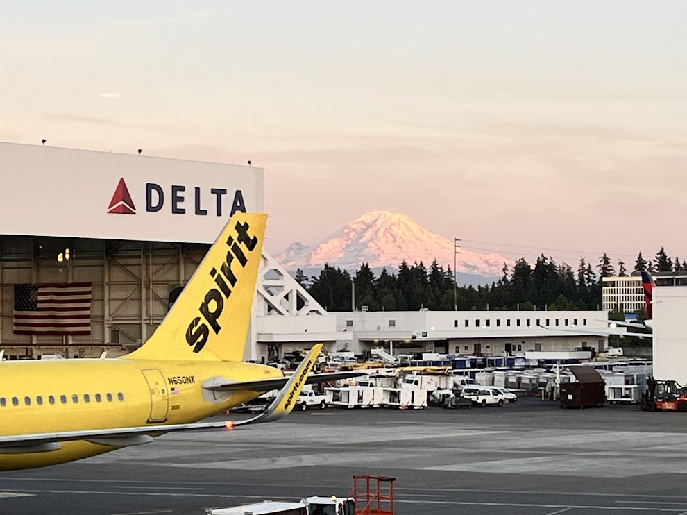

However, time flies, and perspectives change. I'm no longer the fervent Red Bull fan I once was, nor am I a super fan of anything in particular these days. College has taught me to question much, which has been enlightening in many ways. I wrote  a 10-page academic paper critiquing the exploitative nature of F1 and commercial sports in general, which remains the piece of work I am most proud of. Since writing it, my enjoyment of the races has been tempered by the knowledge of their capitalist and at times, life-endangering undertones. Yet, here I am, still a fan, still excited. I've long accepted the fact that I am a bundle of contradictions. If so, I should indulge in my passions when I can, without feeling the need to justify them.

I hope this doesn't come off as too philosophical. That wasn't my intention at the start. Now, onto the main course.

## Go to Montreal from Seattle

It's a charming city, and I am thrilled to have the opportunity to return during the summer after a [wonderful snowy Christmas holiday here in 2022](/posts/2022-12-27-toronto-montreal-ottawa.md/#montreal). I took the light rail Link from the U District, where I reside, directly to the airport. The journey, lasting just an hour, offered stunning views of Seattle as summer sets in. Mt. Rainier to the south appeared almost surreal, especially the view from the airport gate where the sunset cast a purple hue over the snow-capped mountain—truly breathtaking.

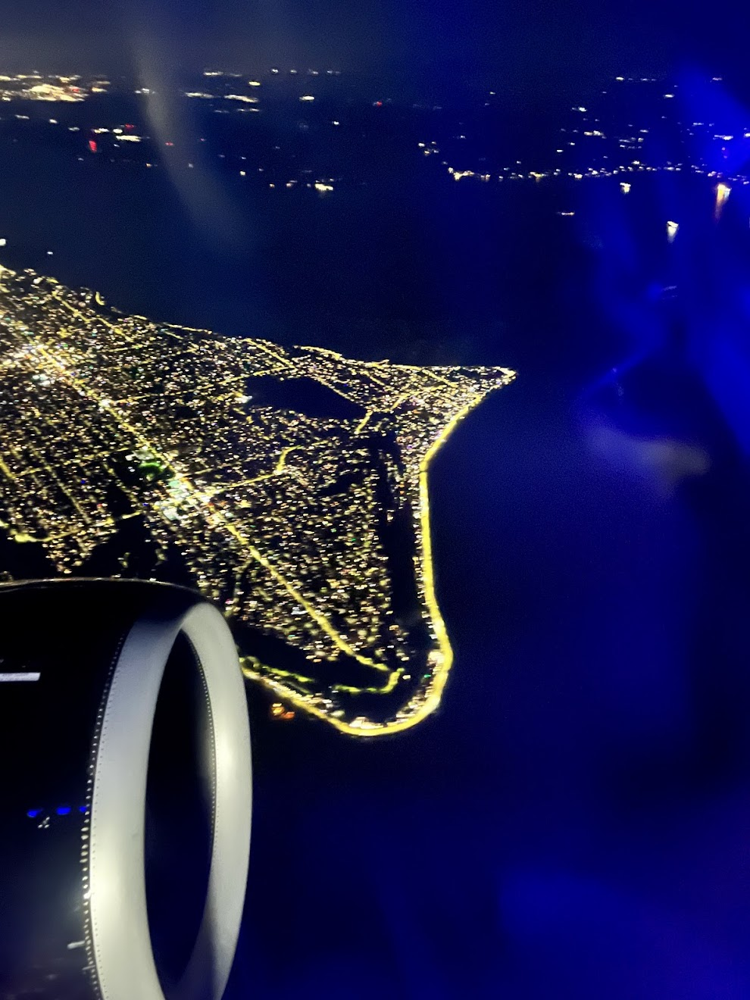

Of course, it was another red-eye flight across America, which I generally dread since I can never seem to sleep well on flights. However, this was my first nighttime flight out of Seattle, and the city lights, particularly along the coast, were mesmerizing. Interestingly, I ended up chatting with my seatmate, an 18-year Microsoft veteran also headed to the Montreal GP.

During my layover in Toronto, it was fascinating to notice the prevalence of F1 fans among the passengers, with a noticeable majority supporting Ferrari.

## Friday Free Practice 2 at the Circuit

The first time I visited during the winter, everything was blanketed in snow and ice, with not a soul in sight. Now, the place is teeming with F1 fans—it's hard to imagine fitting even one more person here.

I watched FP2 in the afternoon. The moment I first heard an F1 engine roar was absolutely exhilarating. Since we were seated near the end of a hairpin turn, we would hear the engines a few seconds before the cars sped past, followed by another surge of sound. Being just a dozen feet away from the track was an indescribably intense experience.

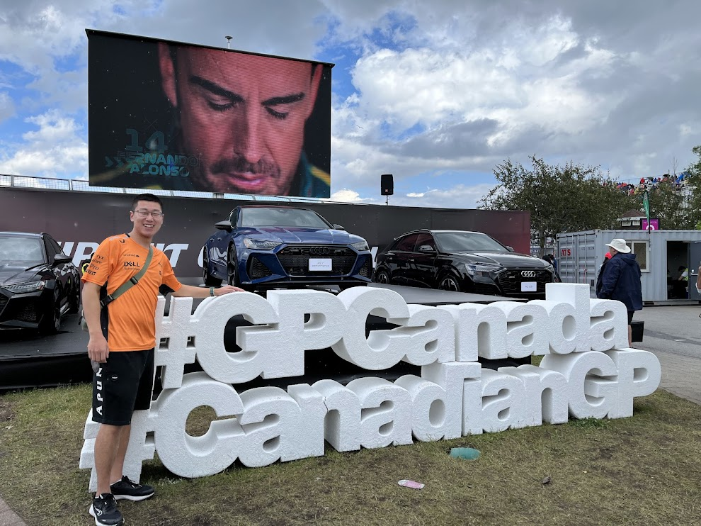

The sheer scale of the grandstands was also astonishing. The space per seat was barely enough for me to sit comfortably, yet hundreds of thousands flock here to catch a glimpse of the cars zipping by each lap. It's a testament to the wild popularity of this sport and the dedication of its fans.

What surprised me most was the frequent visibility of Amex. They had a massive setup resembling a pit stop. We received some small gifts, and I must say, their marketing is top-notch—you really do feel privileged as an Amex cardholder.

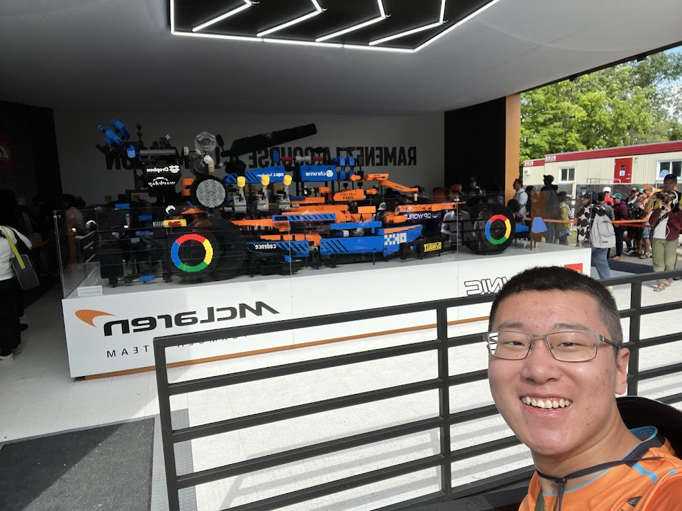

Another standout was the Lego building. They displayed a life-size McLaren F1 car made entirely of Lego bricks, complete with sponsor branding. It was a remarkable sight.

## McGill University

I remember passing by the university two winters ago, and here I am again. McGill, as one of only three English-language universities in Quebec, holds a unique position. The campus architecture boasts a distinctly European charm, contrasting sharply with the modern skyscrapers that form its urban backdrop. During my visit, I noticed a Palestinian encampment on the lawn.

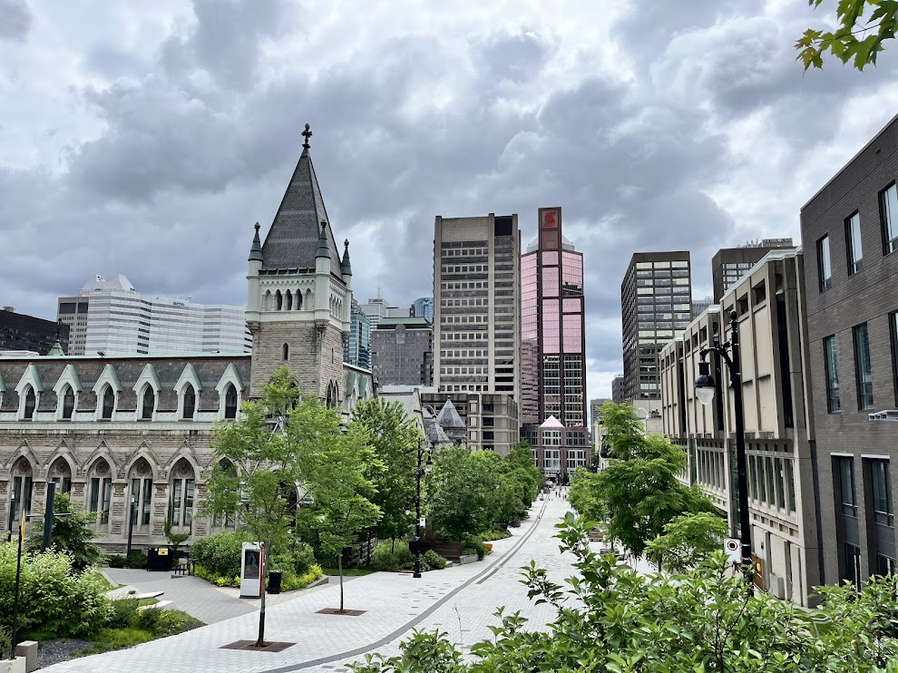

## Mount Royal Park

Adjacent to McGill, Mount Royal Park is the best spot for panoramic views of Montreal's skyline. A moderate hike and some stair climbing bring you to a vantage point where the entire city spreads out below. Unlike my previous visit, which was marked by snow, slippery conditions, and gusty winds, this time I enjoyed an easy climb and sunny vistas.

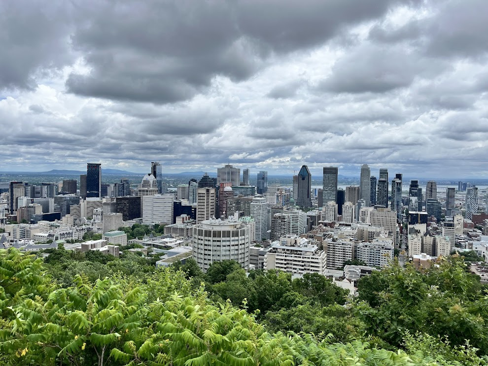

## Qualifying

We returned to the track for the qualifying session, which, as expected, was even more crowded. In the Fan Zone, we participated in a pit stop challenge, undoubtedly one of the best experiences of this trip. Having watched pit stops countless times on TV and critiqued many teams' performances, I finally got to try it myself. Holding the wheel guns and actually using them was absolutely thrilling. It’s not as easy as it looks—the tires and guns are quite heavy, and it requires skill to position everything quickly.

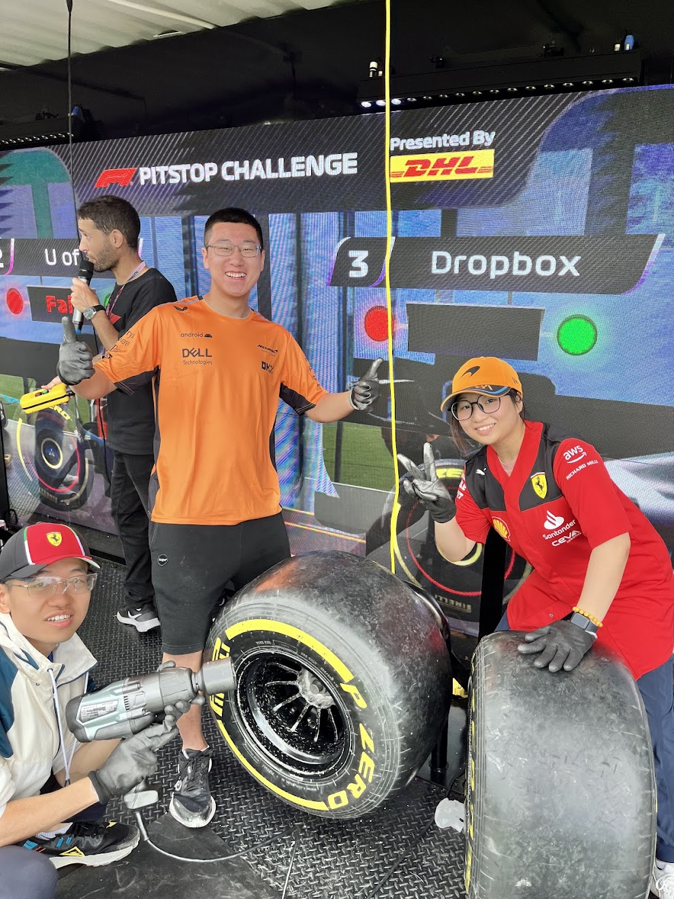

I managed a 9-second pit stop, even though I dropped a nut that rolled away on the stage—still faster than Sauber haha.

Once the qualifying began, experiencing the cars zooming past with their loud engines was an indescribable thrill. The sound is something you truly have to experience yourself. I love it.

## Université de Montréal

This institution is similar to a state university but offers instruction in French. Located on the slope of Mount Royal, opposite McGill, the campus features a cool design with many pavilions interconnected underground. Unfortunately, I mistakenly wandered into the women's restroom due to my lack of French understanding. Please don't judge me.

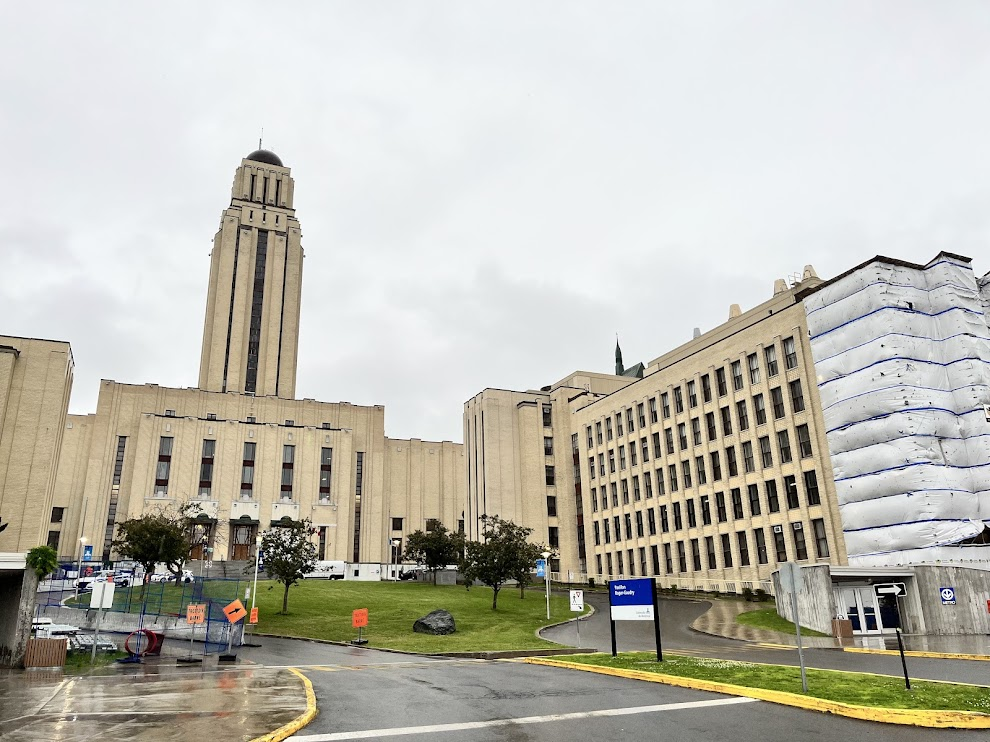

## Saint Joseph's Oratory

While dining nearby, we passed by Saint Joseph's Oratory, also located on Mount Royal. Even from a distance, the Oratory appeared both holy and spectacular. If time permits, I definitely plan to visit. It evoked a similar sense of grandeur to that of the [Hallgrimskirkja](/posts/2024-03-09-reykjavik/#hallgrimskirkja) in Reykjavik, which left a lasting impression on me.

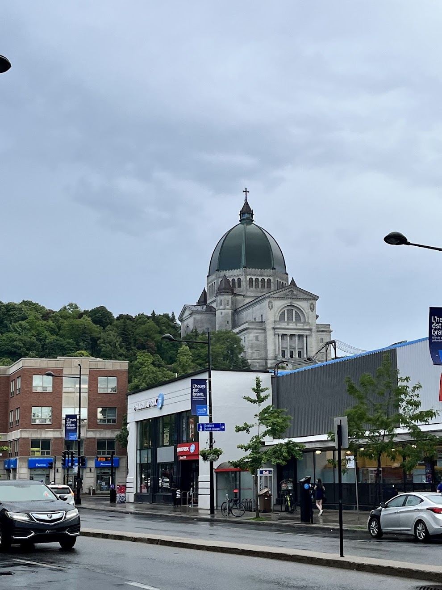

## The Race

Sitting by the trackside and watching an actual race live is a completely different experience compared to watching it on TV. The fans at Montreal were not as fanatic as I had expected, which was not necessarily a bad thing. Everyone was paying full attention either to the cars roaring by or the big screen.

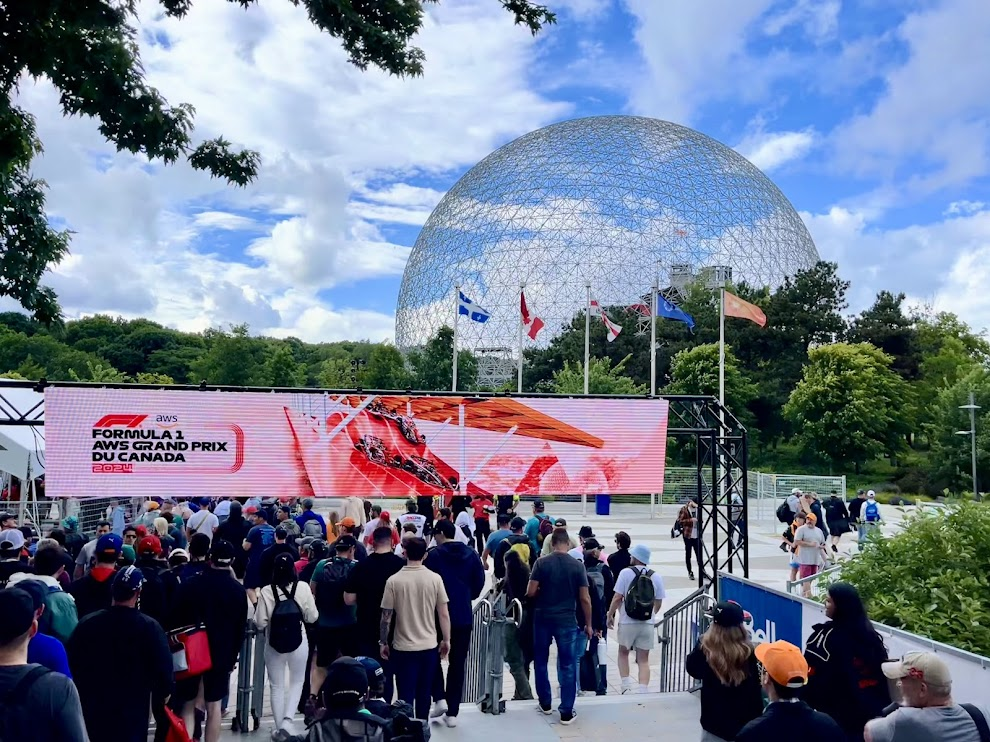

What really made the day special was the unpredictable and ever-changing weather. It rained twice, and the track dried twice. I felt like I was watching four different races as teams kept changing strategies to adapt to the weather. To my surprise, we were able to spot quite a few overtakes at our part of the track, which is a long straight line right after a hairpin.

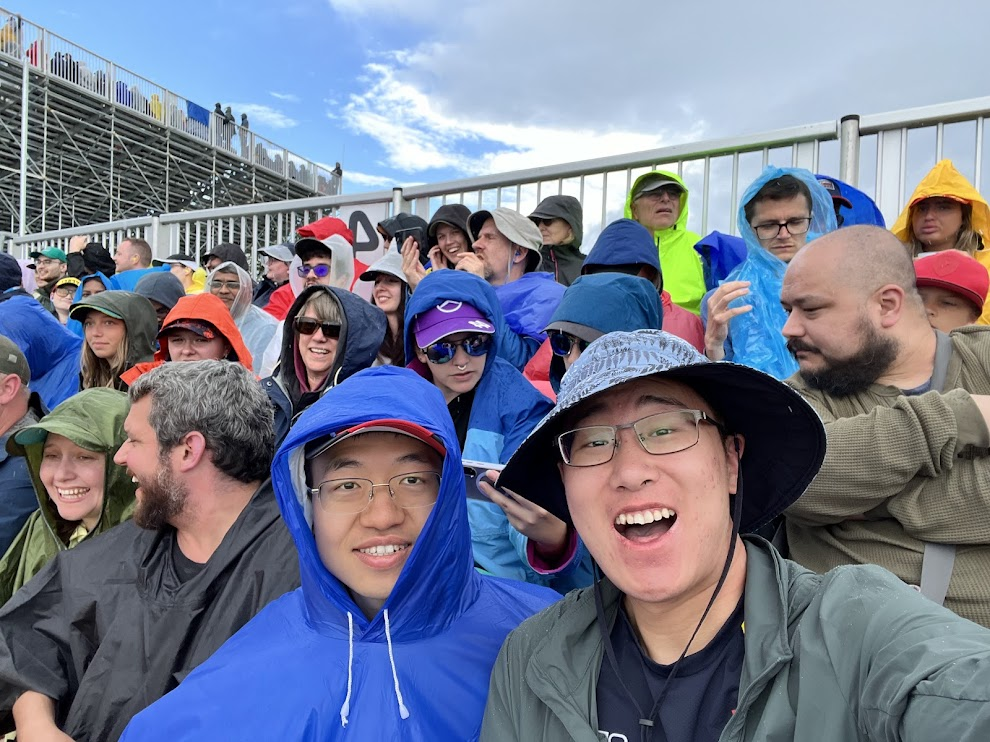

After the race, people started rushing to the track by jumping over the fences while others were stuck at the tiny bridge for the exit. It was quite "unfortunate" that Max won again, but the race was so much fun to watch. This has been the best race of the season so far.

We, of course, also stepped onto the track, which felt completely different than it did two winters ago. It had much more passion and excitement.

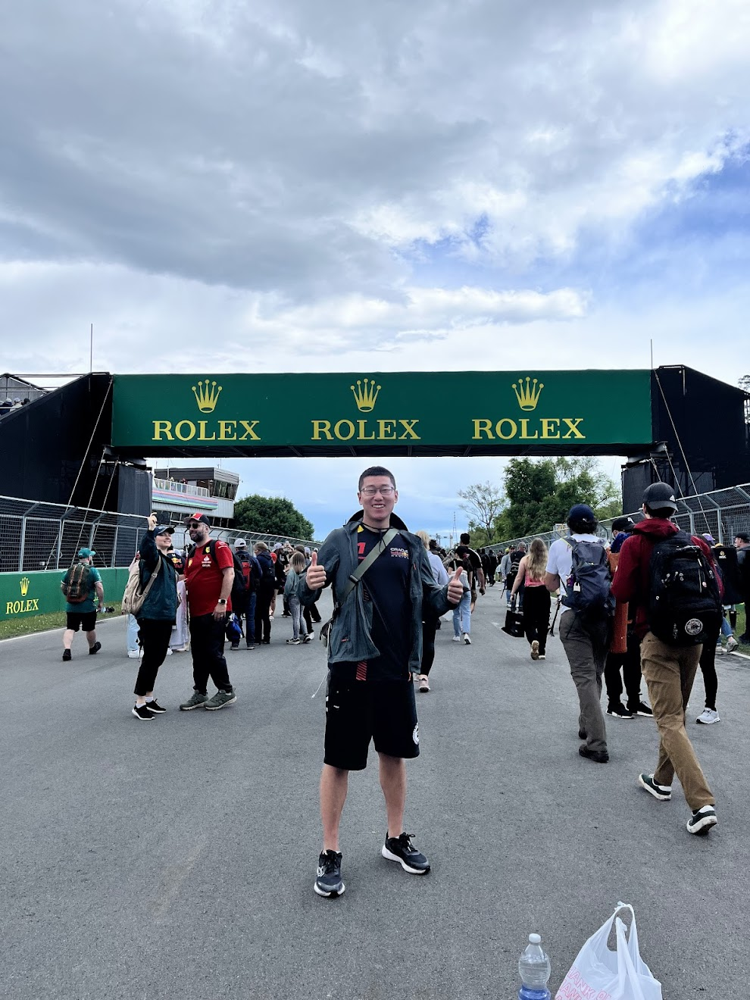

## Old Port of Montreal

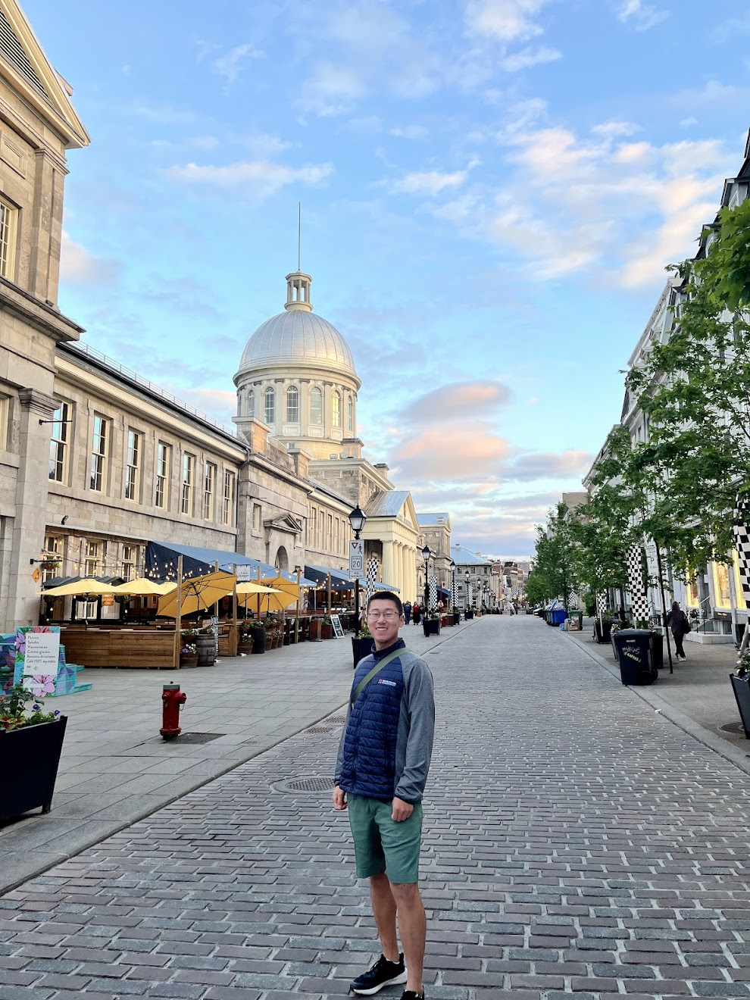

I have been here two winters ago which all I can remember was the frozen river and first time in my life I bought a scarf for myself. This time, I could finally see what Montreal really is in this wild summer. Walking by all those landmarks, the ferryswheel, the chapel, the shopping street was such a throw back for me. We even checked out the coffee shop that we had to get in because of the cold. 

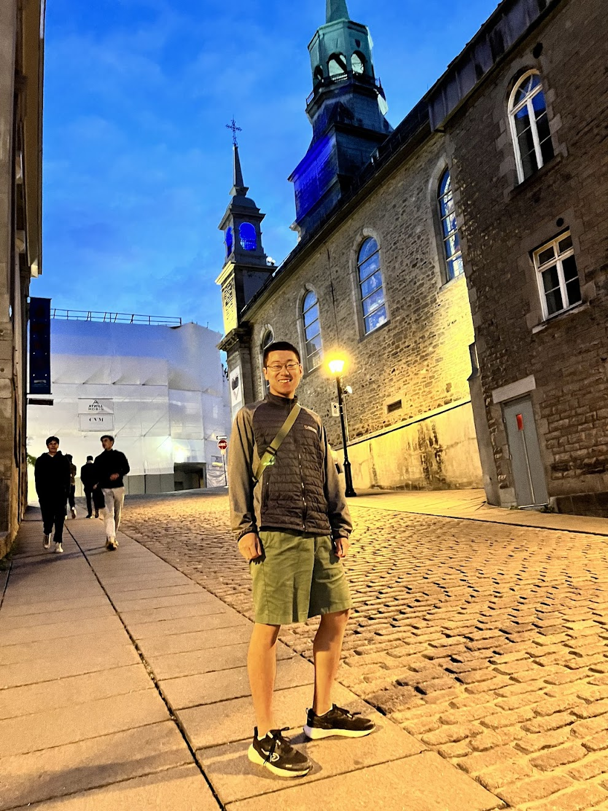

---

In summary, it is a very charming town, and I enjoyed every bit of it. What especially interested me was the unique Quebec culture. When we walked downtown, the separatists were handing out flyers while saying, "English is a crime," which I found funny and thought-provoking as I considered the historical context and significance behind it.

That being said, this might be the last time I will ever go to an F1 race given how expensive and "amazing" it is. Seeing cars driving that fast in front of me feels like watching people commit suicide, frankly. It kept reminding me of the notion that "commercial spectator sports are highly exploitative and especially harmful to the players." I know it's weird, but I totally buy it now.

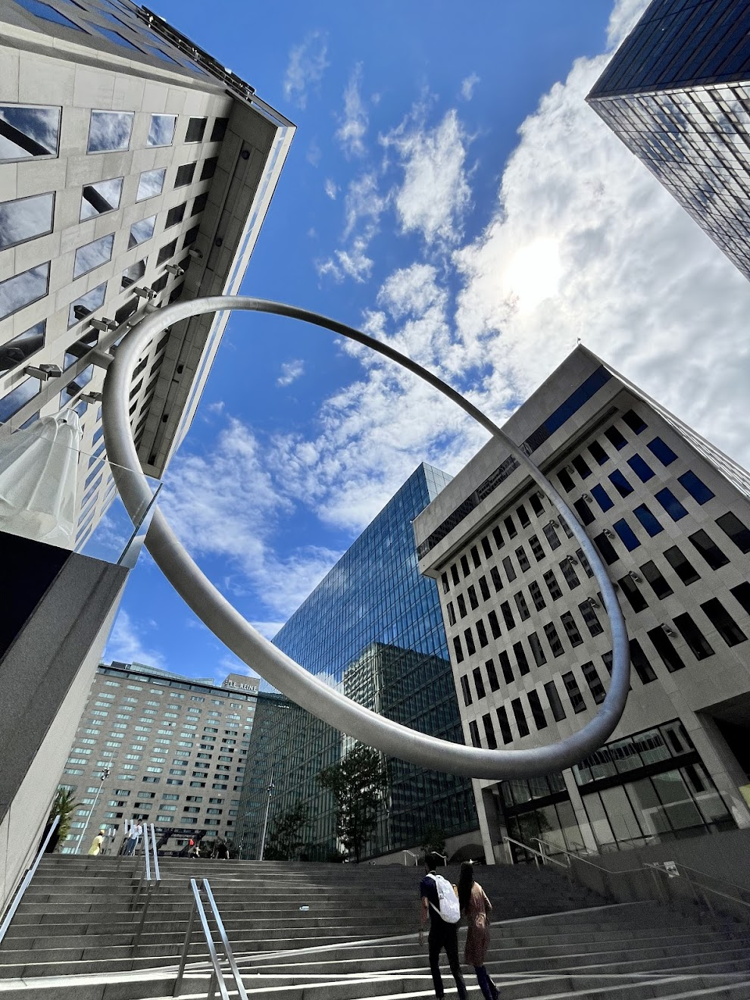A once-in-a-lifetime F1 race in Montreal is amazing. I will definitely come back to Montreal if I have a chance.
