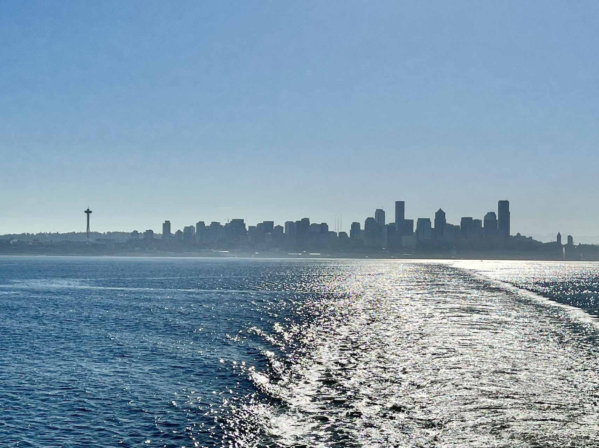
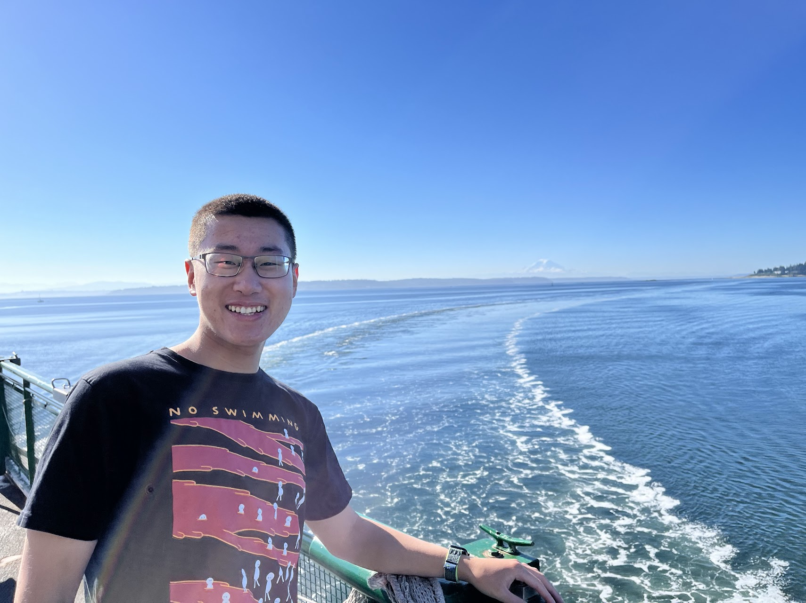

Glacier-capped mountains, rain forests, and coastline all together.

Olympic National Park is so diverse that I don't think anything beats the greatness and wide range of landscapes it offers. I hate to say this, but this is absolutely one of my favorite parks, if not the only favorite. Although I say this after visiting every park. For me, a National Park is amazing because it has something for everyone, every occasion, and every season. No matter when and how I decide to approach a national park, I have never been disappointed even once. To me, this is the beauty of National Parks. Olympic National Park, especially, is the one. It literally has all types of features for you to explore.

## Ferry to Bainbridge Island

We started our day by driving the car onto the ferry, which took us to Bainbridge in a half-hour ride. It was the first time I drove a car onto a ferry, and the views from the deck were amazing. The whole Seattle skyline was there, with a bit of hue in the morning giving it a touch of mystery. Moreover, it's hard to miss Mt. Rainier to the south and even Mt. Baker to the north if you look more carefully.

## Olympic Game Farm

Our first stop is a drive through zoo and I thought nothing would beat the one I visited in Texas with Girraffe literally put the whole head into our car to get the food. However, this one is even more amazing not beacuse of the giraffe, but more other animals such as Bisons, Elks, Bears and more. What makes these animals special is how outgoing they are. When we entered the farm zone, countless elks just started "attacking" us by leaking our windows and some Bisons even start to hit the door handle maybe thinking they can open the car. These are all wild but super fun experience. The level of their outgoing is just unbeatable. Besides, they are just simply so cute.

What I rememver the most was the bear 
