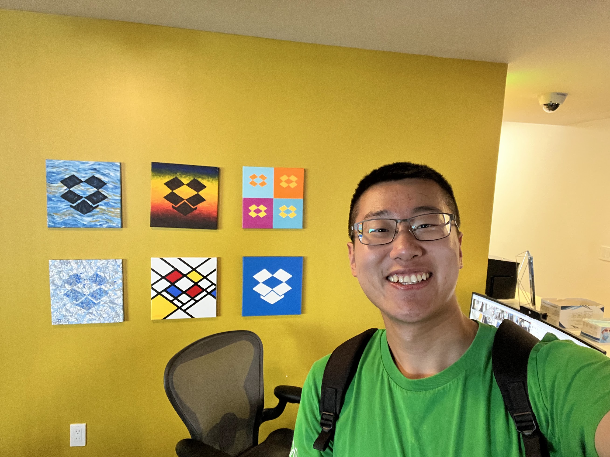
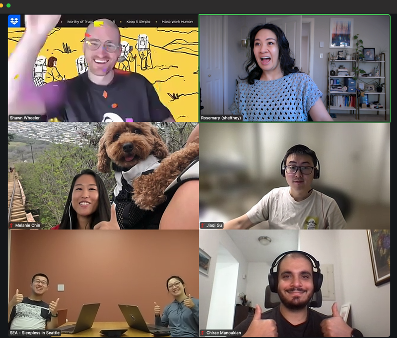
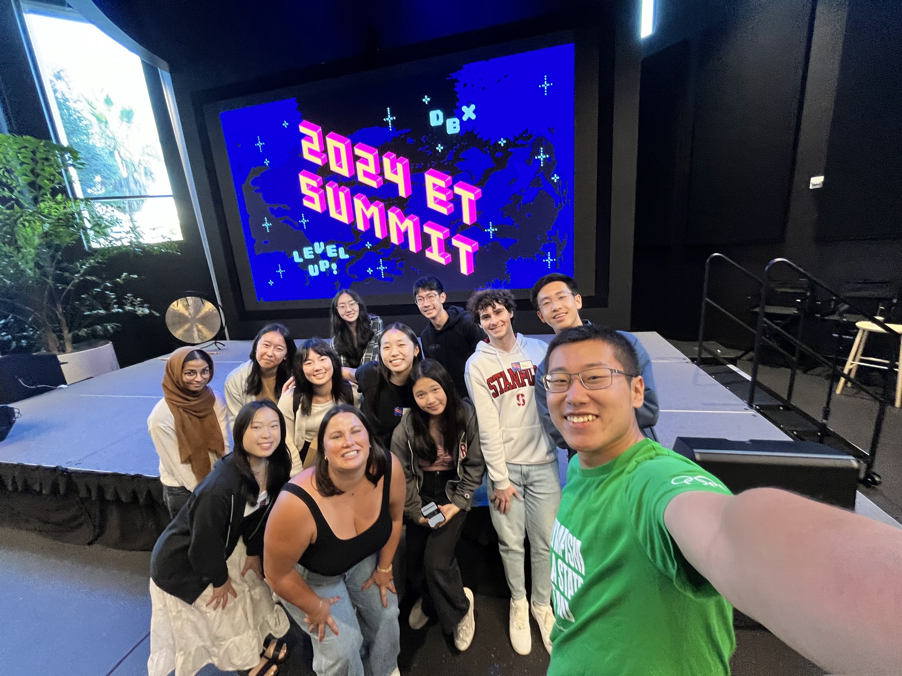
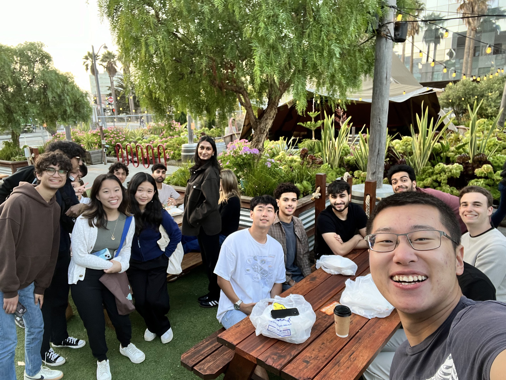
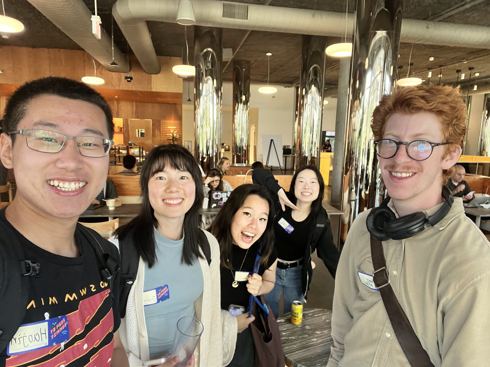

Today marks the last day of my internship at Dropbox.

As I finished my last matcha latte from the office and took the light rail back from Dropbox's Seattle Studio to the U District, I became overwhelmed with emotions. I found myself smiling at my reflection in the window, listening to Zach Bryan's country music, feeling a bittersweet sadness creeping in. It doesn't feel like just a 12-week internship—it's been so much more. The thought of leaving this place and the people I've met tugs at my heart.

I've been meaning to write about my summer for weeks now, but this moment felt too important to let slip by. Even though Seattle didn't quite win me over this summer, realizing that it's the third longest place I've lived—after my hometown Xi'an and school—gave me a strange sense of attachment. Despite my mixed feelings about the city, I know I'll miss it.

Goodbye, Seattle. Goodbye, Dropbox.

---

Reflecting on these past months, I couldn’t have asked for a better way to spend my summer. I've learned so much, both professionally and personally, and I owe it all to the incredible people I've met along the way. I’m deeply grateful for every encounter, every lesson, and every shared moment.

### My Team
As DocSend Prism’s first intern, I was nervous at the start. I had no idea how to navigate the corporate world, especially since this was my first tech internship. But my team surprised me with their authenticity—they were open to feedback and unafraid to share honest opinions. I felt included from day one, treated as a real engineer, with nothing hidden from me—good or bad. Our team dynamics were something special, and I’ll miss the ease with which we interacted, whether it was asking questions, making jokes, or just being ourselves.

My mentor was instrumental in my growth. He encouraged me to ask "stupid" questions and gave me the autonomy to write my own design docs, while providing the guidance I needed. The most valuable technical skill I learned wasn’t just about coding, but about a way of thinking. Designing a feature, considering all the edge cases, evaluating alternative designs, and understanding the trade-offs—these were the skills I honed. Going from feeling overwhelmed by complexity to breaking down tasks and solving problems step by step was incredibly rewarding.

I’ve gained a newfound respect for software engineers. I used to think we were just typing away on keyboards, but now I see how complex even a simple feature can be. There’s so much to consider, and it’s no easier than constructing a skyscraper. Yet, I love the process and am more determined than ever to become a real software engineer, building solutions that empower users.

My manager also went above and beyond to support me. I see her as another mentor, not just a manager. Despite the remote setup, I had the chance to connect with my team almost every day, which I really appreciated. Whether it was a standup or an implementation discussion, I enjoyed every opportunity to interact. Meeting some team members in person later only confirmed that they were as passionate and interesting in real life as they were virtually. I used to doubt the efficacy of a fully remote setup, but now I’m convinced it’s the future, and it works perfectly for me.

Outside of my own team, being part of the broader DocSend community was an amazing experience. DocSend feels like a startup under Dropbox's umbrella, providing the perfect environment to learn and grow. I had the chance to engage with virtually anyone I wanted to—from product folks to senior tech leads and managers. The collaborative culture made me feel supported, and it played a crucial role in my understanding, especially as an intern.

Of course, no organization is without its challenges, and Dropbox and DocSend are no exceptions. But with the people and culture here, I’m confident that it’s a healthy and sustainable place to work.

### Fellow Interns
This is another wonderful group of people I’ve had the honor to meet. I’m so grateful we gathered at the Emerging Talent Summit at Dropbox’s SF HQ for an in-person team-building experience.

From the moment I met the first person at our hotel, I knew I was going to love it. I was excited to meet my fellow interns, and I had endless energy to talk to everyone. This was one of the coolest groups I’ve ever encountered, with diverse backgrounds, roles, and perspectives. I’m proud to say I remembered almost everyone’s name and story. Hearing different experiences from such a variety of people was one of the highlights of my summer.

Though I hadn’t drunk all summer due to medication, those three days in SF were an exception. I’ve always said I enjoy the taste of beer more than the social aspect, but this time I enjoyed both. Acting like a social butterfly (I’m not) helped me connect with more people. I’m not a regular drinker, but when I do drink, I go all in. And I only drink when I’m either extremely happy or sad. I’m happy to say this time, it was sheer joy.

I’ll never forget the night we went to karaoke after an open bar where I’d had 10 bottles of dark beer. I was a completely different person, letting loose after a summer of hard work. I’m grateful to those who stopped me from drinking more—I was on the verge of getting sick but managed to avoid it.

The next morning, I woke up with a lost voice and sore muscles. I hadn’t felt that sore even after running a competitive 5K. I guess I jumped around too much the night before. But what an experience—it was worth every moment of release and joy.

I have a strong feeling that the people I met here will go on to do amazing things. They’re not only talented but also fascinating individuals. They’re not the typical geeks but people with immense charisma. I hope to see some of them again in the future, and maybe, we’ll achieve something great together.