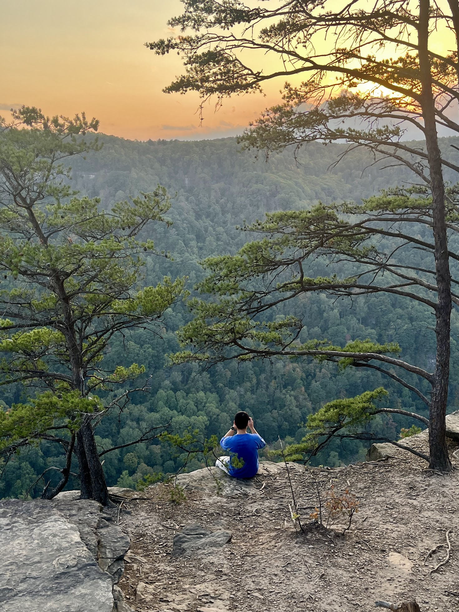

Country roads, take me home...

I’m finally here in West Virginia, not just for a brief stop like last year’s ski trip, but fully, deeply, in this place I've dreamed of. A national park, a part of my soul. The excitement has been building since last fall break. I knew this day would come. I booked the Airbnb almost a year ago, but it felt like I had been waiting a lifetime to experience this.

After a long six-hour drive back to Duke, I’m utterly exhausted. My body wants nothing more than to collapse into bed, but my heart is still buzzing with everything I felt during this trip. I need to write. I need to document this feeling now, before it fades.

This trip means so much more than just a song, more than John Denver’s timeless words. It's not just about fulfilling a dream—it's about meeting a piece of myself I've always been destined to encounter. A place I’ve carried in my heart since childhood. West Virginia may be one of the poorest states in the U.S., but my love for it isn’t built on its reputation or reality. It's built on a fantasy, an image shaped by Denver’s lyrics and my own imagination. But over these past few days, I finally saw her beauty, her quiet charm, and it’s even more wonderful than I could have ever imagined.

Driving through the New River Gorge Bridge, with “Country Roads” playing in the background, was a moment so intense, so packed with emotion, that I almost couldn’t breathe. Happiness, sadness, excitement, regret—they all collided at once. That song, that road, that view—every ounce of feeling I’ve ever tied to this place came rushing to the surface. It was as if my heart was too small to hold it all.

And the people. I cherished every moment with the crew on this trip. We laughed endlessly, played games like Contact, Exploding Kittens, and Wavelength until we were out of breath from the joy. There's something special about being with people, sharing moments that go beyond just words.

I thought this would be a classic blog post, detailing every stop, every trail, but I realize now that words like “itinerary” can’t capture emotions. I’m feeling too much, and I just want to hold onto it all—without breaking it down into days and times.

Sitting around the fire, making s’mores on our last night at that beautiful Airbnb in Coal Run, felt like the perfect end to something precious. The soft drizzle of rain against the crackling fire, reflecting on my life—college, future, everything—felt so surreal. It was one of those moments that etches itself deep into your memory, a gentle, lingering feeling that you carry with you.

The sunset at Endless Wall trail will stay with me forever. The view from that rock, where the bridge seemed impossibly far, with the sun casting golden light across the New River—it's too much joy for one place to hold. The river couldn’t possibly contain all that we felt.

Whitewater rafting brought its own magic. I thought I’d save $15 by not getting a dry suit...and ended up shivering for two hours. It was the coldest I’ve ever felt, even colder than Iceland’s winter or Alaska’s glaciers. Every splash of water reset my body’s temperature, making me feel alive in a way I can’t explain. That cold, the fog, the early morning sunshine, the roar of the water, the brilliance of the fall leaves—it’s a tattoo on my heart. West Virginia’s water, wild and untamed, is something I’ll never forget.

If there’s a God, I think nature must be it. I’ve found more peace, more happiness, in nature than anywhere else. The air, the sunlight, the water—it all speaks to me in ways that words can’t.

Driving back—those six long hours—was strangely peaceful. Everyone else fell asleep, and it was just me, the road, the music, and my thoughts. Or maybe no thoughts at all. I entered that flow, where time melts away and it’s just you and the endless highway. There’s something so freeing about driving, about being alone with your own mind and the hum of the car.

This trip was more than just a getaway—it was a release. I’ve been carrying so much stress with recruiting, waiting to hear back from Dropbox, and the weight of uncertainty has been heavy. But West Virginia... West Virginia was a breath of fresh air, a giant hug wrapping around me, keeping me alive, keeping me hopeful. I want to cry now, to release all that tension, but instead, I hold onto the memory of these past few days, letting them keep me afloat.

"Country Roads, take me home, to the place I belong..."

West Virginia, you’ve blessed me in ways I can’t put into words. Thank you.

