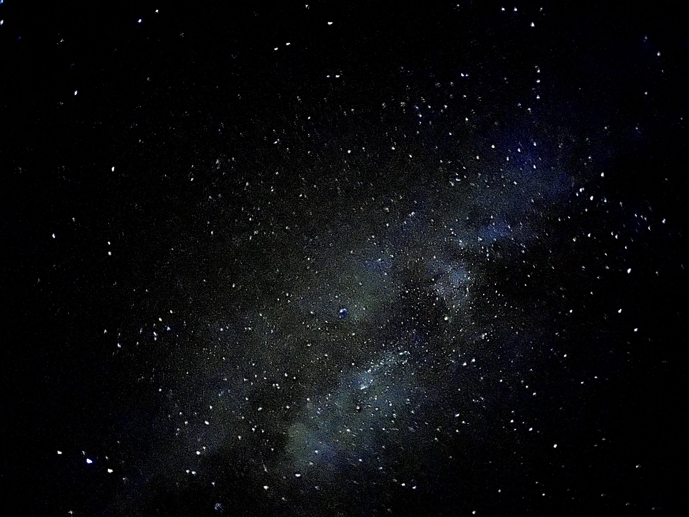
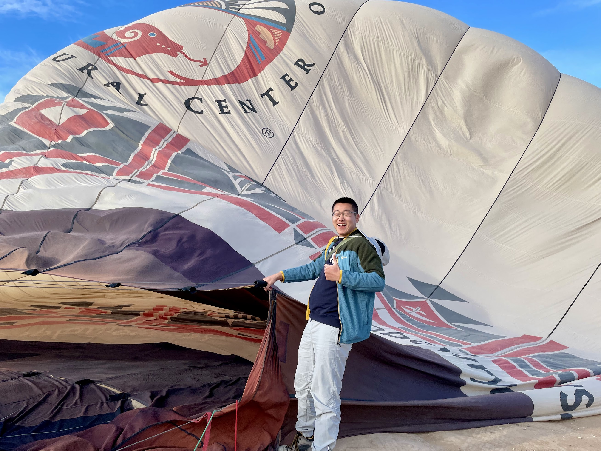

How does one capture a year that feels like floating in space?

This year defies simple categorization. To call it tough would overlook the constellation of beautiful memories scattered throughout. To call it a blast would dismiss the first real existential crisis that gripped my mind, the first time mental health became more than just a distant concept. No, this year was like any other year – a cosmic dance of ups and downs. It's as if all these years I had been training to be an astronaut, enduring intense simulations and dangerous trials, but when the actual launch day arrived, when I was finally suspended in the vast expanse of space, everything changed. Reality proved different from any simulation – the racing mind, the pounding heart, the overwhelming everything.
For me, 2024 was the year I was launched into space. I had weathered difficult moments during "training" and took pride in passing those tests. But being in actual orbit? That's an entirely different story. I began experiencing real panic, genuine worries, and raw emotions I could no longer suppress. Clearly, I wasn't the well-trained astronaut I had always imagined myself to be.

Let me first trace the constellations of joy. In truth, most of the year sparkled with incredible moments. I remember the first sunrise of 2024 painting my face in golden light at the remote Big Bend National Park, where Texas meets Mexico. I recall the tranquil, freezing waterfall in Iceland that filled my soul with joy (and left one toe numb for two weeks). There was the homecoming, opening a 10-year-old memory box with elementary school friends, each memento a shooting star of nostalgia. Summer became a meteor shower of adventures: the sunset's embrace in Victoria, F1 engines roaring like thunder in Montreal, holy Mt. Rainier mirrored perfectly in Reflection Lake, and Crater Lake's waters as blue and clear as Earth viewed from space. My time at Dropbox felt like discovering a new galaxy. Life moved so fast, so brilliantly, that I barely had time to document its light.

I cherish every part of this journey. Each moment shaped who I am, helping me see myself with crystal clarity. But even the most carefully planned space missions encounter turbulence.

The descent began with the endless wait for a return offer from Dropbox – a hope I clung to based on my performance and manager's feedback. The delay stretched into late November, becoming a gamble I was destined to lose. I held onto false hope, neglecting to apply elsewhere. When news of the 20% layoff hit, it struck like a meteor to the chest. Questions about my place in society's orbit and my significance in this vast universe began to spiral. An existential crisis – words I never thought would describe my own experience – took hold.

First came self-blame, regret, and resentment for not seeking other opportunities. Then, deeper pain for my manager, one of the kindest souls I've known, who was laid off. I wanted to blame someone – the CEO, investors, the capital market, capitalist society, the world itself, human nature? The questions haunted my nights like distant radio signals with no clear source. If my manager or I could be cut loose at any moment, regardless of our performance, what was the point of any of it? Working for a corporation suddenly felt like inviting a black hole into my home for company.

The semester brought more gravitational pulls downward. A propaganda class glorifying mining's 500-foot pit holes as community benefits, and a devastating breach of trust with a dear friend and co-worker trapped me in a prison of self-torture and denial. Everything seemed to be falling into a dark void. I was stuck in zero gravity.

For the first time, I realized I needed help. Through the darkness, I found myself blessed with a constellation of kind, caring people, and I'm grateful I reached out. Through conversations and self-reflection, I began to understand that my life had been a godspeed highway without real obstacles – creating the illusion that everything was within my control if I just tried hard enough. But this isn't the universe's primary law. So much lies beyond our control, and accepting this truth is part of the journey. My refusal to acknowledge this led to self-blame and questioning the value of my efforts. I began to drift too far, empathizing with everything – past, present, future, decades ahead. My internal guidance system couldn't handle the load, and it crashed.

The key lesson from this orbital journey: not everything is in my control. It's a difficult truth for an idealist who prefers to be called an optimist. I hope to keep this lesson close, like a compass guiding me to focus on what I can control.

I've spent too much time gazing at distant stars. Now it's time to feel the ground beneath my feet again. Keep running, keep falling, keep smiling – in this beautiful, imperfect world where loved ones past and future light the way forward.