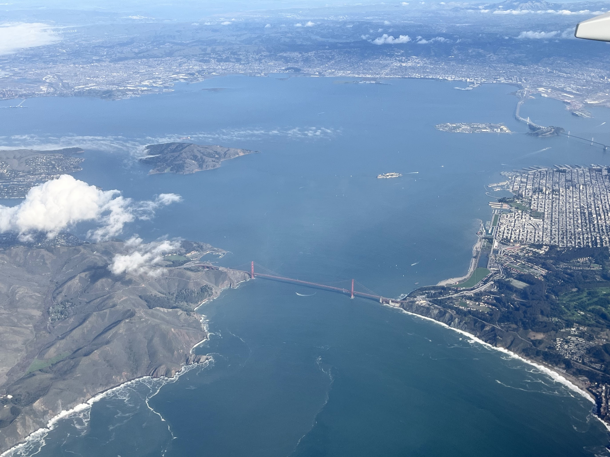
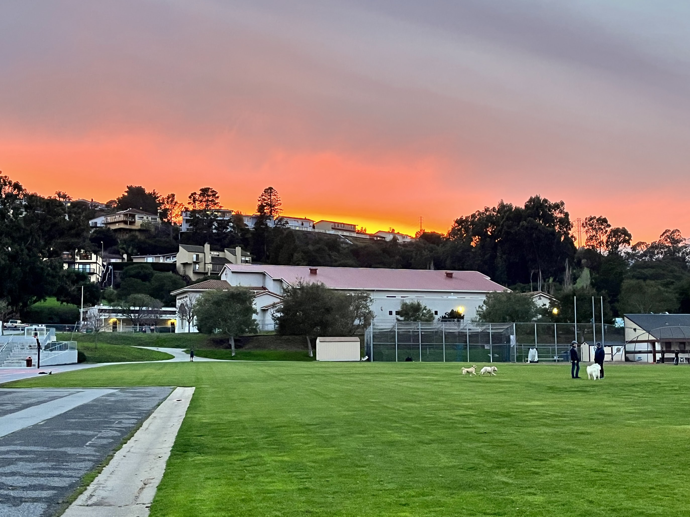
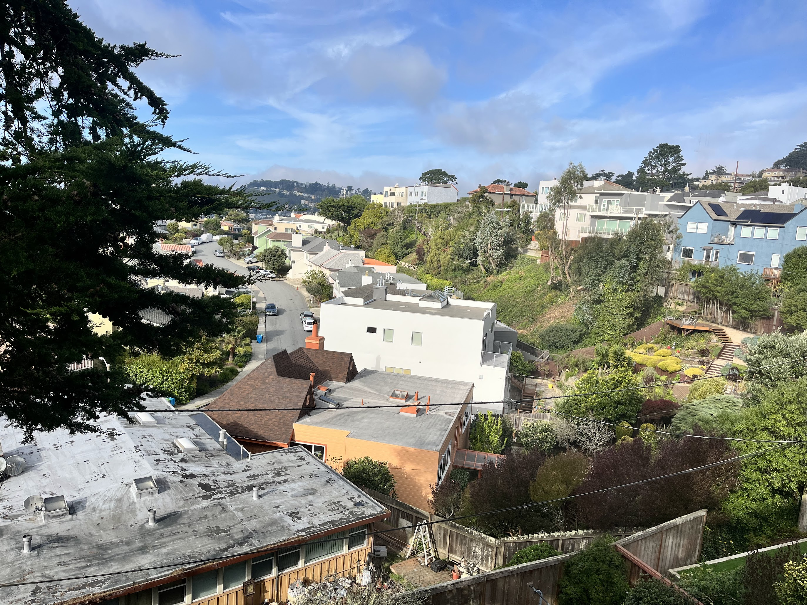
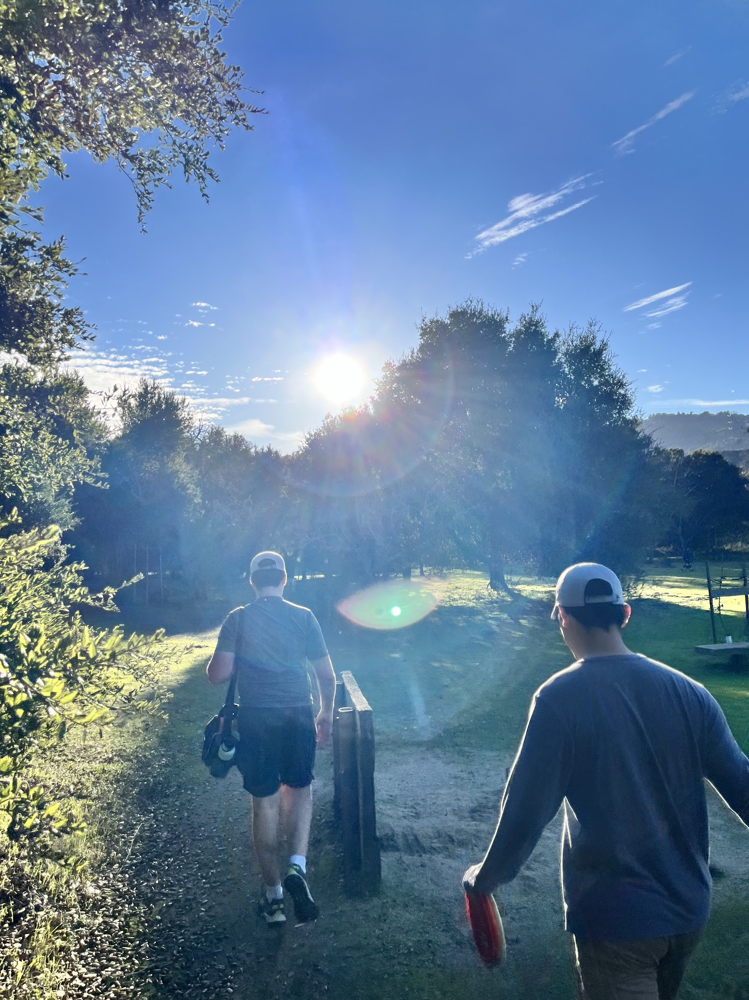

My first onsite interview and a blast time with friends.

The winter break has been a blast for me. After my ambitious road trip from LA all the way up to Vancouver, I crashed at a friend's place in Seattle and flew to SF shortly after for an onsite interview at a startup. I thought it would be a stressful few days with 5 rounds of back-to-back interviews in a single day, but meeting with my friend/mentor here gave everything a colorful beauty.

On the day I arrived, I was lucky enough to see the entire SF city from the landing plane. The city looks so surreal with its massive dense residential areas and skyscrapers up in the sky. It felt like a dedicated LEGO piece of art standing in the water by the bay. The Golden Gate Bridge looks even more magnificent from above. I was also surprised to see the vast land of Golden Gate Park, which resembles Central Park in NYC. The city looks like a heaven full of ideas and ideals, at least from above.

I watched one of the most unique sunsets I've ever seen in Millbrae while grabbing dinner with my mentor. The sky was covered by clouds and fog at dusk, but the setting sun captured the hue, decorating it with the most beautiful red I've ever seen. The color looked like red wine that made me want to indulge in it.
The next day, I started by picking up trash with my friend in the neighborhood, something that was absolutely never in my consideration before. My friend has my highest respect and really made me reflect on myself, as this is something I never did for my own neighborhood yet it's so easy to do. The weather was amazing and I lost count of how many times I said "OMG" while in SF. It's a blessing to be able to do some little good deeds under the amazing sunshine.
In the afternoon, I tried pickleball for the first time at the local community center. It was genuinely an amazing sport that's friendly to all age groups, and I had a lot of fun learning and getting better at it faster than expected. I might have to play more pickleball now.

Though exhausted, I still went disc golfing with friends, which I would never have done without them. And I'm glad it was such a great decision. I had played disc golf a few times before with the same friends in Golden Gate Park but never got to enjoy it to the fullest. This time, I made my first two throws and witnessed some insane shots by friends that I'll probably remember forever, plus again, the amazing weather in SF. Moreover, I got my written offer from TikTok during the game and I just rushed to my friends to hug them. I couldn't be happier. Last month I was experiencing serious mental health issues, and I couldn't believe I was here now. Shit happens but life changes fast.

The next day was the real business - my onsite interview with a YC startup called Agave. This was my first ever onsite interview and first time being this close to startup culture. The company is located in a residential house just like any other in SF. I had to double-check the address before knocking on the door, afraid of disturbing a random friendly neighbor. When I walked in, I saw the team having planning meetings in the living room while I sat down in the kitchen with a warm cup of tea. I could smell the startup vibe as soon as I walked in. Everyone was chill and working. I tried to greet everyone as I came here genuinely wanting to learn more about the startup and was curious about the people working here, regardless of the interview results.

Then the interview part began. I really appreciated the ample time I had after each interview to ask questions, where I got lots of insights into how this startup works, and how startups work in general. It was rewarding and interesting to learn.

One of the coolest interviews I've ever had was among the five. I was asked to design a file explorer across different cloud storage systems while given some APIs to use. I got confused with the requirements but had a fun time talking back and forth with the interviewer to figure out the core problem and possible solutions. The interviewer tried so hard to clarify my questions while not telling me the answer. Eventually, he showed me that this little interview question was actually a real feature they built for customers. The moment he showed me the real working feature in the software, I was so surprised and impressed. This was the best interview I've had. It's these things that really excite me about being a software engineer.

I passed out in the hotel after the five interviews that took the whole day. Then I got an email from the CEO for a talk at 6pm and I got the offer! I was in my friend's car going to enjoy some amazing all-you-can-eat KBBQ. The moment I heard that "congrats" on the phone, I was over the moon, over Mars, over every planet in the solar system. The air in the car became the sweetest thing I'd ever breathed. Suddenly I wanted to cry so much because the sudden relief was tremendous. The depressed version of myself from a month ago kept showing up in my mind, and I wanted to thank him and tell him everything was OK now. I wanted to hug my friends so badly but the car space wasn't enough. I just held my hands on my head until I calmed down a bit, arriving at the restaurant.
What an amazing day, what an amazing week, what an amazing winter break. I've been through the darkest time and probably also the brightest time right now. The feeling is just indescribable.

Now it's time to finally enjoy my senior last semester and appreciate people, things, and everything around me. It's never too late to express gratitude and enjoy life.

