It turns out Atlanta has way more to offer than Coca-Cola World.

Life is getting better and better these days. Ever since I started getting job interviews and offers, everything has turned to the bright side for me. It was a tough lesson to learn last semester, but I also realized how precious my remaining college life is. I promised myself I would make trips with friends I haven't had the chance to travel with and expand my footprint to as many places as possible. This LMK weekend was definitely one of those promises to myself.

It was probably one of the most spontaneous trips I've ever made. I booked everything only one week before and got my last friend on board just two days before departure. That being said, it was still an amazing time and a blast. As with virtually any trip I've had, it exceeded expectations, as they always do.

## Romare Bearden Park in Charlotte, NC

We started from Duke around Friday night and made a small pit stop in Charlotte, which was around a 2-hour drive. By the time we arrived, it was already 8pm, and unfortunately, I couldn't go to any museums, which I always like to check out in a city. Instead, we hit one of the supposedly best skyline view parks in the city. The view was often obstructed by trees. Friday night in Charlotte was kind of dead – we barely saw any pedestrians downtown, but it felt quite safe since nobody was there and the streets were actually quite clean.

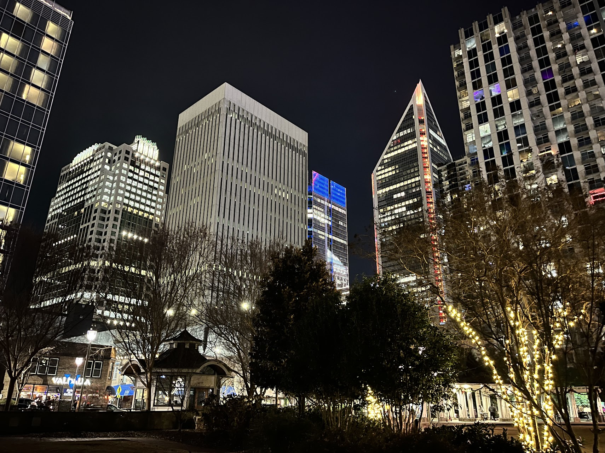

We wandered around the park for only 5 minutes before having to leave because it was too cold, especially for one of my friends who forgot to bring a jacket. He was going to suffer a bit for the rest of the trip as it started to get colder and colder!

After the park, we drove for another 2 hours to stay a night in Greenville, SC. It was the cheapest Hyatt Place I've stayed at, but it turned out to be pretty good.

## Coca-Cola World

This is probably the most famous landmark in Atlanta. Honestly, it was overrated in my opinion. But don't get me wrong – it was still worth seeing, especially worth tasting all 150 flavors of Coke products from around the globe. It was just a smaller and shorter exhibition than I expected.

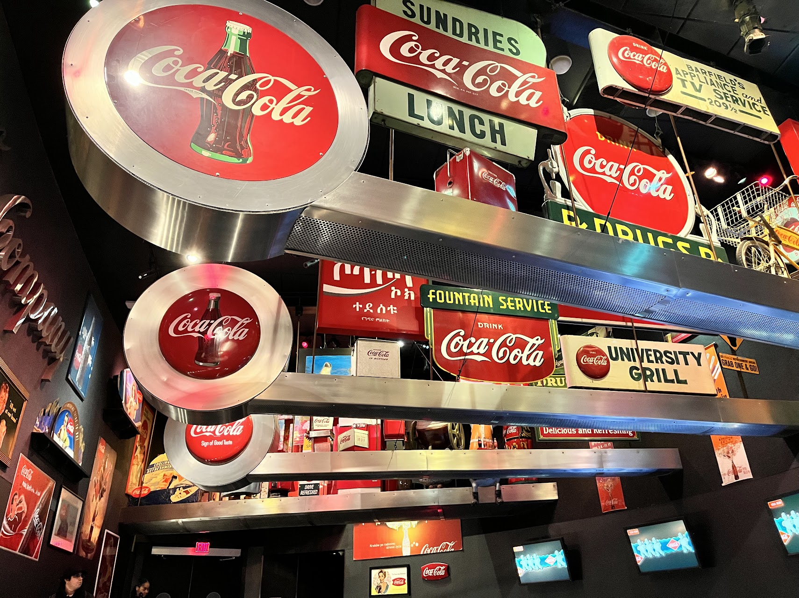

As with many experiences, we first watched a Coca-Cola propaganda video about happiness for 8 minutes. It was clever in that it never mentioned the brand, but Coke kept showing up in the happiest moments, such as skydiving for the first time or throwing a surprise birthday party for family. I even started crying because these were genuine moments of joy that resonated deeply with me. But ultimately, my inner skeptic reminded me it was just propaganda.

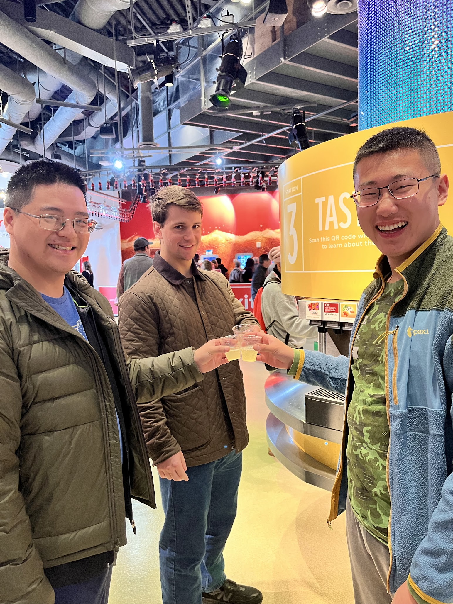

We saw many cool Coca-Cola signs and physical ads from across the world, spanning different eras and languages, casually hanging in the hall. It created a really cool Coke time-travel space. I didn't realize how powerful and valuable this brand was until seeing all the genius promotions they've done.

And here comes the best part – tasting all of them! I liked how my friend just skipped the smell gallery and went directly to the giant tasting stations. I tried at least 60 of them, and my favorite was the Fanta from Greece, which I'm visiting this spring break and where I hope to try it authentically. To sample more flavors while saving my stomach, I started mixing 5 flavors together. It might have broken my taste buds as it barely tasted like anything, but it wasn't bad.

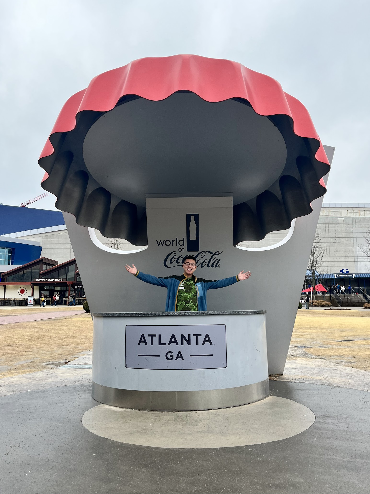

Eventually, we walked out feeling like diabetes was on the way soon. They had a really cool souvenir shop, and some Coca-Cola designs were actually really stylish and fashionable. In general, I left this world with a good impression of Coca-Cola – they did a great job on brand presentation!

## Emory University

We also walked around Emory University's campus thanks to one of our friends' friends who goes there. The school is pretty cool but has way smaller undergraduate spaces than Duke. All the premium facilities are in their medical school, which has the best facilities, buildings, and funding. Anyway, it was still very nice to walk around, and you can really tell different schools have different personalities and student vibes just by exploring the campus.

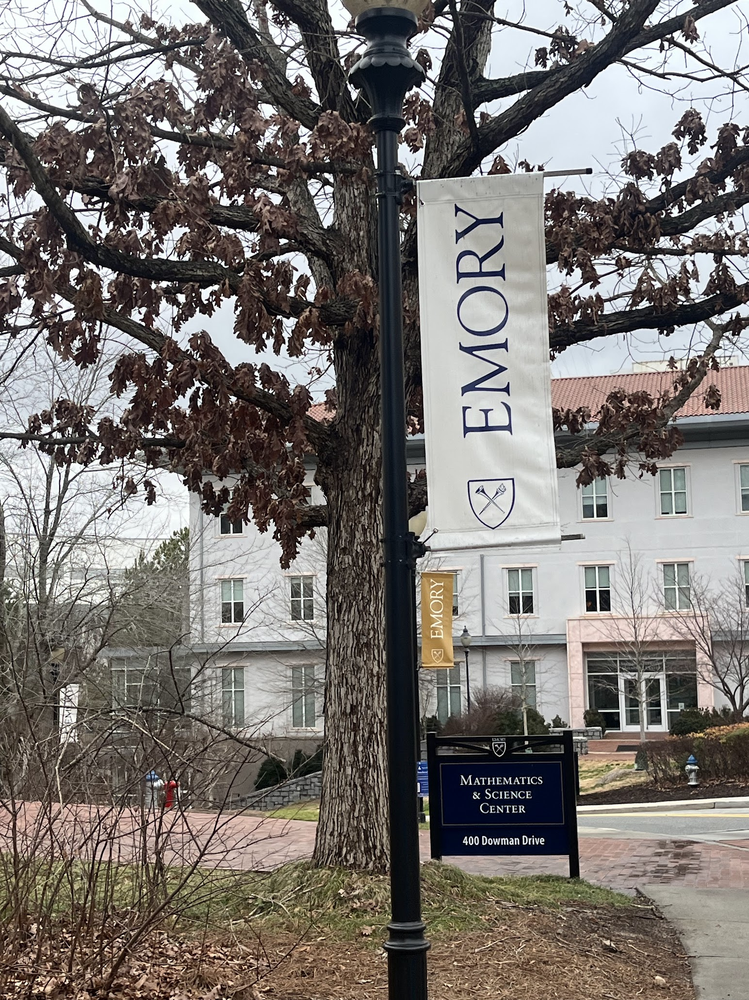

## Jimmy Carter Center

It was purely a coincidence that the Jimmy Carter Center is here, as he's from Atlanta. We decided to check it out even though it had just closed before we arrived. It gives off the vibe of a private residence but is publicly accessible. Unfortunately, we couldn't get into the facilities.

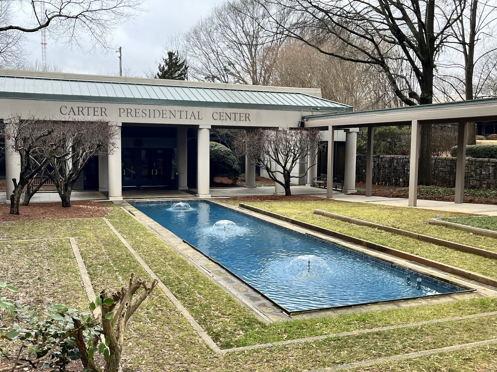

## Ponce City Market

This is definitely the coolest city market/shopping mall I've ever seen. The historical style really reminds me of the [Central Market Hall in Budapest](/posts/2023-08-17-budapest/#central-market-hall), very industrial but also very lively.

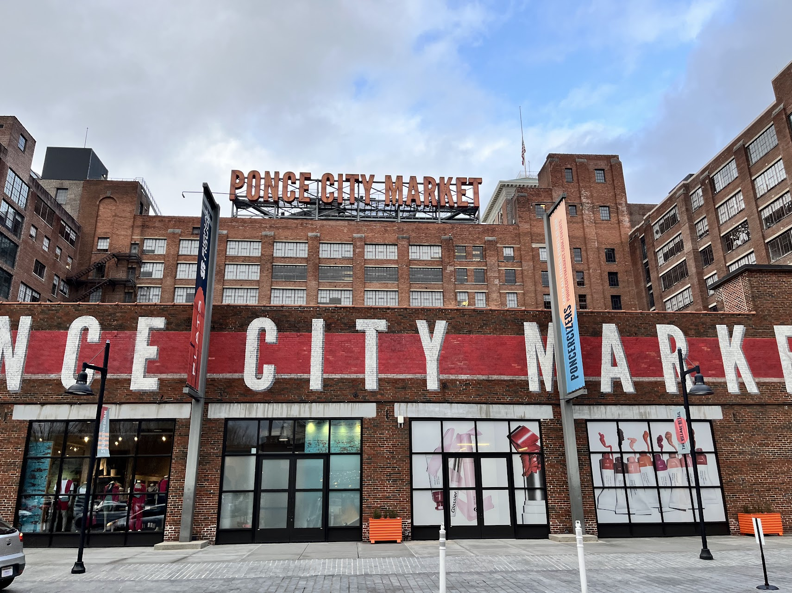

It's a great city transition project that turned old industrial buildings and areas into an excellent public space with food courts, rooftop bars, and walking trails. We were also able to see a pretty nice sunset from the market's balcony.

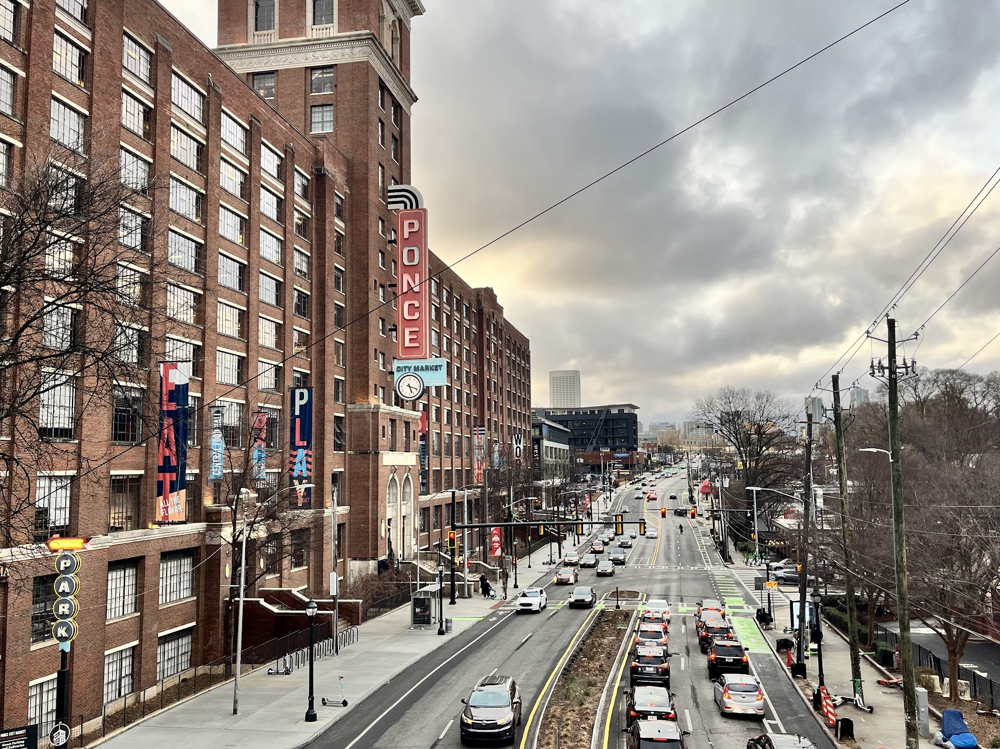

## Georgia Aquarium

This is the coolest aquarium I've ever seen. I'm actually never a fan of aquariums or zoos because I don't like seeing creatures stuck inside artificial containers. Instead, I love seeing them running freely and happily in the wild, just as I hope to be outdoors always. But this time, I actually liked the aquarium because it attempted to build a giant world that feels like a free one, even though it isn't.

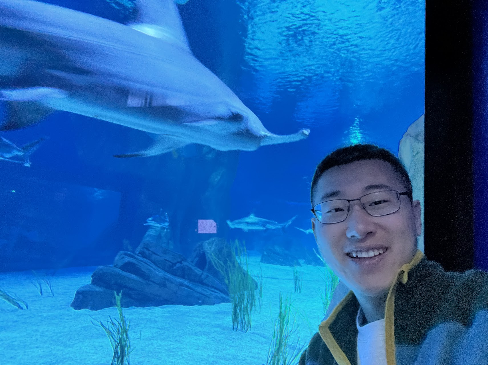

I was amazed by how huge the water tank is. We saw sharks, whales, and giant stingrays through many water walls from above, below, and through tunnel views. It was just so cool to see so many animals living there vibrantly.

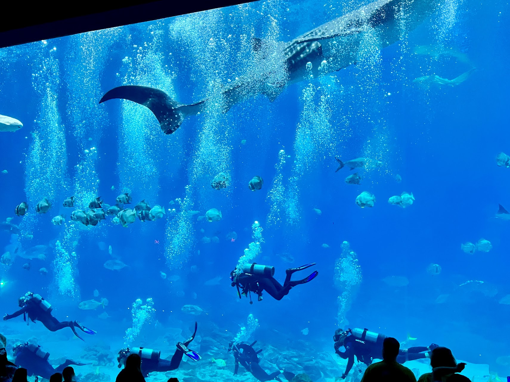

Today I realized my favorite animals besides cats are sea otters. They are simply so cute. They reminded me of the sea otter I saw in Alaska, where they just leisurely lay on the sea, as if reading a newspaper while crossing their legs. They are just adorable.

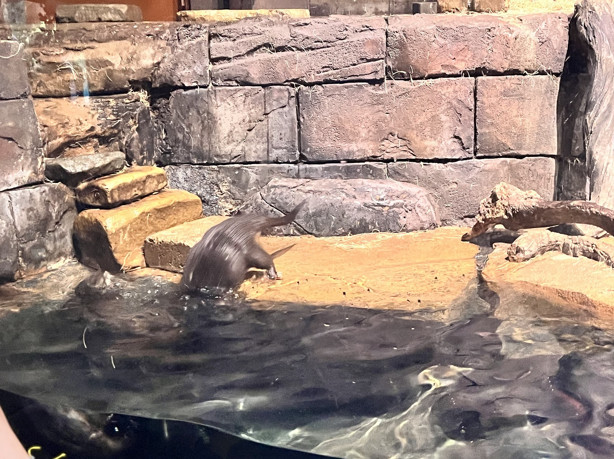

## Stone Mountain State Park

This was the only hiking we did in Atlanta due to the severe cold weather. It wasn't a hard hike – only 2 miles and 1 hour round trip with a steady incline. However, the wind became really extreme on top of this bald stone mountain without any trees. I felt like I was nearly being blown away. That being said, the view from the top was quite spectacular even given the bad cloudy weather conditions. We saw sunbeams streaming onto the city, and it just felt unreal. Atlanta felt like an angel's city with all the light beams.

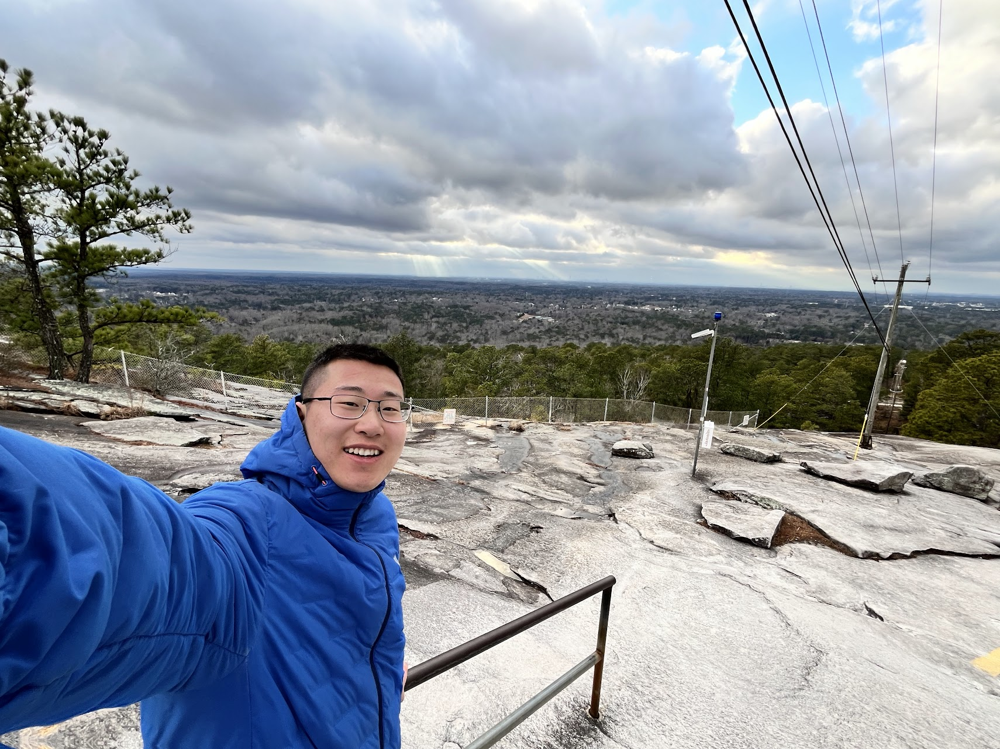

We also checked out something unusual: a rock carving memorial for the Confederacy generals. They even built a whole memorial hall for them. I was simply there to appreciate the art, and the presentation really resembles Mount Rushmore, which I aspire to visit sometime in the future.

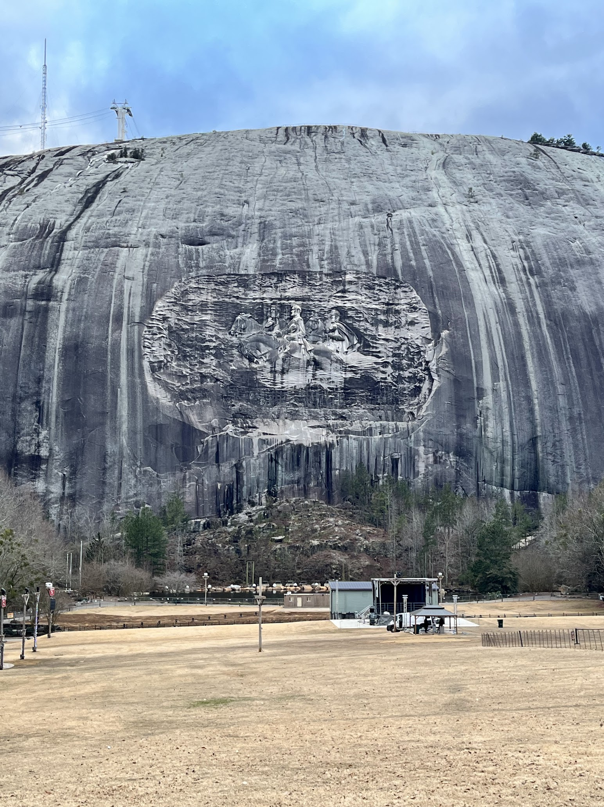

## Piedmont Park

It's similar to the park in Charlotte with a night skyline view but way better. There was a lake that reflected the skyline. We enjoyed the short stay even though it was still record-breakingly cold in Atlanta, where my water bottles literally froze despite being in the deep South.

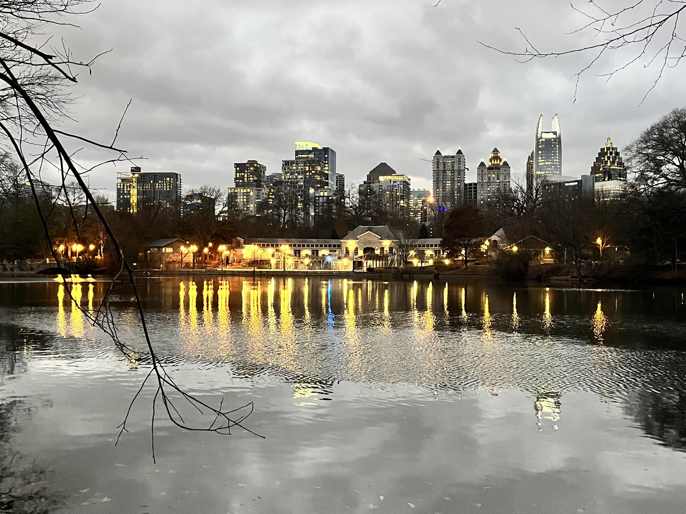

---

In summary, I really enjoyed this spontaneous trip to Atlanta. There were many surprises along the way: I didn't expect Atlanta to be this cold (it even snowed the day after we left!), but I also didn't realize Atlanta is such a vibrant city with so much to offer besides Coca-Cola. One regret is that we didn't visit the Chick-fil-A headquarters, which is ironic considering we had 4 meals there during the trip! Would love to come back again!