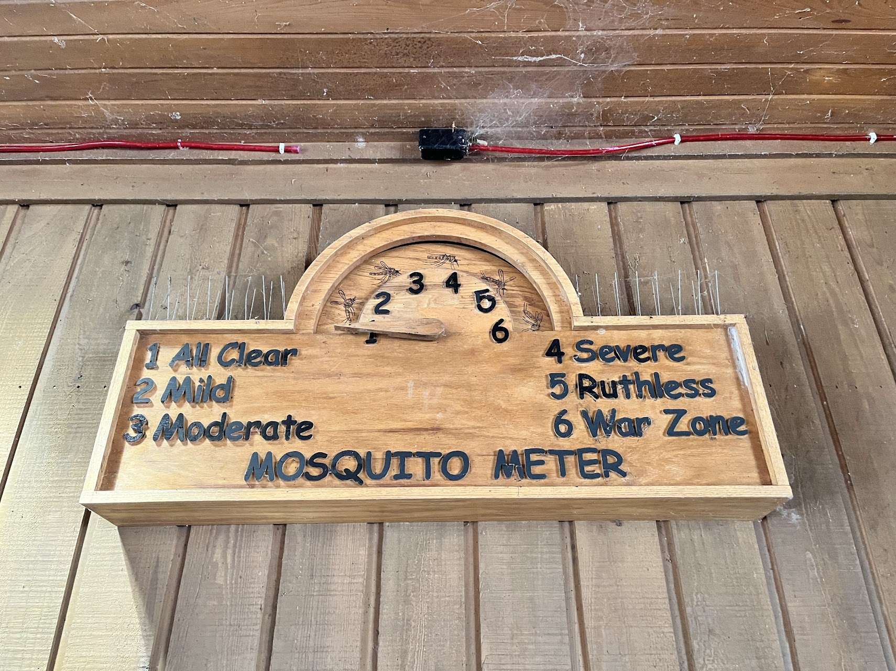
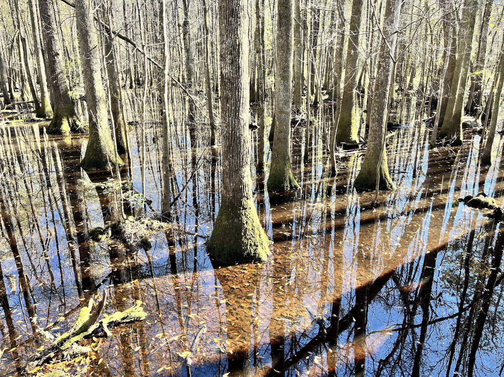
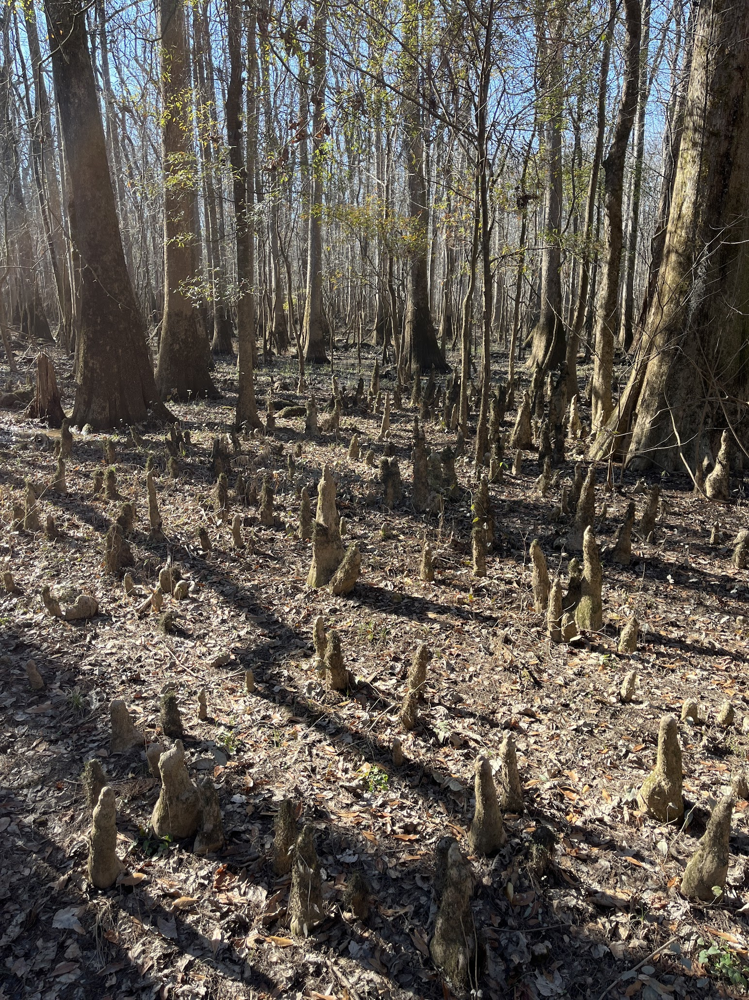

It's a short visit but it marks my 30th out of 63 national parks!!!

After visiting Atlanta, we decided to take a 1-hour detour route back to North Carolina through Columbia, SC, which happens to be where Congaree National Park is located. It was, of course, another spontaneous decision on this spontaneous trip.

The park doesn't have a great reputation because of its bug situation, especially in summer. The park actually features a mosquito meter, which I found really amusing – it even makes Death Valley's temperature meter seem less impressive in comparison!

The park is often summarized as a swamp full of mosquitoes, and that's not wrong. However, conditions are much better in winter, and we got lucky with sunny and warmer weather. Just 3 hours earlier when we started driving from Atlanta, we were freezing in the rain. Now it was sunny and warm enough to enjoy our visit. The timing worked out perfectly since we'd spent 2 hours having lunch on the road while watching Trump's inauguration speech!

Maybe because I had such low expectations, I actually really enjoyed the park. We didn't do much besides visiting the visitor center and taking a 1.5-hour hike along the boardwalk over the swamp.

It turns out to be a pretty impressive chunk of wetland. The trees are historic and fascinating as they form a vast forest. We also learned some interesting history – during Prohibition, people would actually distill alcohol in the swamp as it was hard to find and easy to hide. We even saw some relics of distillation machines and medals in the swamp.

Another fascinating sight was the cypress knees, which are unique root structures of bald cypress trees. They emerge from the ground near the base of the tree and support gas exchange in wetland environments. To me, they look just like spring bamboo shoots!

---

I'm actually so glad I took that hour-long detour, even though it meant driving 8 hours total that day. Seeing this park was absolutely worth it! While brief, the visit left me wanting more – there are several trails I didn't get to explore. I'd actually like to come back just to experience how intense the mosquito situation is in summer. 

Now I'm just two parks away from my goal of visiting half of all national parks (32/63) before I graduate in May!