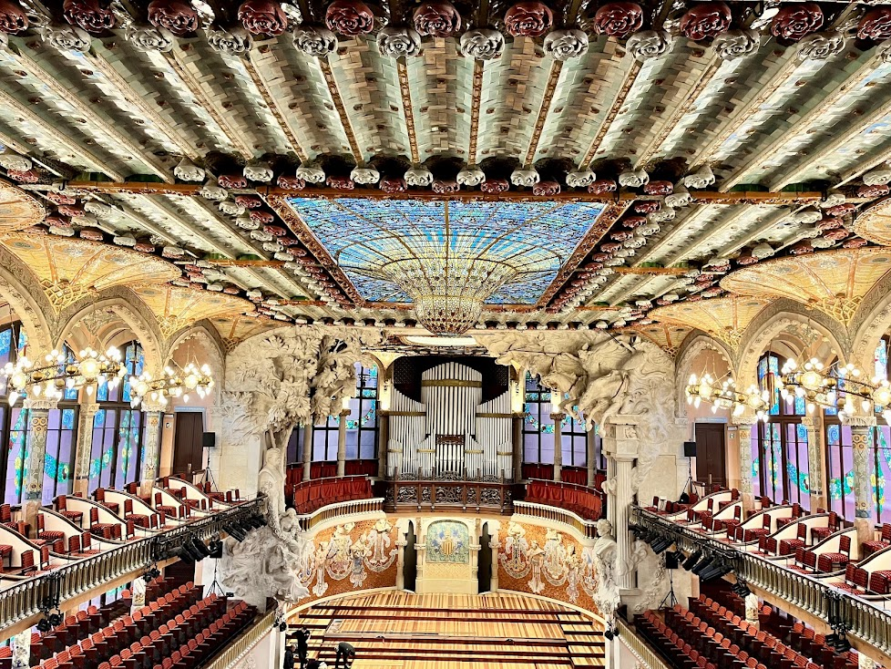
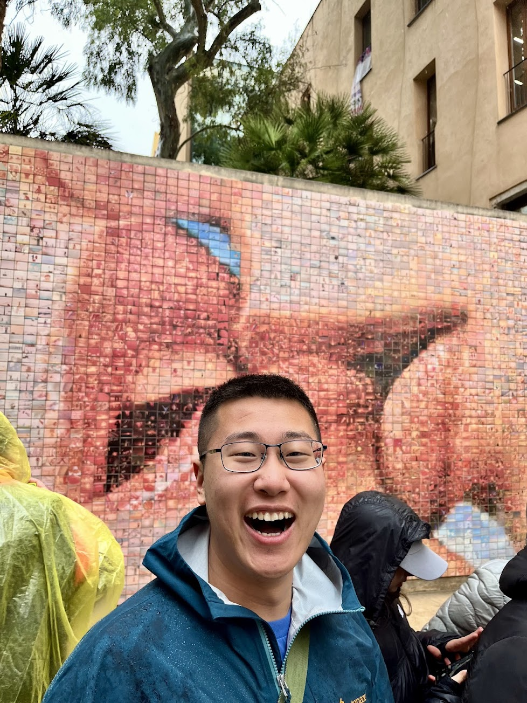

Cataland,  an enchanteng place I will come back to!

## Flying to Barcelona

The whole trip felt nostalgic from the very beginning when I saw the Icelandair check-in counter right next to Air France at RDU. First, I took the exact same RDU-CDG route last time when I road tripped through 11 countries in Europe. Secondly, I was at the Icelandair counter at the exact same time last year during spring break to go to Iceland.

This time, the flight was smooth, but as usual, I could never fall asleep. I even had three bottles of red wine on board to make me sleepy, but it didn't work in the end. When I arrived in Paris, the sun was just rising, and the sunrise was breathtaking as I stepped off the plane.

I never realized how beautiful the Paris CDG airport is. The architecture is so cool and distinctly French. One of the highlights of my trip was this layover experience: a few real birds flew right next to my seat at the gate. Yes, they were real birds, and they were inside the terminal. I did not know how they got in, but it made me so happy. It was a lively reminder that sometimes the unexpected happens in the most ordinary places. I know it's not safe for the flight, but I was still very surprised—it almost felt like a poetic way to start the journey, with birds and planes all around me.

I even vaguely recognized the airport hotel where I stayed two years ago, along with a glimpse of the Eiffel Tower and the Palace of Versailles. Everything truly filled me with nostalgia.

## Park Güell

The weather was not ideal when I arrived; the rain had stopped, but the sky remained overcast. My first stop was taking an Uber to Park Güell, one of Gaudí's few residential projects. I was really surprised to see escalators in the middle of the road, and they rose to a point where I could see the Sagrada Família for the first time in my life. I was astonished by how the Sagrada Família dominates the entire skyline of Barcelona—it truly feels like a divine masterpiece.

The park was interesting to walk around, but it was extremely crowded with tourists. I really enjoyed the view from the top of the park, which features three crosses and a clear view of the Sagrada Família.

Moreover, an artist was performing at the highest point in the park, where his birds perched on his guitar as he played. It was truly a magical moment, adding a burst of color to the grey sky that day.

To be honest, I'm not quite sure how to fully appreciate Gaudí's work. This distinctive architecture gives me goosebumps sometimes, and I feel like he was trying too hard to mimic nature without truly capturing its essence. The extensive use of curves wasn't entirely to my taste. But disclaimer: it's just my personal opinion.

In the only house that offers interior visits, they played a video of the park from last century, showing people riding something similar to a roller coaster to arrive and leave, which I found really interesting. Nowadays, it has all been replaced by roads.

Simply walking through this hilly part of the city and the park is magical. It doesn't feel like any other city. There’s a certain charm to its narrow, oddly laid-out streets—a legacy of industrial Barcelona that gives the city a unique character. It is such a charming city.

One of the most culturally shocking things I saw today was the Uber driver. When the driver informed me that we had arrived at the destination hotel, I couldn't find the hotel entrance where the car had stopped. I saw the driver casually roll down the window and talk to random strangers on the road, asking for directions. Then a stranger casually approached the car window and gave him directions. Of course, everything was in Spanish or Catalonian, but I could tell it was so casual; people here are so willing to help. It is such an open and outgoing place. I love it.

## Palau de la Música Catalana

What an eventful day today. We started by taking the subway to this magnificent music palace. The subway was so clean—though, to be fair, my standards have been ruined by the terrible American system. On the way, my friend, who is studying abroad here and learning a lot about Spanish and Catalonian history, started giving me a tour. I was really impressed by how much history he knows and was intrigued to learn about Catalan history. It was simply fascinating.

Arriving at the Palau de la Música Catalana, I noticed that the building looks similar to the WU at my school, which is a mix of Gothic and modern glass architecture. We took a guided tour and learned that this building was completed in just three years and is owned by a choir. Almost all the materials used for its construction came from Barcelona and its surrounding mountains. 

Walking into the main hall, I was blown away by the grandeur of this place. The ceiling, the stage, the organ—everything was just breathtakingly beautiful. The cultural elements of Catalonia, including St. George, the Catalan flag, and roses, were incorporated throughout the design. It was simply amazing.

## Barcelona Cathedral

After that, we wandered through historic, European-style narrow alleys all the way to the magnificent Barcelona Cathedral. I wouldn't say this is the most incredible cathedral I've ever seen—Cologne Cathedral still holds that title without a doubt—but it is definitely the most unique one. The tower layout and structure of this cathedral were unlike anything I had seen before. I believe it's called the Catalan Gothic style. It has a distinctive look, almost resembling a castle or a citadel guarding the entire city. 

We took the elevator all the way up to the rooftop terrace, which was unlike any other cathedral top I’ve visited. There was literally an entire platform up there. The weather wasn’t great when we visited, but we still got a great view of the surrounding buildings and a glimpse of the beach. I can only imagine how stunning the panoramic view must be on a sunny day. I guess I now have a great reason to come back to this charming city—maybe with a girlfriend next time, haha.

## Random but Amazing Things

We walked a lot across the entire old city of Barcelona and encountered many fascinating little attractions. For example, we saw the remains of a Roman-era pillar, standing for over two thousand years, now protected in an inner atrium surrounded by buildings. It felt surreal.

We also crossed a bridge with a small skull carved into the bottom of its surface. I was told that you need to look back at the skull after crossing, or you'll be cursed. Naturally, being the superstitious person that I am, I strictly followed the rule. The bridge itself was impressive, connecting two historical buildings over a narrow alley.

I also found a souvenir shop that I really liked, even though I didn’t buy anything. I just wish one day my closet could be this colorful.

There was also a "weird" store selling figurines of famous people... pooping. Apparently, it's a Catalan tradition where poop symbolizes a rich harvest and good luck—which, honestly, makes total sense. I would have bought one if they could customize one for me!

We randomly stumbled upon a housing exhibition showcasing residential layouts from around the world, including Spain, Chile, and China. The exterior of the exhibition building was adorable—it featured a giant painting of a child covering the entire façade. I think this is the cutest building I’ve ever seen. One day, when I’m rich, I want to build a skyscraper with every wall covered in my kid’s artwork (hopefully, I won’t have to wait 50 years for that to happen).

And here is El món neix en cada besada—the kissing wall. I love the concept and still hope that one day I can come back here with, well... not just a dude, haha.

After that, we checked out the Arc de Triomf, which was built for the 1888 World Expo. It looks quite similar to the one in France but isn’t as old or as famous. It’s known as the gateway to the city, leading to a wide open boulevard with a beautiful fountain at the end. I still don’t understand why the water had such a magical color.

## Banksy Museum

This was a spontaneous stop, as it started raining heavily and we wanted to visit somewhere indoors. I had heard of Banksy before, but only briefly. This was the first time I got to see so much of his work (though, of course, they were all replicas). I think he might be my new favorite artist. He does things I am neither capable nor courageous enough to do—challenging the system and influencing people on a massive scale. 

I especially loved the anti-capitalism t-shirt painting. The irony was just perfect. When I move to San Francisco, I think I’ll buy a giant print of this one.

## Picasso Museum

This was another spontaneous stop, as it was still raining. I have never been a fan of Picasso, mainly because I don’t understand Abstractionism or how to interpret and appreciate it. This visit didn’t change that, even with the help of the audio guide. Or maybe it was just because this museum did a poor job presenting his work. The exhibition layout was confusing—I wasn’t sure what the correct order was—and it focused too much on his life rather than his art. That was just my personal experience.

## Tapa 2254

I never used to care much about food when traveling, but Barcelona is completely changing my mind. The food here has been incredible from the very first meal I had. So many different types of paella, tapas, beers, and pasta. They aren’t cheap, but they are absolutely worth the price. 

For the first time in my life, I actually enjoyed spending time on food while traveling. Especially at the restaurant we went to for dinner—I had the best spaghetti of my life and the best cheesecake I’ve ever tasted. And the presentation was just amazing.

## La Pedrera - Casa Milà

The next morning, we headed to one of the three must-see masterpieces by Gaudí. Before this, I knew almost nothing about Gaudí, apart from Park Güell, which I had visited the day before.

I was really surprised by the exterior of the building—it was unlike anything I had ever seen before. The use of curves and irregularly shaped windows was intriguing. However, the entire time, I kept associating the design with a honeycomb or an ant hole, which wasn’t the best impression. Maybe I just don’t yet know how to fully appreciate this style of art.

However, the interior was far more interesting. The bold design of an inner courtyard allowing sunlight to shine through was really fascinating to me. It almost felt like there was another world hidden within this space.

We also visited the top floor, which was probably my favorite part. It consists of dozens, if not hundreds, of distinct arches. Moreover, the sculptural clusters on the rooftop were simply incredible—I even bought a t-shirt featuring them. Being up there felt like stepping into another world.

## Barcelona Beach

After that, we headed to Barcelona Beach. Yesterday, I had asked my Uber driver what he loved most about the city, and he immediately said, "the beach." Unfortunately for me, the weather wasn’t great when I visited, but I could only imagine how amazing it must be on a sunny day.

## Sagrada Familia

The *one* reason to come to Barcelona. I first learned about this cathedral on social media and couldn't stop imagining what it would be like to see it in person. And now, here I am. 

As soon as I stepped out of the metro station, the towering structure appeared before me. It was astonishing. It felt sacred just looking at it. It reminded me of the feeling I had when I first saw the [Hallgrímskirkja in Iceland](/posts/2024-03-09-reykjavik/#hallgrimskirkja) appear around a street corner. It’s hard to imagine that 100 years ago, someone could have seen this cathedral and *not* believed in God—this is purely divine work.

Stepping inside the cathedral, I was overwhelmed by the unique tree-like pillars and the breathtaking light effects created by the stained glass mosaics. I truly felt connected to the earth and nature, yet also so small in comparison to the vastness of the universe.

We then took an elevator up one of the cathedral’s towers. It reminded me of climbing the tower at the [Cologne Cathedral](/posts/2023-08-11-cologne/#climb-to-the-top-tower), except this time, there was an elevator. We joked about whether Gaudí ever imagined putting an elevator in one of his towers. 

The view from the top was absolutely incredible. It provided a panoramic view of the entire city, as well as a closer look at the intricate details of the other towers. When I took this picture, I was already over 100 meters above the ground.

## Casa Batlló

Another must-see Gaudí masterpiece—and honestly, my favorite house. I still have my personal bias that some of his buildings look like ant holes, and certain aspects of the design felt a little creepy to me, almost as if I were an insect trapped inside. However, the use of color and the innovative inner courtyard allowing sunlight to filter through were just incredible. I can't believe how much craftsmanship went into this project.

Moreover, the audio guide and the general museum design were excellent. It was a truly immersive experience, and they even had a 3D projection at the end showcasing Gaudí’s imaginative world. 

## Museu Nacional d'Art de Catalunya

We didn’t go inside the museum, but the entire structure was built for the World Expo and sits atop a hill, offering an incredible view of the city. People were gathered on the stairs, listening to someone playing an electronic keyboard. It really reminded me of watching the [sunset in Florence](/posts/2023-08-19-florence/#piazzale-michelangelo).

---

On our way back to the hotel, we stumbled upon the March 8th International Women’s Day parade in the city center. It was probably the first protest or parade I’ve ever been part of, even if only by accident. It was inspiring to witness the energy of the city and the powerful voices advocating for progress. Simply amazing.

---

## Final Thoughts

In summary, Barcelona is an amazing city. It reintroduced me to the world of food and left a lasting impression on me, even during the cloudy days I visited. I truly felt the pride of Catalonia and deeply respect their culture and heritage. 

I know this is a city I would love to return to. There are still so many foods to try, museums to explore, and breathtaking architectural wonders to see—especially on a sunny day. The bad weather during my visit has only given me the perfect excuse to come back.
