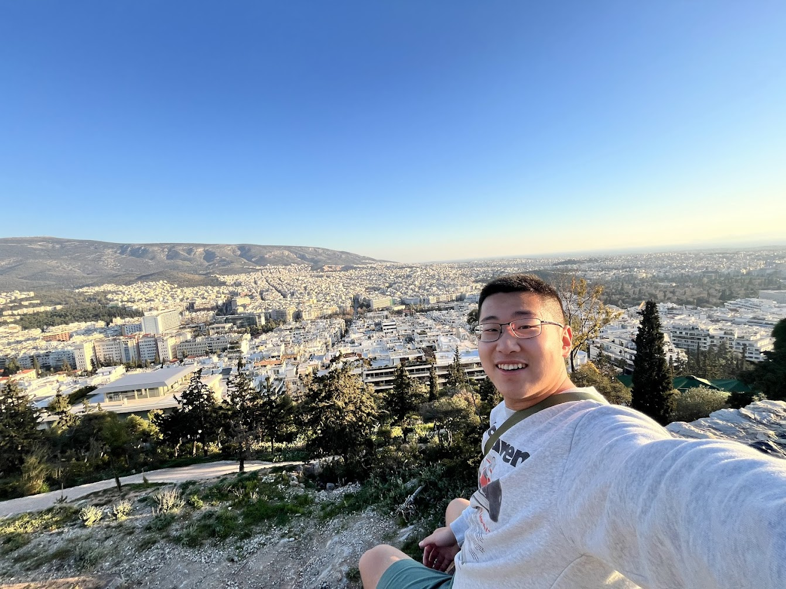
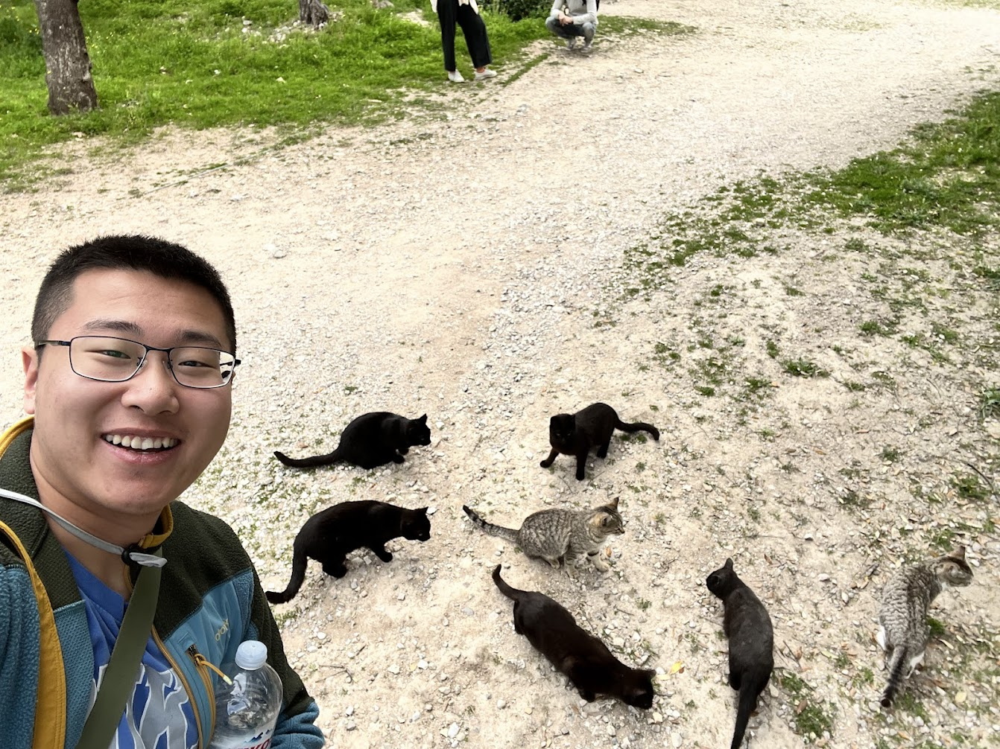

Athena created an amazing city full of culture, history, and charm. I will forever miss the stray cats here.

After a wonderful three days in Barcelona, we headed to our next adventure in Greece. Athens has always been a mysterious city to me since childhood, filled with incredible Greek mythology and ancient temples. I'm so excited to finally see the Parthenon in person, which I first encountered in my third-grade literature textbook. It feels like a dream from another universe coming true.

On our flight, an elderly man sat right in front of me who clearly didn't speak any English. Although I was sitting in the aisle seat, he noticed my excitement as I tried to glimpse Greece through the window. He kept speaking Greek to me—I had no idea what he was saying—but I could sense his hospitality.

Anyway, I guess that was my first encounter with Greek culture. The moment we landed, the weather was a blessing, especially after the cloudy days I'd experienced in Barcelona. I've absolutely missed this sunshine. Everything just kept getting better from that point.

## Our Airbnb

We took an easy taxi ride to our Airbnb, which offered an incredible rooftop with a panoramic view of the Acropolis, Greece's most famous attraction.

## Walking Around the City

We explored what seemed like the old city center, full of restaurants and pedestrian streets surrounding the Acropolis. After taking the earliest flight at 5 AM, I was exhausted upon arrival but couldn't resist exploring this charming city immediately.

The first thing I noticed was the abundance of street cats. They were adorable and unafraid of people. I stopped to say hello to every cat I encountered—it was impossible not to. This city is just filled with love.

We continued along the busy city route, filled with street merchants and bustling with people, especially since it was a Sunday. Casually walking past ancient historical sites dating back to BC was surreal. No matter where we went, the Acropolis was always visible atop its rocky perch. It's hard not to feel spiritual when such an iconic temple watches over you everywhere you go in Athens.

## Plateia Syntagmatos

We walked to Constitution Square (Plateia Syntagmatos), home to the National Congress building. It's remarkable how compact Athens is; we crossed most of the city center in less than two hours.

Every hour, there's a unique changing-of-the-guards ceremony in the plaza. The guards, dressed in traditional Greek uniforms, performed fascinating marches with distinctively high-stepping movements.

## Lycabettus Hill

Continuing to the northern hills, we reached Lycabettus Hill—the highest point in the city, offering an extraordinary view, especially at sunset.

The hike was easy, taking less than 30 minutes, but the view was breathtaking. We frequently paused to savor the vistas and greet kittens along the way. From the summit, landmarks like the original Olympic Stadium, the Acropolis, and the modern Acropolis Museum were clearly visible.

We found the perfect spot to sit and watch the sunset. Seeing the sun slowly dip below the horizon was calming and rewarding. I couldn't resist capturing countless photos during this golden hour.

The view remained stunning even after sunset, with vibrant colors providing an unforgettable backdrop to the illuminated Acropolis.

## Night View

After dinner, we walked back to our Airbnb, enjoying a spectacular night view of Lycabettus Hill and the brightly lit Acropolis.

## Sunrise

March 10th was my 22nd birthday, and I couldn't think of a better way to begin the day than by watching the sunrise from the majestic Philopappos Monument. We woke at 5 AM to climb the hill, and once again, Athens left me speechless.

My friends left shortly after sunrise, but I stayed a while longer to watch the sun fully rise. Sitting on a cliff, half-lying comfortably, I soaked in the magical experience of dawn unfolding across this enchanting city.

Reflecting on how wonderful it must be to wake up and stroll here daily, I felt genuinely blessed.

On my way back to the Airbnb, I greeted more cats, grabbed some Greek yogurt, and enjoyed another spectacular view from our rooftop.

## Acropolis Museum

This modern museum showcases original artifacts from the Acropolis temples. It's surreal seeing these ancient relics still vibrant today. The spirit of ancient Greece—the birthplace of democracy and architectural excellence—will always be remembered here.

## Exploring the Eastern City

Yesterday we explored the west and north; today, we ventured eastward and northward, discovering equally delightful neighborhoods filled with restaurants and shops.

We enjoyed delicious Greek kebabs and pita for lunch. Gyros and Greek sausages quickly became some of my favorite foods here.

## Climbing the Acropolis

Finally, it was time to ascend the Acropolis and admire temples that transcend time.

I originally thought only one temple—the Parthenon—stood atop this hill, but there are actually several temples dedicated to Athens' guardian Athena and her one-time contender, Poseidon. Legend says Athena won the guardianship by gifting Athenians an olive tree, while Poseidon's saltwater spring was less practical. Yet, both gods have temples here, showcasing the city's diplomatic spirit.

Intriguingly, the Parthenon was designed deliberately imperfect—its columns slightly tilted to imitate natural imperfections. This poetic tribute to the gods reminds me of Gaudí's nature-inspired designs.

## Prison of Socrates

Of course, Greek philosophers couldn't be forgotten. Visiting Socrates' prison felt like a pilgrimage, contemplating that Socrates himself once stood here thousands of years ago. It's profoundly poetic.

## Museum of the Ancient Agora

This was once the gathering place of Aristotle, Socrates, and Plato. Although we visited the Roman-era structures, their sheer scale amazed me, as we casually sat upon ruins from centuries BC.

The Agora was also full of friendly cats. With cat treats in hand, I felt like a king.

Interestingly, a fictional statue pairing Plato and Confucius stood in the Agora, commemorating these philosophers who lived roughly contemporaneously.

## Panathenaic Olympic Stadium

This is the site of the first modern Olympic Games over a century ago. Walking here felt like stepping into history.

The stadium was also used by Romans like a Colosseum, and walking through the tunnels where ancient warriors once marched toward death or glory was unforgettable.

## Temple of Poseidon

This iconic temple stands at Cape Sounion, visible to ancient ships navigating the Aegean Sea. It was thrilling to finally visit this temple dedicated to the god I'd heard of since childhood.

We visited hoping to catch another beautiful sunset, but the weather wasn't ideal. Still, having enjoyed three incredible sunrises and sunsets during our stay, we felt fortunate. Even a partial sunset on our last mainland night in Greece was lovely.

If this was my final visit to Greece, I leave feeling fully contented and without regret.
